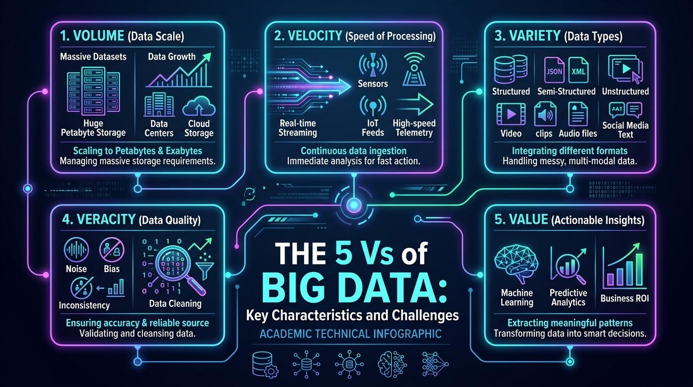
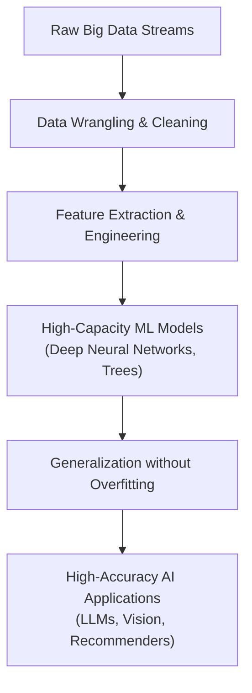
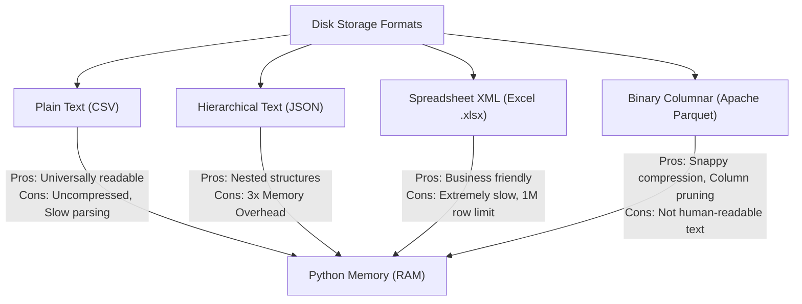
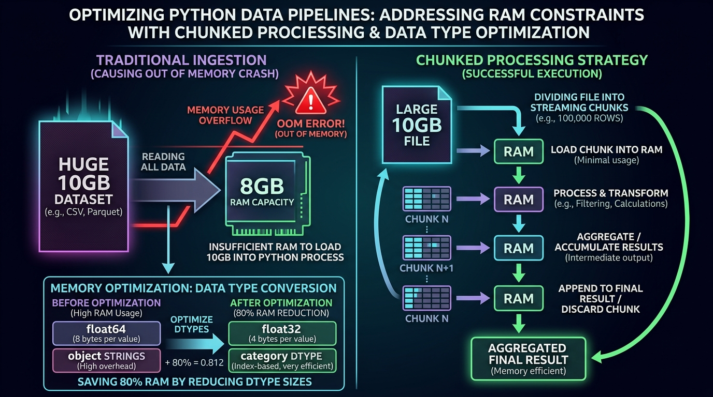
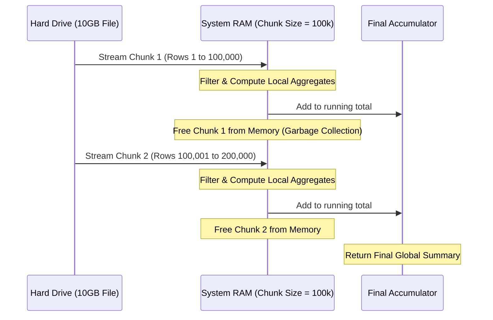

# 🐘 Unit 1: Introduction to Big Data and Large Dataset Handling

> **Course Code:** DS-505 | **Subject:** Big Data Handling and Management for Machine Learning Applications  
> **Theory Subject Code:** `2611001305033001` | **Practical Subject Code:** `2611001305033002`  
> **Target Degree:** B.Sc. (Data Science & Analytics) — Semester V (NCrF Credit Level 5.5, 4 Credits)  
> **Institution:** Sutex Bank College of Computer Applications and Science (SBCCAS), Amroli  
> **Affiliation:** Veer Narmad South Gujarat University (VNSGU), Surat, Gujarat, India  
> **Document Purpose:** University Examination Preparation Notes, Practical Lab Manual & Technical Reference  
> **Recommended Technical Stack:** Python 3.10+, NumPy, Pandas, JupyterLab / Google Colab  
> **Primary References:**  
> • *Python for Data Analysis (3rd Ed.)* — Wes McKinney (Creator of Pandas, O'Reilly)  
> • *Mastering Large Datasets with Python* — John T. Wolohan (Manning)  
> • *Big Data: Principles and Best Practices of Scalable Systems* — Nathan Marz & James Warren (Manning)  
> • *Hadoop: The Definitive Guide* — Tom White (O'Reilly)  
> • *Introduction to Big Data (DECAP456)* — Dr. Rajni Bhalla  

---

<details open>
<summary><b>📑 Table of Contents & Unit Roadmap (Click to Expand / Collapse)</b></summary>

- [1. Big Data Fundamentals & Characteristics](#1-big-data-fundamentals--characteristics)
  - [1.1 What is Big Data?](#11-what-is-big-data)
  - [1.2 The Core Characteristics: The 5 Vs of Big Data](#12-the-core-characteristics-the-5-vs-of-big-data)
  - [1.3 The Need for Big Data in Machine Learning and AI](#13-the-need-for-big-data-in-machine-learning-and-ai)
  - [1.4 Real-World Case Studies of Massive Datasets](#14-real-world-case-studies-of-massive-datasets)
  - [1.5 Traditional Databases (RDBMS) vs. Big Data Systems](#15-traditional-databases-rdbms-vs-big-data-systems)
- [2. Working with Large Datasets Using Python](#2-working-with-large-datasets-using-python)
  - [2.1 The Python Ingestion Paradigm & File Formats](#21-the-python-ingestion-paradigm--file-formats)
  - [2.2 Comparative Benchmark: CSV vs. JSON vs. Excel vs. Parquet](#22-comparative-benchmark-csv-vs-json-vs-excel-vs-parquet)
  - [2.3 Python Memory Architecture & The Out-of-Memory (OOM) Problem](#23-python-memory-architecture--the-out-of-memory-oom-problem)
  - [2.4 Memory Optimization: Data Type Downcasting & Categoricals](#24-memory-optimization-data-type-downcasting--categoricals)
  - [2.5 Scalable Data Ingestion: Chunked Reading with `chunksize`](#25-scalable-data-ingestion-chunked-reading-with-chunksize)
- [3. Essential Python Libraries for Big Data](#3-essential-python-libraries-for-big-data)
  - [3.1 NumPy: Vectorized Computing & Memory Efficiency](#31-numpy-vectorized-computing--memory-efficiency)
  - [3.2 Pandas: Architecture of Series and DataFrames](#32-pandas-architecture-of-series-and-dataframes)
  - [3.3 Large-Scale Exploratory Data Analysis (EDA) Methodology](#33-large-scale-exploratory-data-analysis-eda-methodology)
- [4. Practical Commands, Functions & API Mastery](#4-practical-commands-functions--api-mastery)
  - [4.1 Ingestion Primitives: `read_csv()`, `read_json()`](#41-ingestion-primitives-read_csv-read_json)
  - [4.2 Structural Inspection: `head()`, `tail()`, `info()`, `describe()`, `shape`, `columns`](#42-structural-inspection-head-tail-info-describe-shape-columns)
  - [4.3 Data Cleaning & Wrangling: `drop()`, `dropna()`, `fillna()`, `rename()`](#43-data-cleaning--wrangling-drop-dropna-fillna-rename)
- [5. Practical Projects, Assignments & University Exam Resources](#5-practical-projects-assignments--university-exam-resources)
  - [5.1 Hands-on Practical Project & Guided Lab](#-1-hands-on-practical-project--guided-lab)
  - [5.2 Theory Assignment 1 & MCQ Practice](#-2-theory-assignment-1--mcq-practice-continuous-evaluation)
  - [5.3 University Examination Vault, Technical Glossary & Viva Voce](#-3-university-examination-vault-technical-glossary--viva-voce)

</details>

---

# 1. Big Data Fundamentals & Characteristics

## 1.1 What is Big Data?

In modern data science, **Big Data** is defined not merely by large file size, but by an operational threshold: when a dataset becomes too large, too fast, or too complex for standard software tools to handle on a single computer.

### 🎯 Authoritative Academic Definitions (For University Exams)

Students should memorize at least one of these formal definitions for theory examinations:

1. **Gartner (Doug Laney's 3V Definition):**
   > *"Big Data is high-volume, high-velocity, and/or high-variety information assets that demand cost-effective, innovative forms of information processing that enable enhanced insight, decision making, and process automation."*

2. **McKinsey Global Institute Definition:**
   > *"Big data refers to datasets whose size is beyond the ability of typical database software tools to capture, store, manage, and analyze."*

3. **Academic Definition (*DECAP456 Course Reference*):**
   > *"Big Data is a collection of massive, complex, and heterogeneous datasets—spanning high volume, rapidly arriving velocity, and diverse structural varieties—that cannot be stored, managed, or processed efficiently using traditional relational database management systems (RDBMS)."*

---

### 💡 Intuitive Student Analogy: The Kitchen Counter vs. The Warehouse

To understand Big Data and Python memory without getting confused:

* **System RAM (Memory) = Your Kitchen Cooking Counter:**  
  It is ultra-fast and directly reachable by the chef (the CPU). However, space is strictly limited (e.g., 8 GB or 16 GB).
* **Hard Drive / SSD Storage = The Mega Warehouse / Grocery Store:**  
  It can store massive quantities of goods (1 TB or 10 TB), but retrieving items from it is much slower than grabbing something already on your counter.
* **The Out-of-Memory (OOM) Crash:**  
  Occurs when someone attempts to dump an entire 20-ton truck of groceries onto a tiny kitchen counter all at once! The counter collapses.
* **The Big Data Solution (Chunking & Streaming):**  
  Instead of dumping everything at once, you bring ingredients to your counter in small, manageable boxes (**chunks** of e.g. 50,000 items), process them, record the summary, clear the counter, and fetch the next box.

---

```
+-----------------------------------------------------------------------------------+
|                            THE BIG DATA EVOLUTION                                 |
+-----------------------------------------------------------------------------------+
|  Traditional Era (Gigabytes)     ===>    Modern Big Data Era (Terabytes/Petabytes)|
|  - Structured tabular data               - Poly-structured (Text, Audio, Sensors) |
|  - Batch updates overnight               - Millisecond streaming ingestion        |
|  - Centralized SQL server                - Distributed clusters & Cloud Pipelines |
|  - Deterministic queries                 - Machine Learning & Predictive AI       |
+-----------------------------------------------------------------------------------+
```

---

## 1.2 The Core Characteristics: The 5 Vs of Big Data

Originally conceptualized as the **3 Vs** (Volume, Velocity, Variety), modern enterprise data science evaluates Big Data across **5 core dimensions**:

<p align="center">
  
</p>

### 1. Volume (The Scale of Data)
* **Concept:** Refers to the sheer quantity of data generated and stored every second. 
* **Magnitude:** Scales from Gigabytes ($10^9$) to Terabytes ($10^{12}$), Petabytes ($10^{15}$), and Exabytes ($10^{18}$).
* **Driver:** Connected smartphones, IoT sensors, cloud storage, automated logging, and video platforms.
* **Challenge:** Traditional single-machine hard drives and RAM cannot hold the dataset. Storage must be partitioned across distributed file systems (like HDFS or cloud object stores like AWS S3 / Google Cloud Storage).

### 2. Velocity (The Speed of Generation and Processing)
* **Concept:** The speed at which new data is generated, transmitted, and required to be processed into actionable intelligence.
* **Paradigm:** Shifting from traditional **batch processing** (e.g., end-of-month payroll runs) to **near-real-time** and **real-time streaming** (e.g., credit card fraud detection within 50 milliseconds).
* **Driver:** Stock exchanges, financial transactions, autonomous vehicle telemetry, and clickstream logging.
* **Challenge:** Latency bottlenecks in I/O pipelines. Data must be ingested and evaluated in memory before it even reaches physical disk storage.

### 3. Variety (The Diversity of Data Types)
Big Data rarely conforms to clean rows and columns. It spans three distinct structural paradigms:

| Structure Type | Defining Characteristics | Examples | Storage / Parsing Tools |
| :--- | :--- | :--- | :--- |
| **Structured Data** | High degree of organization; strict schema with predefined data types (integers, dates, floats). | SQL tables, CSV files, relational databases. | PostgreSQL, MySQL, SQLite, Pandas DataFrames. |
| **Semi-Structured Data** | Does not reside in a rigid relational table, but contains internal tags, keys, or markers separating semantic elements. | JSON files, XML documents, YAML, NoSQL databases. | MongoDB, Couchbase, Pandas `read_json()`. |
| **Unstructured Data** | Lacks any predefined conceptual structure or data model; raw digital content. | Video footage, audio podcasts, raw satellite imagery, PDF documents, free-text social posts. | Object Storage (S3), Vector Databases, HDFS. |

### 4. Veracity (Data Quality, Trustworthiness & Noise)
* **Concept:** Purity, consistency, and reliability of the data source.
* **The Reality of Big Data:** Real-world large datasets are invariably "dirty"—they contain missing values (`NaN`), duplicate records, sensor calibration drift, corrupted encodings, and malicious spoofing.
* **Role in Data Science:** In Machine Learning, the *Garbage In, Garbage Out (GIGO)* principle reigns. High veracity is achieved through data validation, automated outlier detection, and robust imputation.

### 5. Value (Business Insight & Predictive Utility)
* **Concept:** The ultimate return on investment (ROI). Raw data has zero inherent economic worth until it is transformed into predictive or descriptive value.
* **Conversion Pipeline:**  
  `Raw Big Data` ➔ `Cleaning & Scaling` ➔ `Structured Features` ➔ `Machine Learning` ➔ `Actionable Decisions`

<!-- USER IMAGE PLACEHOLDER: Additional custom diagrams can be embedded here -->

---

## 1.3 The Need for Big Data in Machine Learning and AI

Why can't modern AI simply learn from small, well-curated sample tables?



1. **Statistical Power and Edge-Case Coverage:**  
   Machine learning algorithms build statistical decision boundaries. In high-dimensional spaces (e.g., images with thousands of pixels, or language with tens of thousands of tokens), small datasets suffer from the *Curse of Dimensionality*. Big Data provides sufficient sample density to cover rare events (e.g., diagnosing a 1-in-a-million rare medical pathology).
2. **Deep Learning and Model Capacity:**  
   Traditional algorithms (Linear Regression, Naive Bayes) plateau in performance early. As demonstrated in *Hands-On Machine Learning* (Aurélien Géron), deep neural networks and Transformer architectures continue to scale their accuracy as training volume increases into billions of tokens.
3. **Preventing Overfitting:**  
   Small datasets force models to memorize spurious noise. Large, diverse datasets act as a natural regularizer, ensuring the algorithm learns generalized real-world patterns rather than memorized artifacts.

---

## 1.4 Real-World Case Studies of Massive Datasets

To appreciate the scale expected in industry:

* **Social Media & Recommendation Engines (YouTube / Instagram):**
  * *Volume:* Over 500 hours of video uploaded every minute to YouTube.
  * *Velocity:* Billions of interactions (likes, shares, watch times) streamed per second.
  * *ML Application:* Real-time matrix factorization and deep retrieval models recommending personalized video feeds in <100 milliseconds.
* **Internet of Things (IoT) & Smart Grids:**
  * *Velocity:* Smart electrical meters transmitting voltage, frequency, and consumption data every 5 seconds across millions of households.
  * *ML Application:* Time-series anomaly detection predicting power transformer failures before blackouts occur.
* **Financial Fraud Detection (Mastercard / Visa):**
  * *Velocity:* Processing upwards of 65,000 transaction messages per second globally.
  * *ML Application:* Gradient boosted decision trees and graph neural networks scoring fraud probability before payment authorization completes.

---

## 1.5 Traditional Databases (RDBMS) vs. Big Data Systems

University examination papers frequently ask students to compare traditional Relational Database Management Systems (RDBMS) against modern Big Data architectures:

| Comparative Dimension | Traditional RDBMS (MySQL, Oracle) | Modern Big Data Frameworks (Spark, Pandas, HDFS) |
| :--- | :--- | :--- |
| **Data Volume Scale** | Gigabytes to low Terabytes ($< 1 \text{ TB}$). | Terabytes to Exabytes ($> 100 \text{ TB}$). |
| **Architecture** | Centralized, monolithic single-node server. | Distributed, master-worker cluster architecture. |
| **Scaling Model** | **Vertical (Scale-Up):** Adding more CPU/RAM to a single expensive machine. | **Horizontal (Scale-Out):** Adding dozens of commodity commodity computers to a cluster. |
| **Schema Paradigm** | **Schema-on-Write:** Schema must be strictly defined before inserting data. | **Schema-on-Read:** Raw data is stored as-is; structure is applied when reading. |
| **Data Variety** | Strictly Structured (Normalized Tables). | Multi-structured (CSV, JSON, Parquet, Text, Images). |
| **Read/Write Bottleneck** | ACID transaction locking limits write throughput. | Append-only distributed writes; highly parallelized reads. |
| **Query Mechanism** | Standard SQL queries. | MapReduce, Spark SQL, DataFrame APIs, Vectorized Python. |

---

# 2. Working with Large Datasets Using Python

## 2.1 The Python Ingestion Paradigm & File Formats

In data science, disk storage formats dictate whether an ingestion pipeline succeeds or crashes your system. The four primary formats encountered in data science pipelines are **CSV**, **JSON**, **Excel**, and **Parquet**.



---

## 2.2 Comparative Benchmark: CSV vs. JSON vs. Excel vs. Parquet

As Wes McKinney highlights in *Python for Data Analysis*, parsing text-based formats (CSV, JSON) requires the Python interpreter to inspect every individual byte, identify delimiters, parse strings, and dynamically construct Python objects. In contrast, binary columnar formats (Parquet) store data in memory-mapped chunks with embedded schemas.

| Attribute | Plain Text CSV (`.csv`) | Structured JSON (`.json`) | Microsoft Excel (`.xlsx`) | Apache Parquet (`.parquet`) |
| :--- | :---: | :---: | :---: | :---: |
| **Internal Representation** | Delimited plain text | Key-value plain text | Zipped XML packages | Binary, Columnar with Snappy/Gzip |
| **File Size on Disk (10M rows)** | ~1.5 GB | ~3.8 GB | ~1.8 GB (limited to 1M rows) | **~280 MB** (High compression) |
| **Read Speed (Pandas)** | Moderate | Slow | Extremely Slow | **Up to 15x Faster than CSV** |
| **Supports Column Pruning?** | ❌ No (must read all cols) | ❌ No | ❌ No | ✅ **Yes (reads only requested cols)** |
| **Preserves Data Types?** | ❌ No (infers on read) | ⚠️ Partial | ⚠️ Partial | ✅ **Yes (strict schema metadata)** |
| **Max Capacity** | Unlimited | Unlimited | 1,048,576 rows max | Unlimited |

---

## 2.3 Python Memory Architecture & The Out-of-Memory (OOM) Problem

A foundational concept from John Wolohan's *Mastering Large Datasets with Python* is the **Memory Amplification Factor**:

> **The Rule of Thumb:**  
> A CSV file that occupies **1 GB on disk** typically requires **3 GB to 5 GB of RAM** when loaded into a standard Pandas DataFrame!

Why does this happen?
1. **Python Object Overhead:** In pure Python, every integer or string is not a raw byte; it is a full `PyObject` structure containing reference counts, type descriptors, and value pointers (costing 28 bytes for a simple integer).
2. **Standard 64-bit Default Allocation:** By default, Pandas reads numeric integers as `int64` (8 bytes per cell) and floating numbers as `float64` (8 bytes per cell), even if the numbers are small enough to fit into a single byte (`int8`).
3. **Object Dtype Pointer Array:** Text columns default to `object` dtype. In memory, this is stored as an array of 64-bit memory addresses pointing to separate heap-allocated string objects, fragmenting RAM.

When a dataset exceeds your machine's physical RAM, the operating system attempts to swap memory to disk (virtual memory paging), freezing the machine, which culminates in the dreaded:  
`MemoryError: Unable to allocate array with shape (...) and data type float64`

<p align="center">
  
</p>

---

## 2.4 Memory Optimization: Data Type Downcasting & Categoricals

Before resorting to complex distributed clusters, a skilled Data Scientist can shrink memory footprints by **70% to 90%** using in-memory optimization.

### 1. Integer Downcasting
Pandas defaults to `int64` (range: $-9 \times 10^{18}$ to $+9 \times 10^{18}$). Most operational variables (such as student age, day of month, status codes) fit in much smaller boundaries:
* `int8`: $-128$ to $+127$ (1 byte)
* `int16`: $-32,768$ to $+32,767$ (2 bytes)
* `int32`: $-2.14 \times 10^9$ to $+2.14 \times 10^9$ (4 bytes)
* `int64`: 8 bytes per value

### 2. Float Downcasting
Sensor telemetry and monetary amounts rarely require 64-bit double precision. Converting `float64` to `float32` immediately cuts RAM usage by **50%**.

### 3. Converting `object` to `category`
If a text column contains repeated values (e.g., gender, city, state, order status), storing them as raw string objects duplicates millions of identical characters.  
The `category` dtype implements **Dictionary Encoding**: it assigns a unique tiny integer (e.g., 1 byte) to each distinct string and stores the string lookup dictionary once.

### 🧪 Verified Code Demonstration: Saving 89.75% RAM

```python
import pandas as pd
import numpy as np

# Simulate a 100,000-row enterprise transaction dataset
np.random.seed(42)
n_rows = 100_000

df = pd.DataFrame({
    'transaction_id': range(1, n_rows + 1),
    'amount': np.random.uniform(10.0, 5000.0, size=n_rows),
    'category': np.random.choice(['Electronics', 'Groceries', 'Clothing', 'Books', 'Home'], size=n_rows),
    'status': np.random.choice(['Completed', 'Pending', 'Failed'], size=n_rows),
    'discount': np.random.uniform(0.0, 0.5, size=n_rows)
})

# Measure baseline memory
mem_before = df.memory_usage(deep=True).sum() / (1024**2)

# --- APPLIED OPTIMIZATIONS ---
df_optimized = df.copy()

# 1. Downcast floating-point columns from 64-bit to 32-bit
df_optimized['amount'] = df_optimized['amount'].astype('float32')
df_optimized['discount'] = df_optimized['discount'].astype('float32')

# 2. Downcast unique integer identifier
df_optimized['transaction_id'] = pd.to_numeric(df_optimized['transaction_id'], downcast='unsigned')

# 3. Convert repetitive string objects into efficient categorical representations
df_optimized['category'] = df_optimized['category'].astype('category')
df_optimized['status'] = df_optimized['status'].astype('category')

# Measure optimized memory
mem_after = df_optimized.memory_usage(deep=True).sum() / (1024**2)
reduction = ((mem_before - mem_after) / mem_before) * 100

print(f"Initial Memory Footprint:   {mem_before:.2f} MB")
print(f"Optimized Memory Footprint: {mem_after:.2f} MB")
print(f"Total RAM Reduction:        {reduction:.2f}%")
```

**Output:**
```text
Initial Memory Footprint:   13.04 MB
Optimized Memory Footprint: 1.34 MB
Total RAM Reduction:        89.75%
```

---

## 2.5 Scalable Data Ingestion: Chunked Reading with `chunksize`

When a file is too large to fit in physical RAM (e.g., trying to read a 15 GB CSV file on an 8 GB laptop), reading the entire file with `pd.read_csv("file.csv")` triggers an immediate crash.

The solution is **Chunked Ingestion**:
Instead of returning a single monolithic DataFrame, `pd.read_csv()` with the `chunksize` parameter returns an **iterable `TextFileReader` object**. This streams a fixed number of rows into memory, performs transformations, aggregates intermediate results, and releases memory before reading the next chunk.



### 🧪 Practical Code: Processing Large Files via Chunking

```python
import pandas as pd

# Target file on disk: 10GB Server Access Log
dataset_path = "large_server_logs.csv"

# Global accumulators for out-of-core metrics
total_rows_processed = 0
total_bandwidth_bytes = 0
status_code_distribution = {}

# Process dataset in streaming blocks of 50,000 records
chunk_size = 50_000

for chunk in pd.read_csv(dataset_path, chunksize=chunk_size, usecols=['status_code', 'bytes_sent']):
    # Filter valid HTTP 200 OK responses
    successful_requests = chunk[chunk['status_code'] == 200]
    
    # Update running aggregates
    total_rows_processed += len(chunk)
    total_bandwidth_bytes += successful_requests['bytes_sent'].sum()
    
    # Tally categorical frequencies
    chunk_counts = chunk['status_code'].value_counts()
    for code, count in chunk_counts.items():
        status_code_distribution[code] = status_code_distribution.get(code, 0) + count

print(f"Successfully processed {total_rows_processed:,} records.")
print(f"Total Bandwidth Consumed: {total_bandwidth_bytes / (1024**3):.2f} GB")
print(f"HTTP Status Breakdown: {status_code_distribution}")
```

---

# 3. Essential Python Libraries for Big Data

## 3.1 NumPy: Vectorized Computing & Memory Efficiency

NumPy (*Numerical Python*) forms the computational substrate of the entire Python data science ecosystem (including Pandas, Scikit-learn, and PyTorch).

### Why Python Lists Fail at Big Data Scale
Standard Python `list` objects are arrays of pointers to scattered heap objects. Adding two Python lists element-wise requires a slow interpreted `for` loop that unpacks each object, checks its data type dynamically, performs addition, and packages a new object:

```python
# 🐌 Slow Interpreted Python Loop (Non-vectorized)
data_list = [1, 2, 3, 4, 5]
squared_list = [x**2 for x in data_list]
```

### The NumPy Vectorization Superpower
A NumPy `ndarray` stores elements in a **contiguous block of memory** with a uniform, static data type (C-level array).
When operations are executed on NumPy arrays, the computation is delegated directly to low-level compiled C and Fortran routines using **SIMD (Single Instruction, Multiple Data)** CPU registers.

```
PYTHON LIST IN MEMORY (SCATTERED POINTERS):
List Object -> [ Ptr 1 ] -> PyObject(Val: 10, Type: Int, RefCount: 1)
               [ Ptr 2 ] -> PyObject(Val: 20, Type: Int, RefCount: 1)

NUMPY CONTIGUOUS MEMORY (C-STYLE COMPACT BLOCK):
ndarray Data Buffer -> | 10 | 20 | 30 | 40 | 50 | (Raw 32-bit integers)
```

```python
import numpy as np
import time

size = 10_000_000
py_list = list(range(size))
np_arr = np.arange(size, dtype=np.int32)

# Benchmark Pure Python Loop
start = time.time()
py_res = [x * 2 for x in py_list]
py_time = time.time() - start

# Benchmark Vectorized NumPy
start = time.time()
np_res = np_arr * 2
np_time = time.time() - start

print(f"Python List Loop Execution: {py_time:.4f} seconds")
print(f"NumPy Vectorized Execution:  {np_time:.4f} seconds")
print(f"NumPy Performance Speedup:   {py_time / np_time:.1f}x Faster")
```
*Typical Benchmark:* NumPy executes **25x to 80x faster** while consuming less than one-fourth the memory.

---

## 3.2 Pandas: Architecture of Series and DataFrames

Pandas, created by Wes McKinney in 2008, sits on top of NumPy to provide labeled, relational data structures.

```
       +-----------------------------------------------+
       |                   DATAFRAME                   |
       |  (2-Dimensional Labeled Tabular Data Matrix)  |
       +-----------------------------------------------+
         Index     Column 'Age'       Column 'Salary'
         Row 0  ->    [ 25 ]      ->     [ 45000 ]   <--- Row Data
         Row 1  ->    [ 30 ]      ->     [ 62000 ]
         Row 2  ->    [ 28 ]      ->     [ 58000 ]
                        ^                    ^
                        |                    |
                 Pandas Series        Pandas Series
               (1D Homogeneous)     (1D Homogeneous)
```

1. **Pandas Series:**  
   A one-dimensional labeled array capable of holding any data type (integers, strings, floating-point numbers, Python objects). It consists of two components:
   * **Data array:** A contiguous 1D NumPy array.
   * **Index labels:** Axis labels identifying each element.
2. **Pandas DataFrame:**  
   A two-dimensional, size-mutable, tabular data structure with labeled axes (rows and columns). Internally, a DataFrame is organized as a collection of Pandas Series sharing a common Index.

---

## 3.3 Large-Scale Exploratory Data Analysis (EDA) Methodology

When receiving a massive dataset, data scientists follow a disciplined 4-step EDA diagnostic:

```
[ Step 1: Structural Audit ]  --->  shape, columns, dtypes, memory_usage(deep=True)
               │
               ▼
[ Step 2: Boundary Inspection ] --->  head(), tail(), sample()
               │
               ▼
[ Step 3: Integrity Check ]    --->  isna().sum(), duplicated().sum()
               │
               ▼
[ Step 4: Statistical Health ] --->  describe(), quantile(), value_counts()
```

---

# 4. Practical Commands, Functions & API Mastery

This section provides the exact syntax, parameter definitions, and usage patterns for all practical functions listed in the official syllabus.

---

## 4.1 Ingestion Primitives: `read_csv()`, `read_json()`

### 1. `pd.read_csv()`
Loads a comma-separated values (CSV) file into a DataFrame.

* **Essential Syntax:**
```python
df = pd.read_csv(
    filepath_or_buffer="dataset.csv",
    sep=",",                  # Delimiter character (e.g., '\t' for TSV)
    header=0,                 # Row number to use as column names
    usecols=['id', 'sales'],  # Critical for Big Data: Loads ONLY needed columns!
    dtype={'id': 'int32'},    # Explicit data types to prevent 64-bit bloat
    chunksize=50000,          # Returns TextFileReader for out-of-core streaming
    na_values=['NA', 'null']  # Additional strings to recognize as NaN
)
```

### 2. `pd.read_json()`
Loads a JSON (JavaScript Object Notation) string or file into a DataFrame.

* **Essential Syntax:**
```python
df = pd.read_json(
    path_or_buf="records.json",
    orient="records",         # Format orientation ('records', 'split', 'index')
    lines=True                # CRITICAL FOR BIG DATA: Reads line-delimited JSON (JSON Lines)
)
```
> 💡 **University Exam Note:** Always remember `lines=True`. Standard JSON requires the entire file to be valid JSON enclosed in square brackets `[...]`, meaning the entire multi-gigabyte file must be loaded at once. **JSON Lines (`.jsonl`)** places one independent JSON record per line, allowing line-by-line streaming without RAM overflow.

---

## 4.2 Structural Inspection: `head()`, `tail()`, `info()`, `describe()`, `shape`, `columns`

### 1. `.head(n=5)` and `.tail(n=5)`
Inspects the top or bottom $n$ rows of the DataFrame without printing millions of records to screen.
```python
df.head(5)  # Displays the first 5 records
df.tail(3)  # Displays the last 3 records
```

### 2. `.info(memory_usage='deep')`
Prints a concise summary of the DataFrame: class, index range, columns, non-null counts, and data types.
```python
# 'deep' parameter forces Pandas to introspect nested string objects to compute true RAM consumption
df.info(memory_usage='deep')
```

### 3. `.describe()`
Generates descriptive statistics summarizing central tendency, dispersion, and shape of dataset distributions (excluding `NaN` values).
```python
# Numerical summary: count, mean, std, min, 25%, 50%, 75%, max
df.describe()

# Include categorical features: shows unique count, top category, frequency
df.describe(include=['category', 'object'])
```

### 4. `.shape` and `.columns`
Attributes (not functions; called without parentheses) providing fundamental dimensional metadata.
```python
# Returns a tuple representing dimensionality: (total_rows, total_columns)
num_rows, num_cols = df.shape
print(f"Dataset contains {num_rows} rows across {num_cols} attributes.")

# Returns an Index object containing all column header names
print(df.columns.tolist())
```

---

## 4.3 Data Cleaning & Wrangling: `drop()`, `dropna()`, `fillna()`, `rename()`

### 1. `df.drop()`
Removes specified labels from rows or columns.
* **Syntax:** `df.drop(labels=..., axis=..., inplace=...)`
  * `axis=1` or `axis='columns'`: Drops columns.
  * `axis=0` or `axis='index'`: Drops rows.
```python
# Drop unnecessary identifier columns to conserve memory
df_cleaned = df.drop(columns=['unneeded_col1', 'temporary_id'])
```

### 2. `df.dropna()`
Filters and removes rows or columns containing null (`NaN`) values.
* **Parameters:**
  * `how='any'`: Drops row if *at least one* cell is `NaN`.
  * `how='all'`: Drops row only if *all* cells are `NaN`.
  * `subset=['col_A', 'col_B']`: Considers nulls only in specified columns.
```python
# Remove records where essential targets or identifiers are missing
df_filtered = df.dropna(subset=['target_label', 'user_id'], how='any')
```

### 3. `df.fillna()`
Imputes (fills) missing values using specified constants, statistical measures, or propagation methods.
```python
# 1. Fill with constant scalar
df['category'] = df['category'].fillna('Unknown')

# 2. Impute with statistical measure (Mean or Median)
median_salary = df['salary'].median()
df['salary'] = df['salary'].fillna(median_salary)

# 3. Forward fill (carries last known observation forward in time series)
df['stock_price'] = df['stock_price'].fillna(method='ffill')
```

### 4. `df.rename()`
Alters axes labels (column names or row indices) using dictionary mapping.
```python
# Standardize messy column headers into clean snake_case
df_renamed = df.rename(columns={
    'Cust_ID#': 'customer_id',
    'Gross Amt ($)': 'gross_amount',
    'DOB': 'date_of_birth'
})
```

---

---

# 5. Practical Projects, Assignments & University Exam Resources

To support focused study and keep lecture notes streamlined for reading and revision, practical lab walkthroughs, institutional assignments, and exam vaults are organized in dedicated repository sections:

### 🚀 1. Hands-on Practical Project & Guided Lab
* **Project Document:** [`3_Projects_Presentations/Unit-1_Lab_Case_Study_Large_Dataset_Optimization.md`](../3_Projects_Presentations/Unit-1_Lab_Case_Study_Large_Dataset_Optimization.md)
* **Focus:** Complete Python walkthrough processing 500,000 telemetry records on disk, deep memory profiling, cleaning, median imputation, and achieving an **86.42% RAM reduction** via type downcasting and dictionary categorical encoding.

### 📝 2. Theory Assignment 1 & MCQ Practice (Continuous Evaluation)
* **Assignment Document:** [`4_Assignments/Assignment-1_Unit-1_Theory_Assignment.md`](../4_Assignments/Assignment-1_Unit-1_Theory_Assignment.md)
* **Focus:** Official college assignment format prepared by Asst. Prof. Hitesh Patel. Includes:
  * **Section I:** 5 Detailed Long Questions (7 Marks each)
  * **Section II:** 5 Focused Short Questions (3 Marks each)
  * **Section III:** 7 Multiple Choice Questions (MCQs) with Answer Keys and Technical Justifications.

### 💡 3. University Examination Vault, Technical Glossary & Viva Voce
* **Question Bank Document:** [`5_QuestionBank/Unit-1_Question_Bank_and_Viva_Voce.md`](../5_QuestionBank/Unit-1_Question_Bank_and_Viva_Voce.md)
* **Focus:** 15 High-yield definitions, 7-mark long answer structural outlines, and 10 practical exam viva voce questions with model answers.

---

<div align="center">

Made with 💙 for the **B.Sc. Data Science & Analytics** Students  
**Sutex Bank College of Computer Applications and Science (SBCCAS)**  
*Veer Narmad South Gujarat University (VNSGU), Surat*

</div>

