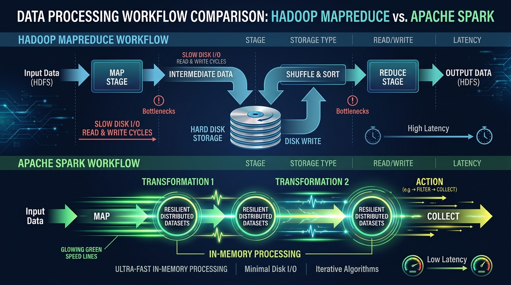
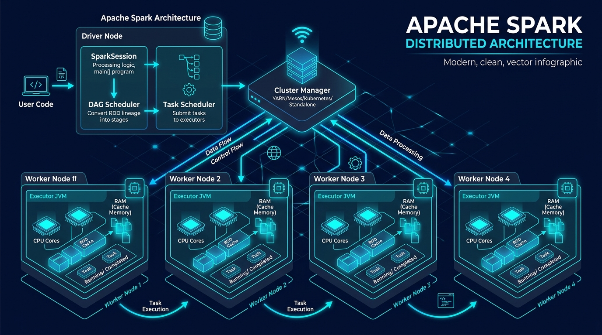
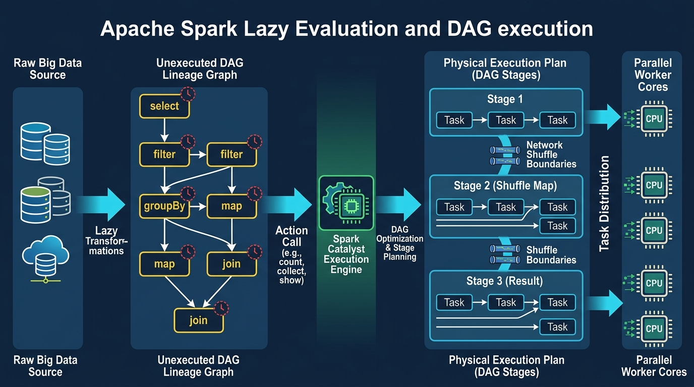

# ⚡ Unit 2: Big Data Processing using PySpark

> **Course Code:** DS-505 | **Subject:** Big Data Handling and Management for Machine Learning Applications  
> **Theory Subject Code:** `2611001305033001` | **Practical Subject Code:** `2611001305033002`  
> **Target Degree:** B.Sc. (Data Science & Analytics) — Semester V (NCrF Credit Level 5.5, 4 Credits)  
> **Institution:** Sutex Bank College of Computer Applications and Science (SBCCAS), Amroli  
> **Affiliation:** Veer Narmad South Gujarat University (VNSGU), Surat, Gujarat, India  
> **Document Purpose:** University Examination Preparation Notes, Practical Lab Manual & Technical Reference  
> **Recommended Technical Stack:** Python 3.10+, Java OpenJDK 8/11/17, Apache Spark 3.4+, PySpark, JupyterLab / Google Colab  
> **Primary References:**  
> • *Learning Spark: Lightning-Fast Data Analytics (2nd Ed.)* — Jules S. Damji, Brooke Wenig, Tathagata Das & Denny Lee (O'Reilly)  
> • *Machine Learning with PySpark* — Tomasz Drabas & Denny Lee (Packt)  
> • *Big Data Analytics with Spark: A Practitioner's Guide* — Mohammed Guller (Apress)  
> • *Hadoop: The Definitive Guide (4th Ed.)* — Tom White (O'Reilly)  
> • *Big Data: Principles and Best Practices of Scalable Systems* — Nathan Marz & James Warren (Manning)  

---

<details open>
<summary><b>📑 Table of Contents & Unit Roadmap (Click to Expand / Collapse)</b></summary>

- [1. Distributed Data Processing Fundamentals](#1-distributed-data-processing-fundamentals)
  - [1.1 Limitations of Traditional Single-Node Computing](#11-limitations-of-traditional-single-node-computing)
  - [1.2 The Distributed Computing Paradigm: Scale-Up vs. Scale-Out](#12-the-distributed-computing-paradigm-scale-up-vs-scale-out)
  - [1.3 The Evolution: Hadoop MapReduce vs. Apache Spark](#13-the-evolution-hadoop-mapreduce-vs-apache-spark)
  - [1.4 What is Apache Spark?](#14-what-is-apache-spark)
- [2. Apache Spark Architecture & Ecosystem](#2-apache-spark-architecture--ecosystem)
  - [2.1 Distributed Master-Worker Architecture Overview](#21-distributed-master-worker-architecture-overview)
  - [2.2 Core Architectural Components](#22-core-architectural-components)
  - [2.3 The Execution Hierarchy: Applications, Jobs, Stages, and Tasks](#23-the-execution-hierarchy-applications-jobs-stages-and-tasks)
  - [2.4 The Unified Apache Spark Ecosystem](#24-the-unified-apache-spark-ecosystem)
- [3. Spark Data Abstractions & Lazy Evaluation Mechanics](#3-spark-data-abstractions--lazy-evaluation-mechanics)
  - [3.1 Evolution of Data Abstractions: RDDs vs. DataFrames vs. Datasets](#31-evolution-of-data-abstractions-rdds-vs-dataframes-vs-datasets)
  - [3.2 The Catalyst Optimizer & Project Tungsten](#32-the-catalyst-optimizer--project-tungsten)
  - [3.3 Lazy Evaluation & Directed Acyclic Graph (DAG)](#33-lazy-evaluation--directed-acyclic-graph-dag)
  - [3.4 Transformations vs. Actions (Narrow vs. Wide Dependencies)](#34-transformations-vs-actions-narrow-vs-wide-dependencies)
  - [3.5 Key Advantages of Apache Spark for Big Data](#35-key-advantages-of-apache-spark-for-big-data)
- [4. Working with PySpark & Environment Setup](#4-working-with-pyspark--environment-setup)
  - [4.1 PySpark Architecture: Python-to-JVM Interoperability (Py4J)](#41-pyspark-architecture-python-to-jvm-interoperability-py4j)
  - [4.2 Environment Installation & Prerequisites](#42-environment-installation--prerequisites)
  - [4.3 Initializing the SparkSession (The Unified Entry Point)](#43-initializing-the-sparksession-the-unified-entry-point)
- [5. Scalable Data Ingestion in PySpark](#5-scalable-data-ingestion-in-pyspark)
  - [5.1 The `DataFrameReader` Pattern](#51-the-dataframereader-pattern)
  - [5.2 Ingesting Delimited Files (CSV) with Schema Enforcement](#52-ingesting-delimited-files-csv-with-schema-enforcement)
  - [5.3 Ingesting Semi-Structured Data (JSON)](#53-ingesting-semi-structured-data-json)
  - [5.4 Ingesting Big Data Columnar Formats (Apache Parquet)](#54-ingesting-big-data-columnar-formats-apache-parquet)
- [6. Practical Commands, Functions & API Mastery (Syllabus Core)](#6-practical-commands-functions--api-mastery-syllabus-core)
  - [6.1 Displaying Data: `df.show()`](#61-displaying-data-dfshow)
  - [6.2 Inspecting Metadata: `df.printSchema()`](#62-inspecting-metadata-dfprintschema)
  - [6.3 Projection & Transformation: `df.select()`](#63-projection--transformation-dfselect)
  - [6.4 Conditional Filtering: `df.filter()` / `df.where()`](#64-conditional-filtering-dffilter--dfwhere)
  - [6.5 Distributed Aggregations: `df.groupBy()`](#65-distributed-aggregations-dfgroupby)
  - [6.6 Cardinality & Record Counting: `df.count()`](#66-cardinality--record-counting-dfcount)
  - [6.7 Comprehensive End-to-End Practical Implementation](#67-comprehensive-end-to-end-practical-implementation)
- [7. Performance Optimization, Best Practices & Memory Management](#7-performance-optimization-best-practices--memory-management)
  - [7.1 Caching and Persistence Strategies (`cache()` vs. `persist()`)](#71-caching-and-persistence-strategies-cache-vs-persist)
  - [7.2 Data Partitioning: `repartition()` vs. `coalesce()`](#72-data-partitioning-repartition-vs-coalesce)
  - [7.3 The Dangers of `toPandas()` and Driver OOM](#73-the-dangers-of-topandas-and-driver-oom)
- [8. Practical Projects, Assignments & University Exam Resources](#8-practical-projects-assignments--university-exam-resources)

</details>

---

# 1. Distributed Data Processing Fundamentals

## 1.1 Limitations of Traditional Single-Node Computing

In Unit 1, we observed that single-node data science environments—primarily utilizing Python with **NumPy** and **Pandas**—operate under a severe architectural constraint: **all data structures and intermediate computations must reside entirely within physical Random Access Memory (RAM).**

When dealing with datasets generated by modern internet platforms, IoT sensor arrays, or financial exchanges (spanning hundreds of gigabytes, terabytes, or petabytes), single-node workstations face insurmountable physical and economic bottlenecks:

```
+---------------------------------------------------------------------------------------------------+
|                        TRADITIONAL SINGLE-NODE BOTTLENECK TAXONOMY                                |
+---------------------------------------------------------------------------------------------------+
| 1. Memory Ceiling (OOM) : Physical motherboard RAM limits (e.g., 16 GB - 64 GB). Datasets       |
|                           exceeding RAM trigger OS paging thrashing or hard process crashes.      |
| 2. CPU Saturation       : Single motherboards cap at a finite number of cores (e.g., 8-32 cores).|
|                           Python GIL (Global Interpreter Lock) restricts multithreaded speed.    |
| 3. Storage I/O Limit    : Reading 500 GB from a local NVMe/SSD at 2 GB/s still takes minutes      |
|                           before a single arithmetic operation can commence.                      |
| 4. Single Point of Fault: If the workstation OS crashes or loses power at 99% of training,        |
|                           the entire computation state is permanently lost.                       |
+---------------------------------------------------------------------------------------------------+
```

---

## 1.2 The Distributed Computing Paradigm: Scale-Up vs. Scale-Out

To overcome the physical boundaries of single machines, computer scientists and data engineers rely on two fundamental scaling philosophies:

```
        SCALE-UP (Vertical Scaling)                     SCALE-OUT (Horizontal Scaling)
      "Buy a bigger, costlier server"              "Connect many commodity servers in parallel"
             +---------------+                        +-------+   +-------+   +-------+
             |   SUPER-      |                        | Node1 |---| Node2 |---| Node3 |
             |   SERVER      |                        +-------+   +-------+   +-------+
             | 128 Cores     |                            |           |           |
             | 1.5 TB RAM    |                        +-------+   +-------+   +-------+
             | $$$$$$ Cost   |                        | Node4 |---| Node5 |---| NodeN |
             +---------------+                        +-------+   +-------+   +-------+
       Physical ceiling reached quickly!           Infinite elastic capacity via network!
```

### 📊 Comparative Analysis: Scale-Up vs. Scale-Out

| Evaluation Criterion | Vertical Scaling (Scale-Up) | Horizontal Scaling (Scale-Out) |
| :--- | :--- | :--- |
| **Architectural Concept** | Adding more RAM, faster CPUs, or GPUs to an existing single machine. | Connecting multiple discrete, commodity computers into a unified network cluster. |
| **Hardware Cost Curve** | **Exponential**: High-end enterprise multi-socket servers cost 10x–50x more for incremental gains. | **Linear**: Adding 10 affordable commodity workstations doubles capacity at predictable linear cost. |
| **Maximum Ceiling** | **Hard physical limit**: Motherboard architecture caps RAM slots and bus bandwidth. | **Virtually unlimited**: Cloud clusters can dynamically scale from 10 to 10,000+ nodes. |
| **Fault Tolerance** | **Zero / Low**: If the hardware motherboards fail, the entire system goes offline (Single Point of Failure). | **Native & Automatic**: If worker node #4 crashes, remaining nodes automatically replay lost tasks. |
| **Software Complexity** | Low: Standard single-node Python/Pandas scripts run without distributed coordination logic. | High: Requires distributed orchestration engines (**Apache Spark, Hadoop YARN**) to split data. |
| **Typical Use Case** | Small-to-medium analytical workloads (< 32 GB), departmental SQL databases. | Massive Machine Learning, Petabyte-scale Data Lakehouses, Web-scale log streaming. |

---

## 1.3 The Evolution: Hadoop MapReduce vs. Apache Spark

Distributed computing became widely accessible in 2004 when Google published its seminal paper on **MapReduce**, subsequently open-sourced by the Apache Foundation as **Apache Hadoop**.

However, Hadoop MapReduce suffered from a profound hardware inefficiency: **Disk I/O Latency**.

```
Hadoop MapReduce Paradigm:
[Storage: HDFS] ➔ READ ➔ [Map Task] ➔ WRITE DISK ➔ SHUFFLE OVER NETWORK ➔ READ DISK ➔ [Reduce Task] ➔ WRITE DISK [HDFS]
                                          ▲                                               ▲
                                          |--------- MASSIVE DISK I/O BOTTLENECK ---------|
```

In 2009, researchers at UC Berkeley’s AMPLab (led by Matei Zaharia) recognized that RAM prices had dropped dramatically. They designed **Apache Spark** around a revolutionary principle: **In-Memory Distributed Computation via Resilient Distributed Datasets (RDDs).**

Instead of persisting intermediate states to physical hard drives between processing stages, Spark retains transformed datasets across distributed cluster RAM.

---

### 🖼️ Visual Architecture: MapReduce vs. Apache Spark Workflow



> [!TIP]
> **🎨 AI Image Generation Prompt (For GPT / DALL-E Uniform Aesthetics):**
> ```text
> High-tech comparison infographic diagram comparing Hadoop MapReduce vs Apache Spark data processing workflow. Top lane shows MapReduce with slow disk IO read and write cycles to Hard Disk storage between map and reduce stages. Bottom lane shows Apache Spark with ultra-fast in-memory processing pipeline with resilient distributed memory and glowing green speed lines. Dark navy blue background, modern minimalist enterprise data architecture visualization, clean vector graphics, highly readable typography.
> ```

---

### ⚖️ Architectural Head-to-Head Comparison

| Feature Dimension | Apache Hadoop MapReduce | Apache Spark |
| :--- | :--- | :--- |
| **Primary Storage Layer** | Hard Disk Drive (HDD / SSD via HDFS). | Dynamic In-Memory RAM (spills to disk only if memory is exhausted). |
| **Execution Speed** | Moderate for batch jobs; slow for iterative algorithms. | **Up to 100x faster in RAM**, 10x faster on physical disk. |
| **Iterative / ML Workloads** | **Extremely inefficient**: Every ML iteration (e.g., gradient descent) must read and write full state to disk. | **Ultra-efficient**: Iteration states remain pinned in RAM across training epochs. |
| **Execution Model** | Strict 2-phase pipeline: Map followed by Reduce. | **Directed Acyclic Graph (DAG)**: Arbitrary multi-stage execution pipelines. |
| **Data Abstraction** | Key-Value pairs (`K1, V1 ➔ List(K2, V2)`). | High-level **DataFrames**, **Datasets**, and **RDDs**. |
| **API Usability** | Verbose Java boilerplate; steep learning curve. | Concise, expressive APIs in **Python (PySpark)**, SQL, Scala, and R. |

---

## 1.4 What is Apache Spark?

> ### 🎯 Authoritative Academic Definition (For University Examinations)
> **Apache Spark** is an open-source, distributed, general-purpose computing system designed for high-performance, large-scale data processing and analytics. It provides a unified engine for batch processing, real-time streaming, interactive SQL queries, graph processing, and distributed machine learning, utilizing in-memory execution and Directed Acyclic Graph (DAG) scheduling.

### 💡 Intuitive Student Analogy: The Single Chef vs. The Coordinated Commercial Kitchen

* **Pandas / Single-Node Python = One Master Chef in a Home Kitchen:**  
  The chef is skilled and fast, but has only two hands (CPU cores) and one cutting board (RAM). If an order comes in for 5,000 banquet dishes, the kitchen is paralyzed, and dishes spill onto the floor (Out-of-Memory error).
* **Hadoop MapReduce = Traditional Factory Assembly Line:**  
  Dozens of workers chop vegetables, but after every single vegetable is cut, they must walk across the room, pack it into a wooden crate on a shelf (Disk Write), take a rest, unpack the crate (Disk Read), and then boil it. It is reliable, but exhausting and slow.
* **Apache Spark = High-Tech Commercial Kitchen with Conveyor Trays:**  
  A head coordinator (**Driver**) directs dozens of cooks (**Worker Nodes**). Chopped ingredients are passed directly hand-to-hand across clean counter space (**RAM Cache**) in a synchronized sequence (**DAG Execution**). Crates on shelves are only touched when dishes are ready for final delivery!

---

# 2. Apache Spark Architecture & Ecosystem

## 2.1 Distributed Master-Worker Architecture Overview

Apache Spark employs a centralized **Master-Worker (Leader-Follower)** distributed architecture. The physical and logical infrastructure is separated into three distinct entities:

1. **The Driver Node (The Brain)**
2. **The Cluster Manager (The Resource Allocator)**
3. **The Worker Nodes & Executors (The Muscle)**

---

### 🖼️ Visual Architecture: Apache Spark Distributed Architecture



> [!TIP]
> **🎨 AI Image Generation Prompt (For GPT / DALL-E Uniform Aesthetics):**
> ```text
> Modern technical infographic diagram of Apache Spark distributed architecture on dark navy background. Showing Driver Node with SparkSession and DAG Scheduler connected via Cluster Manager to multiple Worker Nodes. Each Worker Node contains an Executor JVM running CPU cores, RAM cache memory, and tasks. Clean high-tech vector aesthetic, glowing neon cyan and electric blue accents, professional IT system architecture diagram, sharp lines, isometric nodes, ultra-detailed, vector art style.
> ```

---

## 2.2 Core Architectural Components

### 1. The Driver Program
The **Driver** is the process that hosts the application's `main()` function and instantiates the `SparkSession`. It acts as the central brain of the entire computation.
* **Responsibilities:**
  * Analyzes user code (Python/PySpark).
  * Converts high-level user commands into a logical **Directed Acyclic Graph (DAG)** of transformations.
  * Disassembles the DAG into physical **Stages** and **Tasks** via the `DAGScheduler` and `TaskScheduler`.
  * Communicates with the Cluster Manager to request compute resources (CPU cores and RAM).
  * Distributes individual tasks to worker executors across the cluster network.
  * Collects final summary results (e.g., when `count()` or `show()` is called) and displays them to the user.

> [!WARNING]
> **Exam Alert:** The Driver does not perform heavy row-by-row data computations. If a student pulls 100 million records to the driver using `.collect()` or `.toPandas()`, the Driver process will crash with an out-of-memory error!

---

### 2. The Cluster Manager
The **Cluster Manager** is the external orchestrator responsible for acquiring, managing, and relinquishing physical resources across the physical cluster machines. Spark is agnostic to the underlying cluster manager:
* **Spark Standalone:** Spark’s built-in, native cluster manager included out of the box. Simple to set up on private servers.
* **Apache YARN (Yet Another Resource Negotiator):** The default resource manager of Hadoop ecosystems. Allows Spark to share enterprise cluster resources with MapReduce and Hive.
* **Kubernetes (K8s):** Modern container-orchestrated cluster manager. Allows Spark executors to run as elastic Docker containers in modern cloud environments (AWS EKS, Google Cloud GKE, Azure AKS).
* **Apache Mesos:** A legacy distributed systems kernel (deprecated in recent Spark versions).
* **Local Mode (`local[*]`):** Runs the Driver, Cluster Manager, and Executors all within a single computer’s JVM using multithreading. **Used extensively in college labs, development workstations, and Google Colab.**

---

### 3. Worker Nodes
A **Worker Node** is a physical or virtual machine within the cluster network that provides compute and storage resources. It runs a lightweight daemon service that listens to the Cluster Manager and launches executor processes upon command.

---

### 4. Executors
An **Executor** is a dedicated **Java Virtual Machine (JVM)** process launched on a worker node specifically for your Spark application.
* **Lifecycle:** Executors live for the exact duration of the Spark application.
* **Responsibilities:**
  * Runs the individual computational **Tasks** assigned by the Driver.
  * Stores cached partitions in volatile RAM or local storage (**In-Memory Storage Layer**).
  * Returns computation status (Success/Failure) and execution metrics back to the Driver.
  * Writes shuffle output files to local disk when wide transformations occur.

---

## 2.3 The Execution Hierarchy: Applications, Jobs, Stages, and Tasks

Understanding how Spark decomposes high-level Python code into hardware instructions is essential for both theory examinations and performance tuning:

```
[Spark Application]
       │
       ▼ (Triggered by an Action: e.g., df.count())
   [Spark Job]
       │
       ▼ (Split at Shuffle Boundaries: e.g., groupBy, join)
   [Stages] (Stage 0, Stage 1, ...)
       │
       ▼ (One Task per Data Partition)
    [Tasks] ➔ Dispatched to individual CPU Cores inside Worker Executors
```

1. **Application:** The complete program defined by a user's script or notebook, initiated by a single `SparkSession`.
2. **Job:** A parallel computation triggered whenever an **Action** (e.g., `count()`, `show()`, `collect()`, `write()`) is encountered in the code. A single application can execute multiple jobs.
3. **Stage:** Each Job is broken down by the `DAGScheduler` into **Stages**. A stage boundary occurs whenever data needs to be redistributed across the network (**Shuffle Boundary**, caused by operations like `groupBy()`, `join()`, `distinct()`). Transformations within the same stage are pipelined together into memory without network transfers.
4. **Task:** The smallest individual unit of work in Spark. A task represents the execution of a stage's computational pipeline on a **single partition of data** running on a single CPU core.

---

## 2.4 The Unified Apache Spark Ecosystem

Apache Spark is not merely a compute engine; it is a unified analytics platform consisting of five integrated modules built on top of the underlying **Spark Core**:

```
+-----------------------------------------------------------------------------------+
|                        APACHE SPARK UNIFIED ECOSYSTEM                             |
+-------------------+--------------------+--------------------+---------------------+
|     Spark SQL     |  Spark Streaming   |    Spark MLlib     |       GraphX        |
| Structured Tables | Structured Streams | Distributed Machine| Distributed Graph   |
| & DataFrames      | Real-Time Windows  | Learning Pipelines | Processing Engine   |
+-------------------+--------------------+--------------------+---------------------+
|                                   SPARK CORE                                      |
|   Memory Management, Fault Tolerance, Task Scheduling, Distributed Storage I/O    |
+-----------------------------------------------------------------------------------+
|                     CLUSTER RESOURCE MANAGERS (PLUGGABLE)                         |
|   Standalone Cluster   |   Apache YARN   |   Kubernetes (K8s)   |   Local Mode    |
+-----------------------------------------------------------------------------------+
```

* **Spark Core:** Provides memory management, task scheduling, fault recovery, and distributed I/O primitives.
* **Spark SQL & DataFrames:** Provides schema-aware data abstractions, SQL syntax, and the **Catalyst Optimizer** for high-performance tabular querying.
* **Spark Streaming / Structured Streaming:** Processes live, real-time data feeds (from Apache Kafka, AWS Kinesis, or TCP sockets) using micro-batching and low-latency continuous engines.
* **MLlib (Machine Learning Library):** High-level distributed algorithms for classification, regression, clustering, collaborative filtering, dimensionality reduction, and ML pipelines.
* **GraphX:** Graph processing framework for computing graph algorithms (PageRank, Triangle Counting, Connected Components) over graph structures.

---

# 3. Spark Data Abstractions & Lazy Evaluation Mechanics

## 3.1 Evolution of Data Abstractions: RDDs vs. DataFrames vs. Datasets

Over its major releases, Apache Spark evolved its core data representation to maximize both developer productivity and execution efficiency:

```
SPARK 1.0 (2014)               SPARK 1.3 - 2.0 (2015-2016)              SPARK 2.0+ (Unified API)
Resilient Distributed Datasets            Spark DataFrames                         Datasets / DataFrames
       (RDD)                      (Schema-aware Tabular Data)                (Strong Typing + Catalyst)
Low-level functional lambdas       SQL-like columns & Catalyst               Unified API for Scala/Java/Python
No schema awareness                Optimized C-speed bytecode                DataFrames = Dataset[Row]
```

### 📋 Abstraction Comparison Table

| Attribute | Resilient Distributed Dataset (RDD) | Spark DataFrame (PySpark Focus) | Spark Dataset (Scala/Java) |
| :--- | :--- | :--- | :--- |
| **Data Format** | Unstructured JVM Java/Python objects. | Organized into named columns (like an RDBMS table). | Strongly typed domain objects (`Dataset[T]`). |
| **Schema Awareness** | **No**: Spark does not know the internal fields or datatypes inside objects. | **Yes**: Strict schema (`StructType`) with explicit column types. | **Yes**: Defined by case classes or Java Beans. |
| **Optimization Engine**| None: Executes user code exactly as written, flaws and all. | **Catalyst Optimizer & Project Tungsten** generate optimized C-speed code. | Catalyst Optimizer & Project Tungsten. |
| **Memory Efficiency** | High Java object serialization overhead; heavy Garbage Collection (GC). | **Off-Heap Tungsten Format**: Compact binary representation; zero GC overhead. | Compact binary representation. |
| **Type Safety** | Compile-time safety (in Scala/Java). | Runtime safety (untyped in Python). | Compile-time safety. |
| **Target Audience** | Low-level system developers needing manual partitioning. | **Data Scientists, ML Engineers, Big Data Analysts (Syllabus Standard).** | Enterprise Scala/Java engineers. |

---

## 3.2 The Catalyst Optimizer & Project Tungsten

The primary reason **PySpark DataFrames** run at the same blazing speed as native Scala code is the **Catalyst Optimizer**.

When a user writes PySpark code, Catalyst intercepts the instructions and transforms them through four rigorous optimization phases:

```
[User Code: PySpark DataFrame Operations]
                   │
                   ▼
       1. Unresolved Logical Plan (Validates table & column names against Catalog)
                   │
                   ▼
       2. Resolved Logical Plan
                   │
                   ▼
       3. Optimized Logical Plan (Applies Rule-Based Transformations)
          • Predicate Pushdown : Filters rows at the storage source before reading into RAM.
          • Projection Pruning : Loads only requested columns; discards unused columns.
                   │
                   ▼
       4. Physical Plans (Generates multiple strategies: Hash Join vs Broadcast Join)
                   │
                   ▼
       5. Cost-Based Model (Selects lowest CPU / Network IO cost plan)
                   │
                   ▼
       [Project Tungsten Whole-Stage Code Generation]
       (Compiles pipeline into optimized Java bytecode running directly on CPU registers!)
```

---

## 3.3 Lazy Evaluation & Directed Acyclic Graph (DAG)

One of the most foundational principles of Apache Spark—frequently tested in university theory exams and technical interviews—is **Lazy Evaluation**.

> ### 💡 Concept Definition: Lazy Evaluation
> In Apache Spark, **Lazy Evaluation** means that execution does not start when transformations are defined. Instead, Spark records each transformation as a symbolic node in an internal lineage graph called a **Directed Acyclic Graph (DAG)**. Spark defers all physical execution until an **Action** is explicitly invoked.

```
       DIRECTED ACYCLIC GRAPH (DAG) PROPERTIES:
       • Directed : Operations move strictly forward in one direction (Lineage).
       • Acyclic  : There are NO loops or cyclic dependencies in the graph.
       • Graph    : Composed of vertices (data states) and edges (transformations).
```

### Why is Lazy Evaluation a Game-Changer for Big Data?
1. **Global Query Optimization:** If Spark executed immediately on every line (like standard Python), it would load 100 GB of data even if the user only wanted the first 10 rows on line 5. By waiting, Catalyst sees the whole pipeline and pushes the filter straight to the storage layer (**Predicate Pushdown**).
2. **Elimination of Intermediate Storage:** Multiple operations (e.g., `filter()`, `select()`, `map()`) are merged into a single pass over the data in memory.
3. **Resilient Fault Tolerance:** If a worker node explodes during computation, Spark doesn't need to restart from scratch. It simply consults the DAG lineage graph and re-computes only the specific missing data partition on a healthy worker!

---

### 🖼️ Visual Architecture: Lazy Evaluation & DAG Pipeline



> [!TIP]
> **🎨 AI Image Generation Prompt (For GPT / DALL-E Uniform Aesthetics):**
> ```text
> Technical flowchart diagram illustrating Apache Spark Lazy Evaluation and Directed Acyclic Graph (DAG) execution. From left to right: Raw Big Data source -> Lazy Transformations (select, filter, groupBy) constructing an unexecuted DAG Lineage Graph -> Action call (count, show) triggering the Catalyst Execution Engine -> DAG broken down into Stages across network shuffle boundaries -> Tasks distributed to parallel worker cores. Dark blue theme, vibrant cyan, yellow, and green accents, clean software engineering vector diagram, high resolution, sharp labels.
> ```

---

## 3.4 Transformations vs. Actions (Narrow vs. Wide Dependencies)

Every method in the PySpark DataFrame API falls strictly into one of two operational categories:

```
                             SPARK OPERATIONS
                                    │
         ┌──────────────────────────┴──────────────────────────┐
         ▼                                                     ▼
  TRANSFORMATIONS (Lazy)                               ACTIONS (Eager)
  • Returns a new DataFrame.                           • Returns a non-DataFrame value
  • Does NOT trigger cluster compute.                    (integer, list, schema, or disk file).
  • Builds the DAG Lineage Graph.                      • Triggers physical cluster execution!
  • Examples: select(), filter(), groupBy()            • Examples: show(), count(), collect()
         │
         ├──► Narrow Dependencies (No shuffle: map, filter, select)
         └──► Wide Dependencies   (Requires network Shuffle: groupBy, join, distinct)
```

### 1. Transformations: Narrow vs. Wide Dependencies

* **Narrow Dependency (Fast, Local):**  
  Each partition of the parent DataFrame is used by **at most one** partition of the child DataFrame. The computation occurs strictly within local executor memory without transferring bytes over the network network.  
  *Examples:* `select()`, `filter()`, `drop()`, `withColumn()`.
* **Wide Dependency (Slow, Network Shuffle):**  
  Multiple child partitions depend on data distributed across multiple parent partitions. Spark must perform a **Shuffle**—writing data to local disk, sorting keys, and transferring records over the cluster network to group matching keys together.  
  *Examples:* `groupBy()`, `join()`, `distinct()`, `orderBy()`.

---

### 📋 Master Summary: Transformations vs. Actions

| Operation Type | Method Name | Operational Nature | Dependency Type | Trigger Execution? |
| :--- | :--- | :--- | :--- | :---: |
| **Transformation** | `df.select()` | Column projection | **Narrow** | ❌ No |
| **Transformation** | `df.filter()` / `df.where()` | Row filtering | **Narrow** | ❌ No |
| **Transformation** | `df.drop()` | Column removal | **Narrow** | ❌ No |
| **Transformation** | `df.groupBy()` | Key-based grouping | **Wide (Shuffle)** | ❌ No |
| **Transformation** | `df.orderBy()` / `df.sort()` | Global sorting | **Wide (Shuffle)** | ❌ No |
| **Transformation** | `df.distinct()` | Duplicate elimination | **Wide (Shuffle)** | ❌ No |
| **Action** | `df.show()` | Tabular console display | N/A | **✅ YES** |
| **Action** | `df.count()` | Cardinality integer return | N/A | **✅ YES** |
| **Action** | `df.first()` / `df.take(n)` | Row object array return | N/A | **✅ YES** |
| **Action** | `df.collect()` | Returns all rows to Driver | N/A | **✅ YES** |
| **Action** | `df.write.parquet()` | Physical persistence to disk | N/A | **✅ YES** |

---

## 3.5 Key Advantages of Apache Spark for Big Data

1. **In-Memory Computational Speed:** Up to 100x faster than Hadoop MapReduce due to reduced disk read/write cycles.
2. **Unified Single Platform:** Unifies SQL querying, streaming ingestion, machine learning, and graph algorithms under a consistent DataFrame API.
3. **Lazy Evaluation & Intelligent Optimization:** Uses the Catalyst query optimizer and Tungsten off-heap code generation to maximize CPU pipeline throughput.
4. **Resilient Fault Tolerance:** Automatically recovers lost partitions using lineage tracking without requiring duplicate physical disk backups.
5. **Polyglot Developer Support:** Write native logic in **Python (PySpark)**, SQL, Scala, Java, or R.

---

# 4. Working with PySpark & Environment Setup

## 4.1 PySpark Architecture: Python-to-JVM Interoperability (Py4J)

Because Apache Spark is natively written in **Scala** and runs on the **Java Virtual Machine (JVM)**, running Spark from Python requires a high-performance cross-language bridge.

PySpark accomplishes this through a specialized library called **Py4J**:

```
+-----------------------------------------------------------------------------------+
|                        PYSPARK ARCHITECTURE VIA PY4J                              |
+-----------------------------------------------------------------------------------+
|  [ PYTHON DRIVER PROCESS ]                                                        |
|  User writes: df = spark.read.csv("data.csv")                                     |
|         │                                                                         |
|         ▼ (Py4J Network Gateway: TCP Socket on localhost)                         |
|  [ JVM DRIVER PROCESS (SparkSession) ]                                            |
|  Creates JavaSparkContext, DAGScheduler, TaskScheduler, Catalyst Optimizer        |
|         │                                                                         |
|         ▼ (Cluster Network RPC)                                                   |
|  [ WORKER NODE EXECUTORS (JVM) ]                                                  |
|  Executes Spark SQL / Tungsten bytecodes directly at C/Java speed!                |
+-----------------------------------------------------------------------------------+
```

> [!NOTE]
> When using the modern **PySpark DataFrame API**, Python code simply issues instructions to the JVM Catalyst Optimizer. The actual data processing occurs inside the JVM in off-heap memory. Therefore, PySpark DataFrames achieve **near-identical execution speed** to native Scala!

---

## 4.2 Environment Installation & Prerequisites

To practice PySpark in a local development environment (Windows / macOS / Linux) or college laboratory:

### Prerequisites:
1. **Python 3.8 to 3.11** installed and verified.
2. **Java Development Kit (JDK 8, 11, or 17)**: Spark requires a 64-bit Java runtime. Set `JAVA_HOME` in system environment variables.

### Terminal Installation via `pip`:
```bash
# 1. Install PySpark and essential companion libraries
pip install pyspark findspark pandas pyarrow

# 2. Verify installation in Python shell
python -c "import pyspark; print('PySpark Version:', pyspark.__version__)"
```

---

## 4.3 Initializing the SparkSession (The Unified Entry Point)

In Spark 1.x, developers had to manage multiple disparate contexts: `SparkContext` (for core RDDs), `SQLContext` (for SQL tables), and `HiveContext`.

Starting in Spark 2.0 and carried forward into Spark 3.x, everything is unified under a single, elegant entry point: the **`SparkSession`**, constructed using the **Builder Pattern**.

```python
# ==============================================================================
# SCRIPT: Initializing an Enterprise PySpark SparkSession
# ==============================================================================
from pyspark.sql import SparkSession

# Build the unified SparkSession
spark = SparkSession.builder \
    .appName("DS505_Unit2_BigDataProcessing") \
    .master("local[*]") \
    .config("spark.driver.memory", "4g") \
    .config("spark.sql.shuffle.partitions", "4") \
    .getOrCreate()

# Verify cluster connection
print(f"Spark Version     : {spark.version}")
print(f"Application Name  : {spark.sparkContext.appName}")
print(f"Master Node       : {spark.sparkContext.master}")
print(f"Active Web UI URL : {spark.sparkContext.uiWebUrl}")
```

### 🔍 Anatomy of Configuration Options:
* `.appName("...")`: Assigns a human-readable identifier visible in logs and the Spark Web UI.
* `.master("local[*]")`: Specifies the cluster location. `local[*]` instructs Spark to run locally on your machine, spawning worker threads equal to the number of logical CPU cores available. In a production cloud cluster, this would point to `yarn` or `k8s://https://cluster-ip:443`.
* `.config("spark.driver.memory", "4g")`: Allocates 4 Gigabytes of heap memory to the Driver process.
* `.config("spark.sql.shuffle.partitions", "4")`: Controls the number of partitions created during wide shuffle operations. (Default in production is 200; for local laptops, setting this to 4 or 8 prevents excessive partition overhead).
* `.getOrCreate()`: Retrieves an existing active session if one exists, or instantiates a new one.

---

# 5. Scalable Data Ingestion in PySpark

## 5.1 The `DataFrameReader` Pattern

All data ingestion in PySpark follows a unified, standardized syntax provided by the `DataFrameReader` interface:

$$\text{DataFrame} = \text{spark.read.format(}\dots\text{).option(}\dots\text{).load(}\dots\text{)}$$

PySpark natively provides convenient reader shortcuts for all major industry data formats:
* `spark.read.csv("path")`
* `spark.read.json("path")`
* `spark.read.parquet("path")`
* `spark.read.table("hive_table")`
* `spark.read.jdbc("url", "table", properties)`

---

## 5.2 Ingesting Delimited Files (CSV) with Schema Enforcement

While PySpark can automatically infer datatypes using `inferSchema=True`, doing so on massive multi-gigabyte datasets is an **anti-pattern** in production. Schema inference requires Spark to read the entire dataset twice: once to guess data types, and once to load the data.

The industry-standard best practice is **explicit programmatic schema definition** using `StructType` and `StructField`.

```python
from pyspark.sql.types import (
    StructType, StructField, 
    IntegerType, StringType, DoubleType, TimestampType
)

# 1. Define explicit programmatic schema (Zero overhead, 100% type-safe)
customer_schema = StructType([
    StructField("customer_id", IntegerType(), nullable=False),
    StructField("customer_name", StringType(), nullable=True),
    StructField("account_balance", DoubleType(), nullable=True),
    StructField("city", StringType(), nullable=True)
])

# 2. Ingest CSV using explicit schema
df_customers = spark.read \
    .format("csv") \
    .option("header", "true") \
    .schema(customer_schema) \
    .load("data/customers.csv")
```

---

## 5.3 Ingesting Semi-Structured Data (JSON)

JSON is ubiquitous in web APIs, IoT telematics, and NoSQL databases. PySpark natively parses both single-line and multi-line JSON datasets:

```python
# Reading standard newline-delimited JSON (NDJSON / JSON Lines)
df_events = spark.read.json("data/telemetry_events.json")

# Reading pretty-printed, nested multiline JSON files
df_nested = spark.read \
    .option("multiline", "true") \
    .json("data/nested_config.json")
```

---

## 5.4 Ingesting Big Data Columnar Formats (Apache Parquet)

> [!IMPORTANT]
> **Apache Parquet** is the premier, gold-standard file format used across Big Data engineering and Machine Learning pipelines.

### Why Parquet Dominates CSV in Big Data:
1. **Columnar Storage:** Data is stored vertically by column rather than horizontally by row. If a query only accesses 2 columns out of 50, Spark physically skips reading the remaining 48 columns from disk (**Projection Pruning**).
2. **Built-in Snappy Compression:** Compresses file size by up to 75% compared to raw text CSV.
3. **Self-Describing Metadata:** Schema, column datatypes, and statistics (min, max, count) are embedded directly in the file footer. Spark does not need to scan records to determine types.
4. **Statistics-Based Data Skipping:** Spark checks file footer min/max values and skips entire file blocks if they do not match the `WHERE` clause.

```python
# Reading Parquet files (Schema and types are automatically loaded instantly)
df_parquet = spark.read.parquet("data/transactions.parquet")
```

---

# 6. Practical Commands, Functions & API Mastery (Syllabus Core)

The DS-505 syllabus explicitly mandates that students achieve practical, hands-on mastery over six essential PySpark DataFrame functions:

$$\mathbf{df.show()} \quad \bullet \quad \mathbf{df.printSchema()} \quad \bullet \quad \mathbf{df.select()} \quad \bullet \quad \mathbf{df.filter()} \quad \bullet \quad \mathbf{df.groupBy()} \quad \bullet \quad \mathbf{df.count()}$$

Let us analyze each function in rigorous detail, exploring their syntax, parameters, operational classifications, and underlying distributed execution mechanics.

---

## 6.1 Displaying Data: `df.show()`

* **API Classification:** **Action** (Triggers immediate cluster execution).
* **Purpose:** Renders the contents of a DataFrame to the console in a cleanly aligned tabular format.

### 📝 Method Signature & Parameters:
```python
df.show(n=20, truncate=True, vertical=False)
```
* `n` *(int, default=20)*: The number of rows to retrieve and print.
* `truncate` *(bool or int, default=True)*: If `True`, strings longer than 20 characters are truncated with `...`. If an integer is passed (e.g., `truncate=50`), strings are truncated at that character length. If `False`, full strings are shown.
* `vertical` *(bool, default=False)*: If `True`, prints records vertically (one record per block), highly useful when inspecting tables with 30+ columns.

### 💻 Code Example:
```python
# Display top 5 rows without truncating long text strings
df.show(5, truncate=False)

# Display top 2 rows in vertical record mode
df.show(2, vertical=True)
```

---

## 6.2 Inspecting Metadata: `df.printSchema()`

* **API Classification:** **Utility / Metadata Inspection** (Does not trigger an RDD compute job; reads cached catalog schema).
* **Purpose:** Outputs the structural schema of the DataFrame to the console in a clean, human-readable tree hierarchy, detailing column names, datatypes, and nullability flags.

### 💻 Code Example & Output:
```python
df.printSchema()
```
```text
root
 |-- transaction_id: string (nullable = true)
 |-- customer_id: integer (nullable = false)
 |-- transaction_amount: double (nullable = true)
 |-- category: string (nullable = true)
 |-- transaction_timestamp: timestamp (nullable = true)
```

---

## 6.3 Projection & Transformation: `df.select()`

* **API Classification:** **Transformation (Narrow Dependency - Zero Network Shuffle)**.
* **Purpose:** Projects a subset of columns from the DataFrame, computes new derived columns, or applies transformations to existing columns. Similar to the `SELECT` clause in SQL.

### 💻 Code Variations:
```python
from pyspark.sql.functions import col, upper

# Variation 1: Select using string column names
df_sub = df.select("transaction_id", "transaction_amount")

# Variation 2: Select using the programmatic col() construct (Enables chaining methods)
df_sub = df.select(col("customer_id"), col("transaction_amount"))

# Variation 3: Compute derived columns and assign aliases
df_transformed = df.select(
    col("customer_id"),
    upper(col("category")).alias("category_uppercase"),
    (col("transaction_amount") * 1.18).alias("amount_with_18pct_gst")
)
```

---

## 6.4 Conditional Filtering: `df.filter()` / `df.where()`

* **API Classification:** **Transformation (Narrow Dependency - Zero Network Shuffle)**.
* **Purpose:** Filters rows based on a given conditional expression. Only rows where the condition evaluates to `True` are retained.
* **Note:** `df.where()` is an exact functional alias of `df.filter()`, provided so SQL developers feel right at home.

### 💻 Code Variations:
```python
# Approach A: Using SQL Expression String syntax
df_filtered = df.filter("transaction_amount > 1000.0 AND category = 'Electronics'")

# Approach B: Using Pythonic Column Operators (Note: MUST use bitwise operators &, |, ~)
# IMPORTANT: Each individual condition must be enclosed in parentheses!
df_filtered = df.filter(
    (col("transaction_amount") > 1000.0) & (col("category") == "Electronics")
)

# Approach C: Filtering null values
df_clean = df.filter(col("transaction_amount").isNotNull())
```

---

## 6.5 Distributed Aggregations: `df.groupBy()`

* **API Classification:** **Transformation (Wide Dependency - Triggers a Cluster Network Shuffle)**.
* **Purpose:** Groups the DataFrame using specified columns so that aggregate computations (such as count, sum, average, minimum, maximum) can be performed across each group.

```
Distributed GroupBy Execution (The Shuffle):
Worker 1: [Electronics: $100], [Groceries: $20]  ──┐
                                                  ├──► SHUFFLE OVER NETWORK ──► Reducer 1: All Electronics
Worker 2: [Groceries: $50],   [Electronics: $300] ──┘                         ──► Reducer 2: All Groceries
```

### 💻 Code Variations:
```python
from pyspark.sql.functions import sum, avg, max, min, count

# 1. Simple shorthand aggregation
df_category_totals = df.groupBy("category").sum("transaction_amount")

# 2. Comprehensive multi-metric aggregation using .agg()
df_summary = df.groupBy("category").agg(
    count("transaction_id").alias("total_orders"),
    sum("transaction_amount").alias("gross_revenue"),
    avg("transaction_amount").alias("average_order_value"),
    max("transaction_amount").alias("highest_ticket"),
    min("transaction_amount").alias("lowest_ticket")
)

# 3. Grouping by multiple columns
df_multi_group = df.groupBy("category", "payment_mode").agg(sum("transaction_amount"))
```

---

## 6.6 Cardinality & Record Counting: `df.count()`

* **API Classification:** **Action** (Triggers immediate cluster execution across all partitions).
* **Purpose:** Computes and returns the total number of rows in the DataFrame as a native Python 64-bit integer.

### 💡 Distributed Execution Detail:
Unlike single-node Python where `len(df)` checks an in-memory counter, PySpark's `df.count()` assigns parallel counting tasks to all worker executors. Each executor counts the records in its local partitions, transmits the local tally back to the Driver, and the Driver sums the tallies.

```python
# Trigger distributed count
total_transactions = df.count()
print(f"Total Transactions in Big Data Table: {total_transactions:,}")
```

> [!CAUTION]
> In PySpark, calling `len(df)` causes a Python TypeError (`object of type 'DataFrame' has no len()`). Always use `df.count()`!

---

## 6.7 Comprehensive End-to-End Practical Implementation

Below is a self-contained, fully executable PySpark script demonstrating the complete lifecycle: session creation, synthetic big data generation, and the coordinated execution of all six syllabus operations.

```python
# ==============================================================================
# SUTEX BANK COLLEGE OF COMPUTER APPLICATIONS & SCIENCE (SBCCAS)
# SUBJECT: DS-505 Big Data Handling and Management for Machine Learning Applications
# UNIT 2 PRACTICAL DEMONSTRATION: Core PySpark DataFrame Operations
# ==============================================================================

import os
from pyspark.sql import SparkSession
from pyspark.sql.types import (
    StructType, StructField, 
    IntegerType, StringType, DoubleType
)
from pyspark.sql.functions import col, sum, avg, count, round

def main():
    print(">>> 1. Initializing Distributed SparkSession...")
    spark = SparkSession.builder \
        .appName("DS505_Unit2_Mastery") \
        .master("local[*]") \
        .config("spark.sql.shuffle.partitions", "2") \
        .getOrCreate()
    
    # Suppress verbose JVM informational logs
    spark.sparkContext.setLogLevel("WARN")

    print("\n>>> 2. Defining Explicit Schema & Creating Synthetic Big Dataset...")
    schema = StructType([
        StructField("order_id", IntegerType(), False),
        StructField("customer_name", StringType(), True),
        StructField("city", StringType(), True),
        StructField("category", StringType(), True),
        StructField("amount", DoubleType(), True)
    ])

    raw_data = [
        (1001, "Aarav Patel",   "Surat",     "Electronics", 45000.0),
        (1002, "Diya Sharma",   "Ahmedabad", "Groceries",    2300.0),
        (1003, "Rohan Mehta",   "Surat",     "Clothing",     5600.0),
        (1004, "Pooja Shah",    "Vadodara",  "Electronics", 12500.0),
        (1005, "Ananya Joshi",  "Surat",     "Groceries",     850.0),
        (1006, "Kabir Singh",   "Mumbai",    "Electronics", 89000.0),
        (1007, "Neha Verma",    "Ahmedabad", "Clothing",     3400.0),
        (1008, "Manish Trivedi","Surat",     "Electronics", 32000.0),
        (1009, "Priya Desai",   "Vadodara",  "Groceries",    4100.0),
        (1010, "Siddharth Rao", "Mumbai",    "Clothing",    11200.0),
    ]

    df = spark.createDataFrame(data=raw_data, schema=schema)

    # --------------------------------------------------------------------------
    # SYLLABUS OPERATION 1: df.show()
    # --------------------------------------------------------------------------
    print("\n>>> OPERATION 1: df.show(n=5)")
    df.show(5, truncate=False)

    # --------------------------------------------------------------------------
    # SYLLABUS OPERATION 2: df.printSchema()
    # --------------------------------------------------------------------------
    print("\n>>> OPERATION 2: df.printSchema()")
    df.printSchema()

    # --------------------------------------------------------------------------
    # SYLLABUS OPERATION 3: df.select()
    # --------------------------------------------------------------------------
    print("\n>>> OPERATION 3: df.select() - Column Projection & Calculations")
    df_projected = df.select(
        col("order_id"),
        col("customer_name"),
        col("category"),
        col("amount").alias("original_amount"),
        round(col("amount") * 0.18, 2).alias("gst_amount")
    )
    df_projected.show(5)

    # --------------------------------------------------------------------------
    # SYLLABUS OPERATION 4: df.filter()
    # --------------------------------------------------------------------------
    print("\n>>> OPERATION 4: df.filter() - Multi-Condition Filtering")
    # Filter high-value transactions originating from Surat or Mumbai
    df_high_value = df.filter(
        (col("amount") >= 10000.0) & 
        ((col("city") == "Surat") | (col("city") == "Mumbai"))
    )
    df_high_value.show()

    # --------------------------------------------------------------------------
    # SYLLABUS OPERATION 5: df.groupBy()
    # --------------------------------------------------------------------------
    print("\n>>> OPERATION 5: df.groupBy() - Distributed Aggregate Calculations")
    df_category_analytics = df.groupBy("category").agg(
        count("order_id").alias("order_count"),
        round(sum("amount"), 2).alias("total_sales"),
        round(avg("amount"), 2).alias("avg_ticket_size")
    )
    df_category_analytics.show()

    # --------------------------------------------------------------------------
    # SYLLABUS OPERATION 6: df.count()
    # --------------------------------------------------------------------------
    print("\n>>> OPERATION 6: df.count() - Distributed Record Counting")
    total_records = df.count()
    electronics_count = df.filter(col("category") == "Electronics").count()
    print(f"Total Transactions in Cluster : {total_records}")
    print(f"Electronics Category Count    : {electronics_count}")

    print("\n>>> Shutting down SparkSession cleanly...")
    spark.stop()
    print(">>> Demonstration Completed Successfully!")

if __name__ == "__main__":
    main()
```

---

# 7. Performance Optimization, Best Practices & Memory Management

## 7.1 Caching and Persistence Strategies (`cache()` vs. `persist()`)

When an iterative machine learning algorithm or analytical dashboard queries the same DataFrame multiple times, re-computing the DAG from the raw disk files each time is wasteful.

Spark provides two caching mechanisms to pin DataFrames in cluster memory:
* **`df.cache()`**: Shorthand for storing DataFrame partitions in memory with the default storage level `MEMORY_AND_DISK` (deserialized in memory, spills to disk only if memory fills up).
* **`df.persist(StorageLevel)`**: Allows granular control over storage levels:

| Storage Level | Location | Deserialized? | Replication Factor | Best Use Case |
| :--- | :--- | :---: | :---: | :--- |
| `MEMORY_ONLY` | RAM Only | No (Java Objects) | 1 | Small datasets fitting comfortably in cluster RAM. |
| `MEMORY_ONLY_SER` | RAM Only | **Yes (Bytes)** | 1 | Saves RAM space; reduces Java GC pressure. |
| `MEMORY_AND_DISK` | **RAM + Disk** | No | 1 | **Default PySpark behavior**: Safe against OOM crashes. |
| `MEMORY_AND_DISK_2`| RAM + Disk | No | **2** | High-availability enterprise pipelines (tolerates node failure). |

```python
from pyspark.storagelevel import StorageLevel

# Cache in memory and spill to disk if needed
df_filtered.persist(StorageLevel.MEMORY_AND_DISK)

# Materialize cache via an action
df_filtered.count()

# Free up memory when processing is finished!
df_filtered.unpersist()
```

---

## 7.2 Data Partitioning: `repartition()` vs. `coalesce()`

Partitions are the physical atomic slices of data distributed across worker nodes. Managing partition counts is critical for preventing two major performance killers: **Data Skew** (some workers doing 90% of the work) and **Tiny Files Syndrome** (millions of 1 KB files overloading the driver).

```
                        PARTITION RESIZING STRATEGY
                                    │
         ┌──────────────────────────┴──────────────────────────┐
         ▼                                                     ▼
   df.repartition(num_partitions)                      df.coalesce(num_partitions)
   • Can INCREASE or DECREASE partitions.              • Can ONLY DECREASE partitions.
   • Performs a FULL NETWORK SHUFFLE.                  • Merges adjacent partitions locally.
   • Distributes data evenly across nodes.             • ZERO NETWORK SHUFFLE (Ultra fast!).
   • Ideal BEFORE expensive joins / groupBys.          • Ideal BEFORE saving output to disk!
```

---

## 7.3 The Dangers of `toPandas()` and Driver OOM

One of the most frequent junior data scientist errors is attempting to convert a massive distributed PySpark DataFrame into a local Pandas DataFrame:

```python
# ⛔ DANGEROUS DISASTER PATTERN:
pandas_df = df_bigdata.toPandas()
```

### Why does this cause catastrophic crashes?
PySpark DataFrames are distributed across 10, 50, or 100 worker machines. When `.toPandas()` or `.collect()` is called:
1. Every executor serializes its entire data partition and sends it across the network.
2. The single **Driver Node** receives all data streams simultaneously.
3. The Driver attempts to allocate a monolithic single-node Pandas DataFrame in its local RAM.
4. **Result:** `java.lang.OutOfMemoryError: Java heap space` or Python process killed by OS kernel.

### The Correct Industry Alternatives:
1. **Filter / Aggregate First:** Aggregate 1 billion rows down to 500 summary rows in distributed PySpark, then call `.toPandas()` on the tiny summary table.
2. **Take a Representative Sample:** Use `df.sample(fraction=0.01).toPandas()` to inspect 1% of the data locally.
3. **Write Directly to Disk:** Use `df.write.parquet("s3://bucket/output/")` to stream data directly from worker nodes to persistent storage.

---

# 8. Practical Projects, Assignments & University Exam Resources

To complete your preparation for Unit 2, explore the accompanying modular resources located across our repository:

* 🔬 **Hands-on Guided Lab & Case Study:**  
  [Unit-2 PySpark Distributed Data Processing Lab](../3_Projects_Presentations/Unit-2_PySpark_Distributed_Data_Processing_Lab.md)  
  *Contains end-to-end runnable scripts for large-scale e-commerce clickstream analytics, schema inference benchmarking, and query plan optimization.*

* 📝 **Theory Assignment & Continuous Evaluation:**  
  [Assignment-2: Unit-2 Theory Assignment](../4_Assignments/Assignment-2_Unit-2_Theory_Assignment.md)  
  *Formatted to the official SBCCAS continuous assessment rubric: 5 Long Questions (7M), 5 Short Questions (3M), and 7 MCQs with complete answer keys.*

* 🏛️ **University Examination Vault & Technical Glossary:**  
  [Unit-2 Question Bank and Viva Voce](../5_QuestionBank/Unit-2_Question_Bank_and_Viva_Voce.md)  
  *Features 15 high-yield technical definitions, university exam model answers, and 15 practical examination viva voce Q&As.*

---
*(End of Unit 2 Academic Lecture Notes)*
