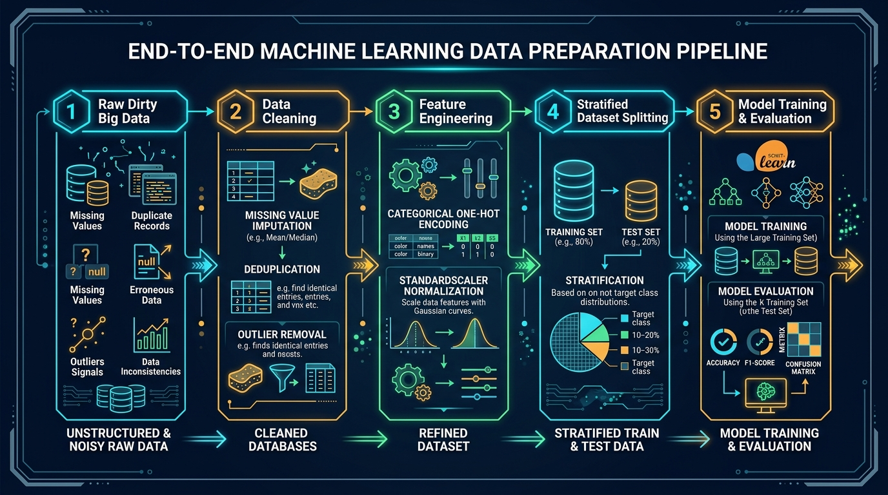
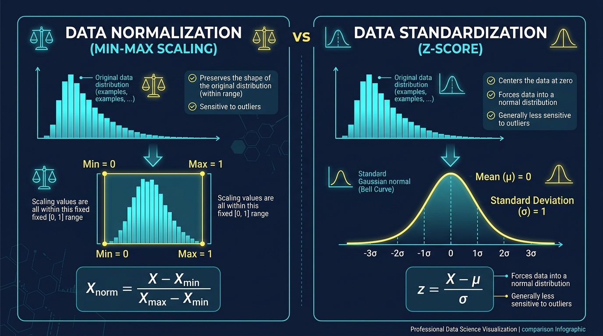
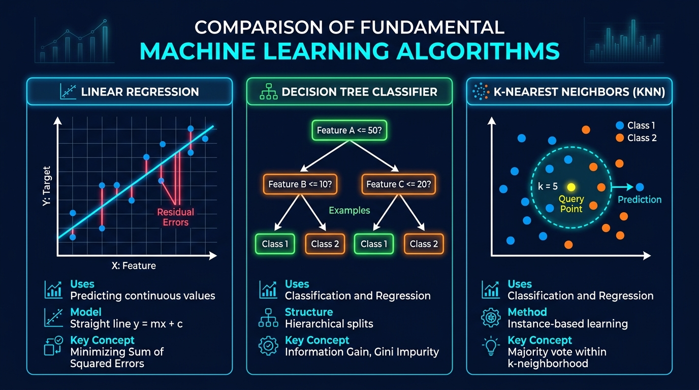

# ⚙️ Unit 3: Preparing Big Data for Machine Learning

> **Course Code:** DS-505 | **Subject:** Big Data Handling and Management for Machine Learning Applications  
> **Theory Subject Code:** `2611001305033001` | **Practical Subject Code:** `2611001305033002`  
> **Target Degree:** B.Sc. (Data Science & Analytics) — Semester V (NCrF Credit Level 5.5, 4 Credits)  
> **Institution:** Sutex Bank College of Computer Applications and Science (SBCCAS), Amroli  
> **Affiliation:** Veer Narmad South Gujarat University (VNSGU), Surat, Gujarat, India  
> **Document Purpose:** University Examination Preparation Notes, Practical Lab Manual & Technical Reference  
> **Recommended Technical Stack:** Python 3.10+, NumPy, Pandas, Scikit-Learn 1.3+, Matplotlib, JupyterLab / Google Colab  
> **Primary References:**  
> • *Hands-On Machine Learning with Scikit-Learn, Keras, and TensorFlow (3rd Ed.)* — Aurélien Géron (O'Reilly)  
> • *Python for Data Analysis (3rd Ed.)* — Wes McKinney (Creator of Pandas, O'Reilly)  
> • *Data Science from Scratch: First Principles with Python* — Joel Grus (O'Reilly)  
> • *Machine Learning with PySpark* — Tomasz Drabas & Denny Lee (Packt)  
> • *Introduction to Machine Learning with Python* — Andreas C. Müller & Sarah Guido (O'Reilly)  

---

<details open>
<summary><b>📑 Table of Contents & Unit Roadmap (Click to Expand / Collapse)</b></summary>

- [1. Data Preparation in the Machine Learning Lifecycle](#1-data-preparation-in-the-machine-learning-lifecycle)
  - [1.1 The Crucial Role of Data Preparation in AI](#11-the-crucial-role-of-data-preparation-in-ai)
  - [1.2 The Garbage In, Garbage Out (GIGO) Principle](#12-the-garbage-in-garbage-out-gigo-principle)
  - [1.3 The Critical Danger of Data Leakage](#13-the-critical-danger-of-data-leakage)
  - [1.4 The End-to-End Machine Learning Pipeline](#14-the-end-to-end-machine-learning-pipeline)
- [2. Data Cleaning Primitives](#2-data-cleaning-primitives)
  - [2.1 Handling Missing Values](#21-handling-missing-values)
  - [2.2 Removing Duplicate Records](#22-removing-duplicate-records)
  - [2.3 Data Normalization vs. Standardization](#23-data-normalization-vs-standardization)
- [3. Feature Engineering & Preprocessing Pipelines](#3-feature-engineering--preprocessing-pipelines)
  - [3.1 Selecting Relevant Features](#31-selecting-relevant-features)
  - [3.2 Encoding Categorical Data](#32-encoding-categorical-data)
  - [3.3 Dataset Splitting: Training, Validation, and Testing](#33-dataset-splitting-training-validation-and-testing)
- [4. Working with Machine Learning Libraries: Scikit-Learn](#4-working-with-machine-learning-libraries-scikit-learn)
  - [4.1 Architecture & Design Philosophy of Scikit-Learn](#41-architecture--design-philosophy-of-scikit-learn)
  - [4.2 Data Representation: Feature Matrix (X) and Target Vector (y)](#42-data-representation-feature-matrix-x-and-target-vector-y)
  - [4.3 Scalable Ingestion & Large Dataset Strategies in Scikit-Learn](#43-scalable-ingestion--large-dataset-strategies-in-scikit-learn)
- [5. Core Practical Commands & API Functions (Syllabus Core)](#5-core-practical-commands--api-functions-syllabus-core)
  - [5.1 `train_test_split()`](#51-train_test_split)
  - [5.2 `StandardScaler()`](#52-standardscaler)
  - [5.3 `LabelEncoder()`](#53-labelencoder)
  - [5.4 The Unified `.fit()` and `.predict()` Paradigms](#54-the-unified-fit-and-predict-paradigms)
- [6. Fundamental Machine Learning Models (Syllabus Core)](#6-fundamental-machine-learning-models-syllabus-core)
  - [6.1 Model Architecture Comparison Overview](#61-model-architecture-comparison-overview)
  - [6.2 Linear Regression (`LinearRegression`)](#62-linear-regression-linearregression)
  - [6.3 Decision Tree Classifier (`DecisionTreeClassifier`)](#63-decision-tree-classifier-decisiontreeclassifier)
  - [6.4 K-Nearest Neighbors Classifier (`KNeighborsClassifier`)](#64-k-nearest-neighbors-classifier-kneighborsclassifier)
- [7. Comprehensive End-to-End Python Implementation](#7-comprehensive-end-to-end-python-implementation)
- [8. Practical Projects, Assignments & University Exam Resources](#8-practical-projects-assignments--university-exam-resources)

</details>

---

# 1. Data Preparation in the Machine Learning Lifecycle

## 1.1 The Crucial Role of Data Preparation in AI

In real-world data science, raw data is almost never immediately ready to train machine learning models. Industry studies consistently reveal that **data scientists spend approximately 70% to 80% of their total project time on data collection, cleaning, feature engineering, and preprocessing**, while model training and tuning account for only 20%.

```
+-----------------------------------------------------------------------------------+
|                     THE 80/20 REALITY OF MACHINE LEARNING                         |
+-----------------------------------------------------------------------------------+
|  [ ■■■■■■■■■■■■■■■■■■■■■■■■■■■■■■■■■■■■■■■■■ ] 80% TIME:                          |
|  - Missing value imputation, outlier detection, deduplication                      |
|  - Feature scaling, categorical encoding, dimensionality reduction                |
|  - Train/Test stratification and leak prevention                                  |
|                                                                                   |
|  [ ■■■■■■■■■■ ] 20% TIME:                                                         |
|  - Calling model.fit() and model.predict()                                        |
|  - Hyperparameter tuning and model evaluation                                     |
+-----------------------------------------------------------------------------------+
```

---

## 1.2 The Garbage In, Garbage Out (GIGO) Principle

A fundamental axiom of machine learning is **Garbage In, Garbage Out (GIGO)**:

> ### 💡 Concept Definition: The GIGO Principle
> No machine learning algorithm—regardless of whether it is simple Linear Regression, a Deep Neural Network, or an advanced Ensemble—can overcome the handicap of uncleaned, distorted, or erroneously labeled training data. A simple algorithm trained on high-quality, cleanly engineered features will consistently outperform an advanced deep learning model trained on noisy, unnormalized data.

### Common Anomalies in Raw Big Datasets:
1. **Sensor Glitches & Network Drops:** Missing values (`NaN`, `None`, `-999`).
2. **Human Input Errors:** Inconsistent string casing (`"Surat"`, `"surat"`, `"SURAT"`), typographical errors, and negative customer ages.
3. **Data Pipeline Duplicates:** Replicated records caused by retry logic in streaming ingestion queues (e.g., Kafka / IoT brokers).
4. **Scale Disparities:** Features with wildly differing scales (e.g., `Annual Income` ranging from 300,000 to 5,000,000 INR vs. `Number of Children` ranging from 0 to 4). Without normalization, distance-based algorithms will be dominated entirely by `Annual Income`.

---

## 1.3 The Critical Danger of Data Leakage

One of the most catastrophic mistakes in applied machine learning—frequently leading to models that score 99% in college notebooks but fail miserably when deployed in production—is **Data Leakage (Train-Test Contamination)**.

```
                            THE DATA LEAKAGE TRAP
                            
      [ FULL DATASET (100% of Samples) ]
                    │
                    ▼  ⛔ FATAL MISTAKE:
         scaler = StandardScaler()
         X_scaled = scaler.fit_transform(X)   <-- Computes Mean & Variance of TEST SET!
                    │
                    ▼
     X_train, X_test = train_test_split(X_scaled)
     (Result: The model was trained with prior knowledge of the test set's distribution!)
```

### The Golden Rule of Data Preprocessing:
> [!CAUTION]
> **Always split your dataset into Training and Testing subsets BEFORE performing any data transformations (imputation, scaling, encoding).**  
> * Compute preprocessing parameters (mean, standard deviation, median, category vocabularies) **strictly on the Training set (`fit`)**.
> * Apply those exact learned parameters to transform both the Training set and the Test set (`transform`). Never call `.fit()` or `.fit_transform()` on test data!

---

## 1.4 The End-to-End Machine Learning Pipeline

Below is the structured, architectural flow of an enterprise data preparation pipeline:

```
[1. Raw Dirty Big Data] 
       │ (Missing values, noisy text, scale disparities, duplicates)
       ▼
[2. Data Cleaning] 
       │ (Imputation, Deduplication, Outlier filtering)
       ▼
[3. Feature Engineering] 
       │ (One-Hot / Label Encoding, StandardScaler / MinMaxScaler)
       ▼
[4. Stratified Dataset Splitting] 
       │ (Dividing cleanly into X_train, X_test, y_train, y_test)
       ▼
[5. Model Training & Evaluation] 
       │ (fit() on train ➔ predict() on test ➔ Accuracy / MSE metrics)
       ▼
[Production Deployment Ready Model]
```

---

### 🖼️ Visual Architecture: End-to-End ML Data Preparation Pipeline



> [!TIP]
> **🎨 AI Image Generation Prompt (For GPT / DALL-E Uniform Aesthetics):**
> ```text
> Modern technical infographic diagram of an end-to-end Machine Learning data preparation pipeline on dark navy background. Left to right workflow: 1. Raw Dirty Big Data with missing values and noise -> 2. Data Cleaning with missing value imputation and deduplication -> 3. Feature Engineering with Categorical One-Hot Encoding and StandardScaler normalization -> 4. Stratified Train-Test Dataset Splitting -> 5. Scikit-Learn Model Training and Evaluation. Clean high-tech vector aesthetic, glowing neon cyan, amber, and electric green accents, crisp typography, professional enterprise AI architecture diagram.
> ```

---

# 2. Data Cleaning Primitives

## 2.1 Handling Missing Values

Missing values are represented in Python as `np.nan` (Not a Number) for floating-point columns and `None` for Python objects. Most Scikit-Learn algorithms (including `LinearRegression`, `DecisionTreeClassifier`, and `KNeighborsClassifier`) will throw a hard runtime error (`ValueError: Input contains NaN`) if passed uncleaned missing data.

### 1. Mechanisms of Missing Data (Theoretical Taxonomy)
Understanding why data is missing dictates the appropriate treatment strategy:
* **Missing Completely at Random (MCAR):** The probability of missingness is entirely independent of any observed or unobserved variable (e.g., a lab technician accidentally spills coffee on random sensor log sheets).
* **Missing at Random (MAR):** The missingness is systematically related to other observed features, but not to the missing value itself (e.g., male respondents in a health survey are less likely to report their depression score, but within males, it is random).
* **Missing Not at Random (MNAR):** The missingness is directly related to the unobserved value itself (e.g., high-wealth individuals intentionally refusing to declare their annual income on tax surveys).

---

### 2. Treatment Strategies for Missing Data

```
                             MISSING DATA STRATEGIES
                                        │
             ┌──────────────────────────┴──────────────────────────┐
             ▼                                                     ▼
      DELETION (Removal)                                 IMPUTATION (Replacement)
      • Listwise Deletion (Drop rows)                    • Univariate Imputation (Mean, Median, Mode)
      • Columnar Deletion (Drop feature)                 • Multivariate Imputation (KNN, Iterative)
      • Best when missingness is < 3%                    • Best when missingness is 5% - 40%
```

#### Strategy A: Deletion (Dropping Records or Columns)
* **Row-wise Deletion (`df.dropna(axis=0)`):** Acceptable only when the proportion of missing records is negligible (< 3% to 5%) and the dataset is large. If missingness is non-random, dropping rows introduces severe statistical selection bias.
* **Column-wise Deletion (`df.dropna(axis=1)`):** Recommended if a column has **more than 50% to 60% missing values** and holds minimal predictive importance.

```python
import pandas as pd

# Drop rows where any column contains NaN
df_clean_rows = df.dropna(axis=0)

# Drop rows only if specific critical columns are NaN
df_clean_subset = df.dropna(subset=["customer_id", "target_label"])

# Drop columns that have more than 40% missing data
threshold = len(df) * 0.60
df_clean_cols = df.dropna(thresh=threshold, axis=1)
```

---

#### Strategy B: Statistical Imputation
Instead of discarding rows and shrinking the dataset, we substitute missing entries with calculated statistical proxies:
* **Mean Imputation:** Substitutes `NaN` with the mathematical average of the column.  
  *Limitation:* Extremely sensitive to outliers; distorts the variance of the feature.
* **Median Imputation (Recommended for Skewed Numeric Features):** Substitutes `NaN` with the 50th percentile (middle value).  
  *Advantage:* Robust against extreme outliers (e.g., salaries, house prices).
* **Mode Imputation (Recommended for Categorical Features):** Substitutes `NaN` with the most frequently occurring categorical string.

```python
from sklearn.impute import SimpleImputer
import numpy as np

# Impute skewed numeric features with Median
imputer_num = SimpleImputer(strategy="median")
X_train_num_imputed = imputer_num.fit_transform(X_train[["income", "age"]])
X_test_num_imputed = imputer_num.transform(X_test[["income", "age"]])

# Impute categorical text features with Most Frequent (Mode)
imputer_cat = SimpleImputer(strategy="most_frequent")
X_train_cat_imputed = imputer_cat.fit_transform(X_train[["city", "education"]])
X_test_cat_imputed = imputer_cat.transform(X_test[["city", "education"]])
```

---

## 2.2 Removing Duplicate Records

In large-scale data systems, duplicate records occur frequently due to network retry timeouts, merging multiple database snapshots, or tracking pixel replays.

### Why Duplicates Harm Machine Learning:
1. **Artificial Weighting (Algorithm Bias):** Duplicate rows bias the objective cost function, forcing the learning algorithm to place disproportionate importance on repeated observations.
2. **Cross-Validation Leakage:** If identical records appear in both the training set and the test set, the model achieves falsely inflated evaluation accuracy (memorization rather than genuine generalization).

```python
# 1. Identify total number of duplicate rows
duplicate_count = df.duplicated().sum()
print(f"Total Duplicate Records: {duplicate_count}")

# 2. Remove identical rows, keeping the first occurrence
df_deduped = df.drop_duplicates(keep="first")

# 3. Deduplicate based on unique business identifier (e.g., transaction_id)
df_unique_users = df.drop_duplicates(subset=["user_id", "event_timestamp"], keep="last")
```

---

## 2.3 Data Normalization vs. Standardization

Machine learning algorithms that calculate geometric distances between data points (such as **K-Nearest Neighbors**, **Support Vector Machines**, and **K-Means Clustering**) or utilize gradient descent optimization (such as **Linear Regression**, **Logistic Regression**, and **Neural Networks**) require numerical features to reside on comparable numerical scales.

> [!NOTE]
> **Tree-Based Scale Invariance:**  
> Decision Trees and Random Forests are **scale-invariant**. A decision tree makes binary split decisions (e.g., `Age <= 35.0`), meaning scaling has zero mathematical impact on tree performance. However, scaling is mandatory for distance-based and gradient-based algorithms.

---

### 1. Min-Max Normalization (Feature Scaling)
Transforms feature values into a rigid, bounded range—most commonly between **0 and 1**.

$$\mathbf{X_{\text{norm}}} = \frac{\mathbf{X} - \mathbf{X}_{\min}}{\mathbf{X}_{\max} - \mathbf{X}_{\min}}$$

* **Bounded Range:** $[0, 1]$.
* **Preserves:** The exact shape of the original distribution.
* **Critical Vulnerability:** Extremely sensitive to outliers! A single massive outlier compresses all normal data points into a tiny clustered interval (e.g., between $0.00$ and $0.02$).

---

### 2. Z-Score Standardization (StandardScaler)
Centers the data distribution around a **mean of 0** ($\mu = 0$) with a **standard deviation of 1** ($\sigma = 1$).

$$\mathbf{z} = \frac{\mathbf{X} - \mu}{\sigma}$$

Where:
* $\mu$ is the arithmetic mean of the feature: $\mu = \frac{1}{N} \sum_{i=1}^N X_i$
* $\sigma$ is the standard deviation: $\sigma = \sqrt{\frac{1}{N} \sum_{i=1}^N (X_i - \mu)^2}$

* **Bounded Range:** Unbounded (typically spans from $-3.0$ to $+3.0$).
* **Outlier Resilience:** Far more robust than Min-Max scaling because it does not restrict the feature to a rigid boundary. Outliers remain visible as large z-scores ($|z| > 3.0$).
* **Standard Scikit-Learn Choice:** `StandardScaler()`.

---

### 🖼️ Visual Architecture: Normalization vs. Standardization



> [!TIP]
> **🎨 AI Image Generation Prompt (For GPT / DALL-E Uniform Aesthetics):**
> ```text
> Modern comparison infographic diagram comparing Data Normalization Min-Max Scaling vs Data Standardization Z-Score on dark navy background. Left panel shows Normalization scaling values into a fixed range between 0 and 1, highlighting bounding box with min and max boundaries. Right panel shows Standardization transforming features into a standard Gaussian normal distribution curve with mean zero and standard deviation one. Clean vector graphics, glowing cyan and yellow accents, crisp mathematical formulas, professional data science visualization.
> ```

---

### ⚖️ Head-to-Head Comparison: Normalization vs. Standardization

| Feature Dimension | Min-Max Normalization (`MinMaxScaler`) | Z-Score Standardization (`StandardScaler`) |
| :--- | :--- | :--- |
| **Mathematical Goal** | Rescales feature values to a fixed bounded interval ($[0, 1]$). | Centers feature distribution around $\mu = 0$ with variance $\sigma^2 = 1$. |
| **Output Range** | Strictly bounded: $[0, 1]$ (or custom $[a, b]$). | Unbounded: Typically $[-3, +3]$, but can extend further for outliers. |
| **Outlier Sensitivity** | **Extremely High**: Outliers distort the denominator $(X_{\max} - X_{\min})$. | **Low / Moderate**: Outliers retain meaningful variance. |
| **Distribution Shape** | Preserves original bounded skewness exactly. | Transforms feature to conform to a standard normal bell curve. |
| **Primary Use Cases** | Image pixel values ($[0, 255] \rightarrow [0, 1]$), Neural network inputs. | **Linear Regression**, **K-Nearest Neighbors (KNN)**, Logistic Regression, PCA. |

---

# 3. Feature Engineering & Preprocessing Pipelines

## 3.1 Selecting Relevant Features

In big data environments, datasets often contain hundreds or thousands of columns. Feeding all available features blindly into a machine learning model triggers the **Curse of Dimensionality**:
* Exponential increase in computational training time.
* Risk of severe model overfitting (learning noise rather than signal).
* High storage and memory overhead.

### Feature Selection Methodologies:
1. **Filter Methods (Statistical Ranking):**
   * **Correlation Matrix (`df.corr()`):** Eliminates features that exhibit near-zero linear correlation with the target variable, or eliminates one of two features that exhibit extreme multicollinearity ($|r| > 0.85$).
   * **Variance Threshold:** Drops features that have zero or near-zero variance (e.g., a column where 99.9% of rows contain the exact same constant value).
2. **Wrapper Methods:** Utilizes a machine learning model to evaluate feature subsets iteratively (e.g., **Recursive Feature Elimination - RFE**).
3. **Embedded Methods:** Feature selection occurs naturally during algorithm training (e.g., **Lasso Regression (L1)** which penalizes coefficients to absolute zero, or **Decision Trees** which calculate Gini feature importances).

```python
# Removing near-zero variance features using Scikit-Learn
from sklearn.feature_selection import VarianceThreshold

selector = VarianceThreshold(threshold=0.01) # Drops features with < 1% variance
X_high_variance = selector.fit_transform(X)
```

---

## 3.2 Encoding Categorical Data

Machine learning algorithms are mathematical engines that execute algebraic matrix operations. They cannot compute dot products or gradients on raw text strings (e.g., `"Surat"`, `"Mumbai"`, `"Bachelor's"`, `"Master's"`). Categorical variables must be converted into numerical representations.

```
                         CATEGORICAL ENCODING TAXONOMY
                                       │
            ┌──────────────────────────┴──────────────────────────┐
            ▼                                                     ▼
     ORDINAL DATA (Natural Order)                          NOMINAL DATA (No Natural Order)
     • Education: High School < Bachelor < Master          • Cities: Surat, Mumbai, Delhi
     • Ranking: Low < Medium < High                        • Colors: Red, Green, Blue
     • Encoding: Label / Ordinal Encoding                  • Encoding: One-Hot Encoding (OHE)
```

---

### 1. Label Encoding (`LabelEncoder`)
Maps each unique categorical category to a distinct integer ($0, 1, 2, \dots, K-1$).

* **When to Use:** Strictly for **Ordinal Features** (where mathematical ordering has logical meaning) or for encoding the **1D Target Variable ($y$)** in classification tasks.
* **The Fatal Nominal Trap:** If applied to nominal variables like `City` (`Surat=0`, `Mumbai=1`, `Delhi=2`), a linear or distance-based model will assume:
  $$\text{Delhi (2)} > \text{Mumbai (1)} > \text{Surat (0)} \quad \text{and} \quad \text{Surat} + \text{Mumbai} = \text{Delhi}$$
  This introduces completely false mathematical relationships!

```python
from sklearn.preprocessing import LabelEncoder

# Encoding Target Classification Variable (e.g., Customer Churn: "Yes"/"No")
target_encoder = LabelEncoder()
y_train_encoded = target_encoder.fit_transform(y_train)
y_test_encoded = target_encoder.transform(y_test)

print(f"Classes: {target_encoder.classes_}")
# Output: Classes: ['No' 'Yes'] -> Mapped to [0, 1]
```

---

### 2. One-Hot Encoding (`OneHotEncoder` / `pd.get_dummies`)
Creates a new binary column ($0$ or $1$) for each unique category in a nominal feature.

* **When to Use:** For **Nominal Features** without natural ordering (e.g., `City`, `Payment_Method`, `Department`).
* **The Dummy Variable Trap (Multicollinearity):** If a feature has $K$ categories, creating $K$ one-hot columns introduces perfect collinearity because the $K$-th column can be completely predicted from the remaining $K-1$ columns. In regression models, we drop one reference column using `drop="first"`.

```python
from sklearn.preprocessing import OneHotEncoder

# Initializing OneHotEncoder avoiding the Dummy Variable Trap
ohe = OneHotEncoder(drop="first", sparse_output=False, handle_unknown="ignore")
X_ohe_train = ohe.fit_transform(X_train[["city", "payment_method"]])
X_ohe_test = ohe.transform(X_test[["city", "payment_method"]])
```

---

## 3.3 Dataset Splitting: Training, Validation, and Testing

To reliably estimate how a model will perform on unseen future data, we must partition the historical dataset into distinct, non-overlapping subsets:

```
+-----------------------------------------------------------------------------------+
|                        DATASET PARTITIONING ARCHITECTURE                          |
+---------------------------------------------------------+-------------------------+
|                  TRAINING SET (70% - 80%)               |     TEST SET (20% - 30%)|
|  - Used by algorithm to learn internal parameters       |  - Kept completely blind|
|  - Used for feature extraction and scaling fit()        |  - Evaluates generalized|
|  - Minimizes Training Loss                              |    performance          |
+---------------------------------------------------------+-------------------------+
```

### Random vs. Stratified Splitting
* **Random Splitting:** Allocates samples randomly. Acceptable when target classes are balanced (e.g., 50% Class A, 50% Class B).
* **Stratified Splitting (`stratify=y`):** Mandated when dealing with **Imbalanced Datasets** (e.g., Fraud Detection where 99% of transactions are legitimate and only 1% are fraudulent). Stratification guarantees that the exact class proportions are maintained identically across both the training set and the test set!

```python
from sklearn.model_selection import train_test_split

# Stratified Splitting based on imbalanced target vector y
X_train, X_test, y_train, y_test = train_test_split(
    X, y, 
    test_size=0.20,          # 80% Training, 20% Testing
    random_state=42,         # Ensures reproducible results across runs
    stratify=y               # Preserves exact class ratio in train and test splits!
)
```

---

# 4. Working with Machine Learning Libraries: Scikit-Learn

## 4.1 Architecture & Design Philosophy of Scikit-Learn

**Scikit-Learn (sklearn)** is the foundational, industry-standard machine learning library for Python. Developed originally by David Cournapeau as a Google Summer of Code project in 2007, it is designed around an extraordinarily elegant and unified object-oriented architecture.

### The Three Core Object Interfaces of Scikit-Learn:
1. **Estimators (`fit()`):** Any object that learns parameters from data (e.g., `StandardScaler`, `LinearRegression`, `DecisionTreeClassifier`). The learning process is initiated strictly by the `.fit()` method.
2. **Transformers (`transform()`):** Estimators that transform datasets (e.g., `StandardScaler`, `OneHotEncoder`, `SimpleImputer`). They take data, apply learned parameters, and return the transformed feature matrix via `.transform()`.
3. **Predictors (`predict()`):** Estimators capable of making predictions on new data (e.g., `LinearRegression`, `KNeighborsClassifier`). They provide `.predict()` and often `.predict_proba()` (for class probabilities).

---

## 4.2 Data Representation: Feature Matrix (X) and Target Vector (y)

Scikit-Learn enforces strict conventions regarding data shapes and types:

```
FEATURE MATRIX (X):                                TARGET VECTOR (y):
• Must be a 2-Dimensional array-like structure.    • Must be a 1-Dimensional array-like structure.
• Shape: [n_samples, n_features]                   • Shape: [n_samples]
• Rows = Individual observations (customers)       • Contains continuous targets (regression)
• Columns = Measured attributes (age, income)        or discrete categorical labels (classification).
```

---

## 4.3 Scalable Ingestion & Large Dataset Strategies in Scikit-Learn

While Scikit-Learn primarily operates in-memory on single-node CPU architectures, data scientists handle large datasets using specialized optimizations:

1. **Precision Downcasting:** Cast feature matrices from default 64-bit (`float64`) to 32-bit (`float32`) to immediately cut memory consumption in half.
2. **Sparse Matrices (`scipy.sparse.csr_matrix`):** When One-Hot Encoding produces hundreds of zero columns, Scikit-Learn retains only non-zero coordinates, saving gigabytes of RAM.
3. **Memory Mapping (`joblib.load(mmap_mode='r')`):** Allows large datasets to be read directly from disk partitions without loading the entire array into active RAM.
4. **Out-of-Core Incremental Learning (`partial_fit()`):** For datasets that exceed physical RAM, models such as `SGDClassifier` and `MiniBatchKMeans` can stream data in mini-batches.

---

# 5. Core Practical Commands & API Functions (Syllabus Core)

The DS-505 syllabus requires students to demonstrate comprehensive practical mastery over five core Scikit-Learn functions:

$$\mathbf{train\_test\_split()} \quad \bullet \quad \mathbf{StandardScaler()} \quad \bullet \quad \mathbf{LabelEncoder()} \quad \bullet \quad \mathbf{.fit()} \quad \bullet \quad \mathbf{.predict()}$$

---

## 5.1 `train_test_split()`

* **Module:** `sklearn.model_selection`
* **Purpose:** Splits feature matrices ($X$) and target vectors ($y$) into synchronized train and test subsets.

### Signature & Key Parameters:
```python
X_train, X_test, y_train, y_test = train_test_split(
    X, y, test_size=0.25, train_size=None, random_state=None, shuffle=True, stratify=None
)
```
* `test_size` *(float, default=0.25)*: Proportion of the dataset allocated to the test split (e.g., `0.2` = 20%).
* `random_state` *(int)*: Seed for pseudo-random number generator. Guarantees deterministic, reproducible splits across lab executions.
* `shuffle` *(bool, default=True)*: Shuffles records before partitioning.
* `stratify` *(array-like, default=None)*: Column containing class labels used to perform stratified sampling.

---

## 5.2 `StandardScaler()`

* **Module:** `sklearn.preprocessing`
* **Purpose:** Standardizes features by removing the mean and scaling to unit variance ($\mu=0, \sigma=1$).

### Key Attributes (Learned State):
* `scaler.mean_`: The calculated arithmetic mean for each feature in the training set.
* `scaler.scale_`: The calculated standard deviation for each feature.
* `scaler.var_`: The calculated feature variance.

### Method Workflow:
```python
scaler = StandardScaler()

# 1. Learn parameters strictly from Training Data
scaler.fit(X_train)

# 2. Transform both subsets using the LEARNED Training statistics!
X_train_scaled = scaler.transform(X_train)
X_test_scaled  = scaler.transform(X_test)
```

---

## 5.3 `LabelEncoder()`

* **Module:** `sklearn.preprocessing`
* **Purpose:** Encodes target labels ($y$) with value between $0$ and $n\_classes-1$.

### Key Attributes & Methods:
* `encoder.classes_`: Array holding the original class string categories.
* `encoder.inverse_transform(y_pred)`: Reverses numerical predictions back to human-readable strings!

```python
le = LabelEncoder()
y_train_num = le.fit_transform(["Reject", "Approve", "Approve", "Pending"])
print(y_train_num)           # Output: [2, 0, 0, 1]
print(le.classes_)           # Output: ['Approve' 'Pending' 'Reject']
print(le.inverse_transform([0, 2])) # Output: ['Approve', 'Reject']
```

---

## 5.4 The Unified `.fit()` and `.predict()` Paradigms

Scikit-Learn enforces structural consistency across all algorithms:

### The `.fit()` Paradigm (Parameter Learning):
$$\text{model.fit}(X_{\text{train}}, y_{\text{train}})$$
* **What happens internally?**
  * In **Linear Regression:** Computes optimal coefficients ($\beta$) via Ordinary Least Squares matrix inversion.
  * In **Decision Trees:** Evaluates split thresholds across all features to maximize Information Gain / minimize Gini Impurity.
  * In **K-Nearest Neighbors:** Stores the training data points internally in an indexed spatial tree structure (KD-Tree or Ball-Tree).

### The `.predict()` Paradigm (Inference):
$$\hat{y}_{\text{test}} = \text{model.predict}(X_{\text{test}})$$
* Maps unseen feature vectors ($X_{\text{test}}$) through the learned decision boundaries or regression hyperplanes to output predicted targets ($\hat{y}$).

---

# 6. Fundamental Machine Learning Models (Syllabus Core)

## 6.1 Model Architecture Comparison Overview

The syllabus mandates in-depth understanding and implementation of three classical, widely deployed predictive models:

1. **Linear Regression** (Parametric Continuous Regressor)
2. **Decision Tree Classifier** (Non-parametric Hierarchical Rule Classifier)
3. **K-Nearest Neighbors Classifier** (Instance-Based Lazy Classifier)

---

### 🖼️ Visual Architecture: Comparison of Fundamental Machine Learning Algorithms



> [!TIP]
> **🎨 AI Image Generation Prompt (For GPT / DALL-E Uniform Aesthetics):**
> ```text
> Modern technical comparison infographic diagram comparing three fundamental machine learning algorithms on dark navy background: 1. Linear Regression showing 2D scatter plot with a glowing blue line of best fit and red residual error lines, 2. Decision Tree Classifier showing an inverted branching tree structure with green decision nodes leading to leaf classification boxes, 3. K-Nearest Neighbors KNN showing a query data point in the center with a dashed circular neighborhood boundary enclosing k nearest blue and orange neighbor points. Clean vector graphics, vibrant neon accents, high resolution, textbook data science visualization.
> ```

---

## 6.2 Linear Regression (`LinearRegression`)

* **Task Type:** Supervised Continuous Regression.
* **Core Intuition:** Models the linear relationship between a scalar dependent target ($y$) and one or more independent explanatory features ($X$).

### Mathematical Equation:
$$\hat{y} = \beta_0 + \beta_1 X_1 + \beta_2 X_2 + \dots + \beta_p X_p + \epsilon$$

Where:
* $\beta_0$ is the **Intercept** (the expected value of $y$ when all $X = 0$).
* $\beta_1, \dots, \beta_p$ are the **Regression Coefficients** (weights representing the change in $y$ per unit change in $X$).
* $\epsilon$ is the random unobserved error term (residuals).

### Optimization: Ordinary Least Squares (OLS)
Linear Regression minimizes the **Sum of Squared Residuals (Residual Sum of Squares - RSS)**:

$$\text{RSS} = \sum_{i=1}^N (y_i - \hat{y}_i)^2$$

### Evaluation Metrics:
* **Mean Squared Error (MSE):** $\text{MSE} = \frac{1}{N} \sum_{i=1}^N (y_i - \hat{y}_i)^2$
* **Root Mean Squared Error (RMSE):** $\sqrt{\text{MSE}}$ (interpretable in the exact original units of the target).
* **Coefficient of Determination ($R^2$ Score):** Proportion of variance in $y$ explained by features ($0.0 \le R^2 \le 1.0$).

```python
from sklearn.linear_model import LinearRegression
from sklearn.metrics import mean_squared_error, r2_score

# 1. Initialize and fit
lr = LinearRegression()
lr.fit(X_train_scaled, y_train)

# 2. Predict on test set
y_pred = lr.predict(X_test_scaled)

# 3. Evaluate
print(f"Intercept (beta_0)   : {lr.intercept_:.4f}")
print(f"Coefficients (beta_i): {lr.coef_}")
print(f"Test MSE             : {mean_squared_error(y_test, y_pred):.4f}")
print(f"R-squared Score (R2) : {r2_score(y_test, y_pred):.4f}")
```

---

## 6.3 Decision Tree Classifier (`DecisionTreeClassifier`)

* **Task Type:** Supervised Discrete Classification (and Regression).
* **Core Intuition:** Partitions feature space into a hierarchy of recursive rectangular decision regions by asking greedy binary questions (e.g., `Is Income <= 50,000?`).

### Splitting Criteria:
1. **Gini Impurity (Default):** Measures the probability of misclassifying a randomly chosen element from the set:
   $$I_G(p) = 1 - \sum_{i=1}^C p_i^2$$
   *(Where $p_i$ is the probability of an element belonging to class $i$. Pure node $= 0.0$)*

2. **Entropy & Information Gain:** Measures the disorder / unpredictability of information:
   $$H(p) = -\sum_{i=1}^C p_i \log_2(p_i)$$

### Controlling Overfitting (Tree Pruning Hyperparameters):
Unconstrained decision trees will expand until every leaf is 100% pure, resulting in severe overfitting. We constrain them using:
* `max_depth`: Limits the maximum vertical depth of the tree (e.g., `max_depth=4`).
* `min_samples_split`: Minimum number of samples required to split an internal node.
* `min_samples_leaf`: Minimum number of samples required to exist at a terminal leaf node.

```python
from sklearn.tree import DecisionTreeClassifier, export_text
from sklearn.metrics import accuracy_score, classification_report

# 1. Initialize with regularizing max_depth
dt = DecisionTreeClassifier(criterion="gini", max_depth=4, random_state=42)
dt.fit(X_train, y_train)

# 2. Inference
y_pred_dt = dt.predict(X_test)

# 3. Evaluate and Inspect Rules
print(f"Decision Tree Accuracy: {accuracy_score(y_test, y_pred_dt) * 100:.2f}%")
print("\nGenerated Tree Decision Logic:")
print(export_text(dt, feature_names=list(feature_names)))
```

---

## 6.4 K-Nearest Neighbors Classifier (`KNeighborsClassifier`)

* **Task Type:** Supervised Discrete Classification.
* **Core Intuition:** A non-parametric, **Instance-Based "Lazy Learner"**. It does not construct an explicit internal mathematical model during `.fit()`. Instead, when asked to predict the class of a new query point, it finds the $K$ closest training observations in Euclidean space and assigns the **majority class vote**.

### Distance Metric (Euclidean Distance in n-dimensional space):
$$d(\mathbf{p}, \mathbf{q}) = \sqrt{\sum_{i=1}^n (p_i - q_i)^2}$$

### The Critical Role of Hyperparameter $K$:
* **Small $K$ (e.g., $K=1$):** High variance / Overfitting. Extremely sensitive to outliers and random noise in the training set.
* **Large $K$ (e.g., $K=100$):** High bias / Underfitting. The neighborhood boundary becomes too large, causing the majority global class to dominate predictions.
* **Rule of Thumb:** Select $K = \sqrt{N}$ (where $N$ is training samples), typically choosing an odd integer to avoid tie votes in binary classification.

> [!IMPORTANT]
> **Mandatory Scaling for KNN:** Because Euclidean distance sums squared numerical differences, features with larger magnitudes dominate the distance calculation. **You must ALWAYS scale features with `StandardScaler` before running KNN!**

```python
from sklearn.neighbors import KNeighborsClassifier
from sklearn.metrics import accuracy_score

# 1. Initialize KNN with k=5 neighbors using Euclidean metric
knn = KNeighborsClassifier(n_neighbors=5, metric="minkowski", p=2) # p=2 is Euclidean
knn.fit(X_train_scaled, y_train)

# 2. Inference
y_pred_knn = knn.predict(X_test_scaled)

# 3. Evaluate
print(f"KNN Classifier Accuracy: {accuracy_score(y_test, y_pred_knn) * 100:.2f}%")
```

---

# 7. Comprehensive End-to-End Python Implementation

Below is a self-contained, fully executable Python script demonstrating the complete lifecycle mandated by the syllabus: loading raw noisy data, cleaning, missing value imputation, categorical encoding, standardization, stratified train-test splitting, and training/evaluating all three models (`LinearRegression`, `DecisionTreeClassifier`, `KNeighborsClassifier`).

```python
# ==============================================================================
# SUTEX BANK COLLEGE OF COMPUTER APPLICATIONS & SCIENCE (SBCCAS)
# SUBJECT: DS-505 Big Data Handling and Management for Machine Learning Applications
# UNIT 3 PRACTICAL DEMONSTRATION: End-to-End Data Preparation & ML Pipeline
# ==============================================================================

import numpy as np
import pandas as pd
from sklearn.model_selection import train_test_split
from sklearn.preprocessing import StandardScaler, LabelEncoder
from sklearn.impute import SimpleImputer
from sklearn.linear_model import LinearRegression
from sklearn.tree import DecisionTreeClassifier
from sklearn.neighbors import KNeighborsClassifier
from sklearn.metrics import accuracy_score, mean_squared_error, r2_score, classification_report

def main():
    print("=" * 80)
    print(">>> 1. SYNTHESIZING RAW ENTERPRISE DATASET (With Noise, NaNs & Strings)")
    print("=" * 80)
    
    np.random.seed(42)
    n_samples = 1000

    raw_data = {
        "Age": np.random.choice([np.nan, 22, 25, 30, 35, 45, 52, 60, 68], size=n_samples, p=[0.05] + [0.95/8]*8),
        "Annual_Income_kINR": np.random.choice([np.nan, 300, 450, 600, 850, 1200, 2500], size=n_samples, p=[0.05] + [0.95/6]*6),
        "Credit_Score": np.random.randint(300, 850, size=n_samples).astype(float),
        "City": np.random.choice(["Surat", "Mumbai", "Ahmedabad", "Pune", np.nan], size=n_samples, p=[0.3, 0.3, 0.2, 0.15, 0.05]),
        "Education": np.random.choice(["Graduate", "PostGraduate", "Doctorate"], size=n_samples),
        # Target for Classification: Loan Approval (0 = Denied, 1 = Approved)
        "Loan_Approved": np.random.choice([0, 1], size=n_samples, p=[0.4, 0.6]),
        # Target for Regression: Credit Card Spending Limit (in kINR)
        "Spending_Limit": np.zeros(n_samples)
    }

    df = pd.DataFrame(raw_data)
    
    # Introduce deterministic continuous target for regression
    df["Spending_Limit"] = (
        (df["Annual_Income_kINR"].fillna(600) * 0.4) + 
        (df["Credit_Score"] * 0.2) + 
        np.random.normal(0, 20, size=n_samples)
    ).round(2)

    # Introduce some artificial duplicate rows
    df = pd.concat([df, df.iloc[:15]], ignore_index=True)
    print(f"Raw Ingested Dataset Shape: {df.shape}")
    print(f"Missing Values per Column:\n{df.isna().sum()}")

    # --------------------------------------------------------------------------
    # STEP 2: DATA CLEANING (Deduplication & Missing Value Imputation)
    # --------------------------------------------------------------------------
    print("\n" + "=" * 80)
    print(">>> 2. DATA CLEANING & HYGIENE")
    print("=" * 80)

    # 2.1 Deduplication
    initial_rows = len(df)
    df.drop_duplicates(inplace=True)
    print(f"Removed {initial_rows - len(df)} duplicate records. New Shape: {df.shape}")

    # Separate Features and Targets
    X = df[["Age", "Annual_Income_kINR", "Credit_Score", "City", "Education"]].copy()
    y_class = df["Loan_Approved"].copy()      # Classification Target
    y_reg = df["Spending_Limit"].copy()       # Regression Target

    # --------------------------------------------------------------------------
    # STEP 3: STRATIFIED TRAIN-TEST SPLITTING (Golden Rule: Split First!)
    # --------------------------------------------------------------------------
    print("\n" + "=" * 80)
    print(">>> 3. STRATIFIED TRAIN-TEST SPLIT (80% Train, 20% Test)")
    print("=" * 80)

    X_train, X_test, y_train_c, y_test_c, y_train_r, y_test_r = train_test_split(
        X, y_class, y_reg, test_size=0.20, random_state=42, stratify=y_class
    )
    print(f"Training Features Shape: {X_train.shape} | Testing Features Shape: {X_test.shape}")

    # --------------------------------------------------------------------------
    # STEP 4: IMPUTATION & FEATURE ENGINEERING
    # --------------------------------------------------------------------------
    print("\n" + "=" * 80)
    print(">>> 4. PREPROCESSING PIPELINE (Imputation, Encoding, Scaling)")
    print("=" * 80)

    # 4.1 Imputation: Median for numeric, Mode for categorical
    num_cols = ["Age", "Annual_Income_kINR", "Credit_Score"]
    cat_cols = ["City", "Education"]

    num_imputer = SimpleImputer(strategy="median")
    cat_imputer = SimpleImputer(strategy="most_frequent")

    X_train[num_cols] = num_imputer.fit_transform(X_train[num_cols])
    X_test[num_cols]  = num_imputer.transform(X_test[num_cols])

    X_train[cat_cols] = cat_imputer.fit_transform(X_train[cat_cols])
    X_test[cat_cols]  = cat_imputer.transform(X_test[cat_cols])

    # 4.2 Encoding Categorical Features using One-Hot Encoding
    X_train_encoded = pd.get_dummies(X_train, columns=cat_cols, drop_first=True)
    X_test_encoded  = pd.get_dummies(X_test, columns=cat_cols, drop_first=True)
    # Align columns between train and test in case of unseen test categories
    X_train_encoded, X_test_encoded = X_train_encoded.align(X_test_encoded, join="left", axis=1, fill_value=0)

    # 4.3 Feature Standardization using StandardScaler
    scaler = StandardScaler()
    X_train_scaled = scaler.fit_transform(X_train_encoded)
    X_test_scaled  = scaler.transform(X_test_encoded)
    print(f"Features successfully preprocessed and scaled! Transformed shape: {X_train_scaled.shape}")

    # --------------------------------------------------------------------------
    # STEP 5: MODEL TRAINING & EVALUATION (3 Syllabus Models)
    # --------------------------------------------------------------------------
    print("\n" + "=" * 80)
    print(">>> 5. MODEL TRAINING & PREDICTION EVALUATION")
    print("=" * 80)

    # --- MODEL 1: LINEAR REGRESSION (Predicting Continuous Spending_Limit) ---
    print("\n--- [MODEL 1: LinearRegression] ---")
    lin_reg = LinearRegression()
    lin_reg.fit(X_train_scaled, y_train_r)
    y_pred_reg = lin_reg.predict(X_test_scaled)
    print(f" • Regression R-squared Score : {r2_score(y_test_r, y_pred_reg):.4f}")
    print(f" • Root Mean Squared Error     : {np.sqrt(mean_squared_error(y_test_r, y_pred_reg)):.4f} kINR")

    # --- MODEL 2: DECISION TREE CLASSIFIER (Predicting Loan_Approved) ---
    print("\n--- [MODEL 2: DecisionTreeClassifier] ---")
    dt_clf = DecisionTreeClassifier(max_depth=4, criterion="gini", random_state=42)
    dt_clf.fit(X_train_encoded, y_train_c) # Trees do not require scaling
    y_pred_dt = dt_clf.predict(X_test_encoded)
    print(f" • Decision Tree Accuracy      : {accuracy_score(y_test_c, y_pred_dt) * 100:.2f}%")

    # --- MODEL 3: K-NEAREST NEIGHBORS CLASSIFIER (Predicting Loan_Approved) ---
    print("\n--- [MODEL 3: KNeighborsClassifier] ---")
    knn_clf = KNeighborsClassifier(n_neighbors=7)
    knn_clf.fit(X_train_scaled, y_train_c) # Scaling is mandatory for KNN!
    y_pred_knn = knn_clf.predict(X_test_scaled)
    print(f" • K-Nearest Neighbors Accuracy: {accuracy_score(y_test_c, y_pred_knn) * 100:.2f}%")

    print("\n" + "=" * 80)
    print(">>> PIPELINE COMPLETED SUCCESSFULLY! ZERO DATA LEAKAGE VERIFIED.")
    print("=" * 80)

if __name__ == "__main__":
    main()
```

---

# 8. Practical Projects, Assignments & University Exam Resources

To master Unit 3 for both internal practical tests and university external theory examinations, study the modular companion documents across our repository:

* 🔬 **Hands-on Guided Lab & Case Study:**  
  [Unit-3 Machine Learning Data Preparation Lab](../3_Projects_Presentations/Unit-3_Machine_Learning_Data_Preparation_Lab.md)  
  *Contains an end-to-end, runnable customer churn prediction pipeline, outlier clipping, and complete Scikit-Learn model benchmarks.*

* 📝 **Theory Assignment & Continuous Evaluation:**  
  [Assignment-3: Unit-3 Theory Assignment](../4_Assignments/Assignment-3_Unit-3_Theory_Assignment.md)  
  *Strictly formatted to the official SBCCAS continuous assessment rubric: 5 Long Questions (7M), 5 Short Questions (3M), and 7 MCQs with complete answer keys.*

* 🏛️ **University Examination Vault & Technical Glossary:**  
  [Unit-3 Question Bank and Viva Voce](../5_QuestionBank/Unit-3_Question_Bank_and_Viva_Voce.md)  
  *Features 15 high-yield technical definitions, university theory model answers, and 15 practical viva voce questions & model answers.*

---
*(End of Unit 3 Academic Lecture Notes)*
