# 🤖 Unit 4: Introduction to Large Language Models and Big Data Applications

> **Course Code:** DS-505 | **Subject:** Big Data Handling and Management for Machine Learning Applications  
> **Target Degree:** B.Sc. (Data Science & Analytics) — Semester V  
> **Institution:** Sutex Bank College of Computer Applications and Science (SBCCAS)  
> **Affiliation:** Veer Narmad South Gujarat University (VNSGU), Surat  
> **Document Purpose:** Complete Exam Preparation Notes, Assignment Reference, and Practical Lab Manual  
> **Recommended Tech Stack:** Python 3.10+, NumPy, Pandas, PySpark, Scikit-learn, Hugging Face `transformers`, Google Colab / Jupyter Notebook

---

<details open>
<summary><b>📑 Table of Contents & Unit Overview (Click to Expand/Collapse)</b></summary>

- 4.1 Introduction to LLM:
  - 4.1.1 Concept of Large Language Models
  - 4.1.2 Examples of LLM applications (chatbots, text summarization)
  - 4.1.3 Importance of Large Datasets for LLM Training
- 4.2 Text Data Processing:
  - 4.2.1 Working with Large Text Datasets
  - 4.2.2 Tokenization and Text Cleaning
  - 4.2.3 Basic Natural Language Processing (NLP) Concepts
- 4.3 Using Pretrained LLM APIs:
  - 4.3.1 Introduction to Hugging Face
  - 4.3.2 Using APIs for Text Generation
  - 4.3.3 Ethical Considerations in AI Systems
- 4.4 Practical Implementation & Functions:
  - 4.4.1 Installation of transformers
  - 4.4.2 Text Processing using Python : split(), lower(), replace(), count()

**Extras & Practical Labs:**

  - 4.4.3 Integrated Text Processing Pipelines
  - 4.4.4 Live Demonstrations: Hugging Face transformers

</details>

---

## 4.1: Introduction to Large Language Models (LLMs)

### 4.1.1 Concept of Large Language Models

A **Language Model (LM)** is a statistical or computational model designed to estimate the probability distribution over sequences of words. It learns syntactic and semantic regularities in human communication to predict missing, subsequent, or related linguistic components.

**OR**

A **language model** is a machine learning model that learns patterns in human language.

**OR**

A **Language Model** is a computer model that learns patterns in language and can predict or generate text.

Example 1 Prompt : **The sun rises in the ___**

A language model may predict: **east**

Example 2 Prompt:  **“ The student is reading a _______”**

Candidate Continuations : **{ book : 0.65, textbook : 0.20. Newspaper : 0.10, car : 0.0001}**

Example 3: **I am going to the ___**

Possible predictions could be: **school, market, office, college, etc.**

**What is an LLM?**

**LLM** stands for **Large Language Model**.

A Large Language Model (LLM) is an AI model trained on very large amounts of text data to understand patterns in language and generate useful text responses.

**Why is it called the "Large Language Model"?**

The name has three important parts:

| Word | Meaning |
| --- | --- |
| Large | It uses large datasets and usually has a large number of parameters. |
| Language | It works mainly with human language such as English, Hindi, Gujarati, etc. |
| Model | It is a trained mathematical/computational model that learns patterns from data. |

**LLM = Large Data + Large Model + Language Understanding/Generation**

<p align="center">
  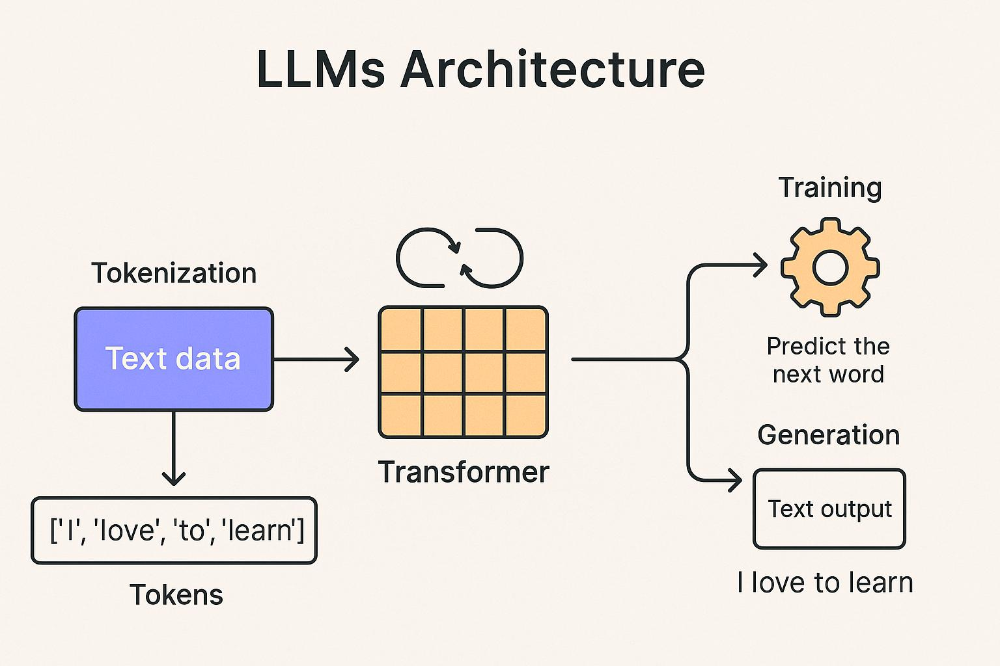
</p>

## How Does an LLM Work?

### We can understand the basic working in five steps.

### Step 1 — Input Text

### The user gives a prompt.

### Example: What is Big Data?

### Step 2 — Tokenization

### The text is divided into smaller units called tokens.

### For example: What | is | Big | Data | ?

### A token does not always mean a complete word. Depending on the tokenizer, a word can be divided into smaller pieces.

### Step 3 — Numerical Representation

### Computers work with numbers rather than ordinary text.

### The tokens are therefore converted into numerical representations called vectors/embeddings.

### Step 4 — Transformer Processing

### The tokens pass through many layers of a neural network based on the Transformer architecture.

### The Transformer uses mechanisms such as attention to consider relationships between different tokens in the input.

### Step 5 — Output Generation

### The model predicts suitable next tokens and produces the final response.

### For example:

### Input: The capital of India is

Possible output: New Delhi.

**What is the Transformer?**

The Transformer is an important neural-network architecture used by many modern language models.

Its important idea is attention.

**What does attention mean?**

Attention helps the model determine which parts of the input are important when processing a particular token.

Consider: The student put the book on the table because it was heavy.

To understand what "it" refers to, the relationship between different words is important.

The attention mechanism helps the model consider relationships between tokens.

Students do not need to learn the mathematical equations of attention at this stage. The important idea is:

Attention helps an LLM understand relationships between different parts of the input text.

### **4.1.2 Examples of LLM Applications**

LLMs are not limited to chat. They can be used in many applications involving language.

**1. Chatbots**
A chatbot is a software application that communicates with users using natural language.

Traditional chatbots often worked using fixed rules.

For example:

User: What are your working hours?

Bot: Our working hours are 9 AM to 5 PM.

### Applications of Chatbots

- Customer support
- Education
- Banking assistance
- Information systems
- Technical support
- Personal assistants
**2. Text Summarization**
Suppose we have a document containing 20 pages.

Reading the entire document may take a long time.

An LLM can be used to create a shorter version containing the important information.

Example

**Original: 190 words**

A long article contains many paragraphs about Big Data, its characteristics, applications, challenges and technologies.

**Summary:29 words**

Big Data refers to large and complex datasets. Technologies such as distributed processing help organizations store and analyze such data.

**Types of Summarization**

- Extractive summarization
Selects important sentences from the original text.

- Abstractive summarization
Generates a new shorter version using the main ideas.

For students, remember:

Summarization = Long text → Short meaningful text

### 3. Text Generation

Generating:

- emails,
- articles,
- descriptions,
- reports,
- study material.

### 4. Translation

Converting text from one language to another.

English

↓

LLM

↓

Hindi / Gujarati / French / etc.

## 5. Question Answering

The user asks a question and the model generates an answer.

## 6. Code Assistance

LLMs can help:

- generate code,
- explain code,
- find possible errors,
- convert code from one programming language to another.

### 7. Sentiment Analysis

The model can be used to identify whether a text expresses a positive, negative, or neutral opinion.

Example:

"This product is excellent!"

Possible result:

Positive

<p align="center">
  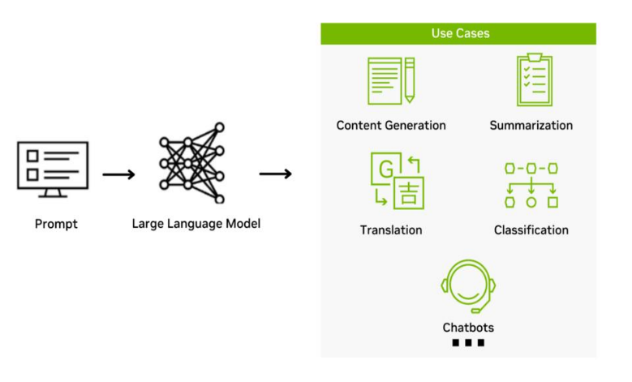
</p>

<p align="center">
  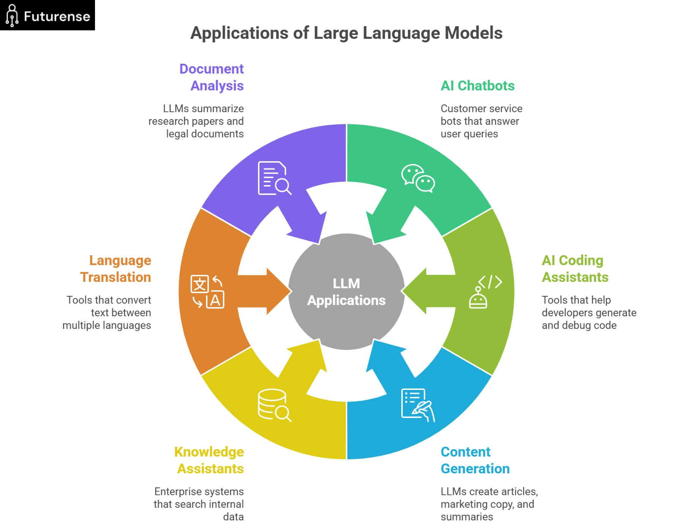
</p>

### 4.1.3 Importance of Large Datasets for LLM Training

This is an important connection between Big Data and LLMs.

The basic idea is:

**LLMs need large amounts of high-quality data to learn the patterns of human language.**

Why Does an LLM Need So Much Data?

Imagine teaching a person a language using only 100 sentences.

The person may learn a few basic patterns, but their understanding will be limited.

Now imagine giving the person:

- books,
- articles,
- conversations,
- websites,
- technical documents,
- stories,
examples from different subjects.

They would see many more examples of how language is used.

LLMs work in a similar basic way: large and varied datasets provide many examples from which the model can learn language patterns.

**Data** **→** **Learning** **→** **Model**

<p align="center">
  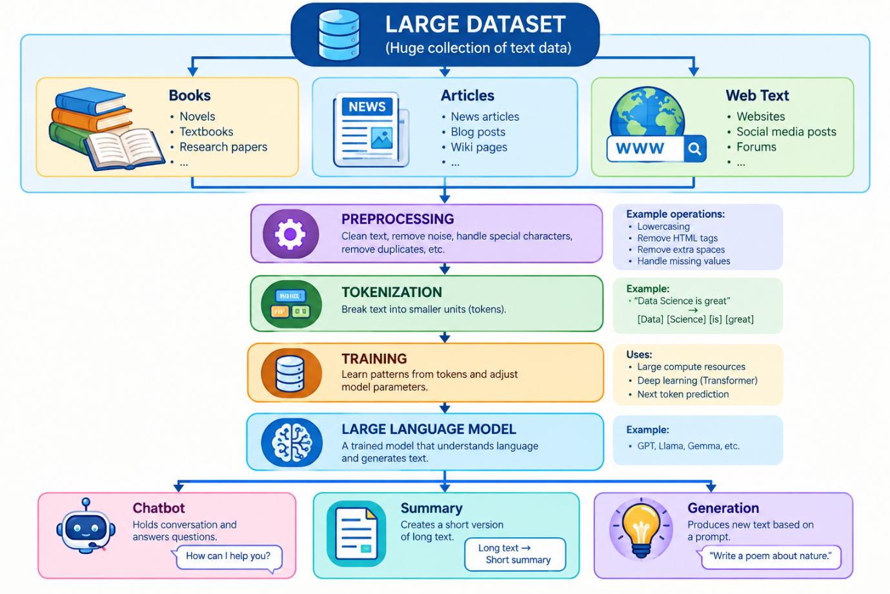
</p>

## Why Big Data is Important for LLMs

There are several reasons.

**1. More Examples**
More examples give the model more opportunities to learn language patterns.

Small Dataset ↓ Fewer examples ↓ Limited patterns

Large Dataset ↓ Many examples ↓ More language patterns

**2. Greater Variety**
A large dataset can contain different:

- topics,
- writing styles,
- languages,
- sentence structures,
- domains.
This gives the model exposure to a wider range of language.

**3. Better Coverage of Language**
Human language contains a huge number of words, expressions and combinations.

A larger dataset provides more opportunities for the model to encounter less common terms and patterns.

**4. Training Large Models**
Large models contain many parameters that need to be learned from data.

Therefore, training a large model generally requires substantial amounts of training data and computing resources.

Good LLM training requires both quantity and quality of data.

Big Data and LLMs — The Connection

<p align="center">
  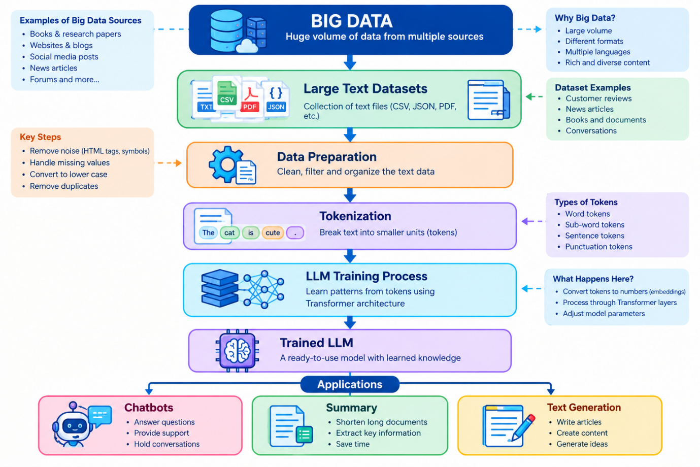
</p>

## **4.2 Text Data Processing**

### **4.2.****0** **Introduction to Text Data**

Text data is information stored in the form of words, sentences, paragraphs, documents, messages, reviews, or other written content.

Examples:

- Customer reviews
- Social media posts
- News articles
- Emails
- Books
- Research papers
- Chat messages
- Product descriptions
- Student feedback
Unlike a numerical dataset, text data is usually unstructured or semi-structured.

### **4.2.1 Working with Large Text Datasets**

In real-world applications, text datasets can become very large.

For example, an organization may collect:

- Millions of customer reviews
- Millions of social media posts
- Thousands of books
- Large collections of news articles
- Chat conversations
- Technical documents
This connects Big Data with Natural Language Processing (NLP) and LLMs.

Basic Processing Flow:

<p align="center">
  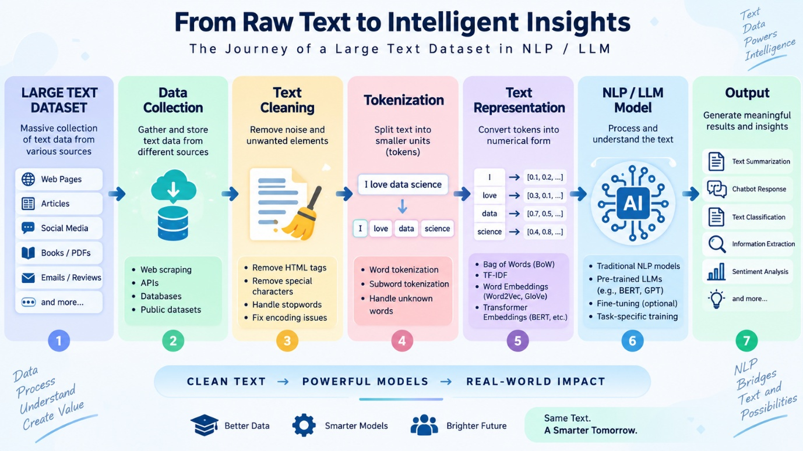
</p>

**Example**

Suppose we have 1 million customer reviews:

Review 1: "Excellent product!"

Review 2: "Very good quality."

Review 3: "Product stopped working."

...

Review 1,000,000

We may want to answer questions such as:

- Are customers satisfied?
- What problems are customers reporting?
- What are the most common words?
- Which products receive negative reviews?
- Can we automatically summarize the reviews?
Before answering these questions, the text needs to be processed.

Challenges of Large Text Datasets

Working with a large amount of text creates several challenges.

**1. Large Size**
Millions of documents require considerable storage and processing power.

**2. Different Formats**
Text may come from:

- TXT files
- CSV files
- JSON files
- HTML pages
- PDFs
- Databases
- APIs
**3. Noisy Data**
Text can contain:

- spelling mistakes,
- unnecessary symbols,
- duplicate text,
- advertisements,
- unwanted HTML tags,
- extra spaces.
**4. Different Languages**
A dataset may contain English, Hindi, Gujarati, or many other languages.

## **5. Different Writing Styles**

Text may be:

- formal,
- informal,
- technical,
- conversational,
- abbreviated.
Therefore, text processing is an important step before applying NLP or LLM techniques.

### **4.2.2 Tokenization and Text Cleaning**

**A. Tokenization**

Tokenization is the process of breaking text into smaller units called **tokens.**

Tokens can be:

- words,
- parts of words,
- sentences,
- punctuation marks,
depending on the tokenizer being used.

Example 1 — Word Tokenization

Input:

"Data Science is interesting."

Possible tokens: Data | Science | is | interesting |.

Example 2 — Sentence Tokenization

Input:

"Data Science is interesting. Machine Learning is useful."

The text can be divided into two sentences:

Sentence 1 → Data Science is interesting.

Sentence 2 → Machine Learning is useful.

**Why is Tokenization Important?**

Computers cannot directly process a complete paragraph as language in the same way humans do.

Tokenization converts text into smaller units that can be processed by NLP and language models.

Original Text

↓

"I love Data Science."

↓

Tokenization

↓

["I", "love", "Data", "Science", "."]

For LLMs, tokenization is especially important because the model processes text through tokens, which are then represented numerically.

Important Point

**A token is not always a complete word.**

For example, a tokenizer may divide a less common or long word into smaller pieces.

Therefore: **Word ≠ Always Token**

**B. Text Cleaning**

Text collected from real-world sources often contains unwanted information.

**Text cleaning** means removing or changing unnecessary parts of the text so that it becomes more suitable for analysis.

Common Text Cleaning Operations

- Convert text to lowercase
- Remove unnecessary spaces
- Remove unwanted symbols
- Remove HTML tags
- Handle punctuation when appropriate
- Remove duplicate text
- Handle missing text
- Correct or standardize certain text formats
Example of Text Cleaning

Original Text

"  GREAT PRODUCT!!! Visit www.example.com NOW!!!  "

After basic cleaning

"great product"

The exact cleaning steps depend on the application. We should not remove information blindly, because punctuation, capitalization, emojis, or special symbols can sometimes carry useful meaning.

**Simple Python Example****s:**

**1. lower()**
Converts letters to lowercase.

text = "Data Science"

print(text.lower())

Output:

data science

**2. split()**
Splits text into smaller parts.

text = "Data Science is interesting"

words = text.split()

print(words)

Output:

['Data', 'Science', 'is', 'interesting']

**3. replace()**
Replaces one piece of text with another.

text = "I like Python"

text = text.replace("Python", "Data Science")

print(text)

Output:

I like Data Science

**4. count()**
Counts how many times something occurs.

text = "data science and data analytics"

print(text.count("data"))

Output:

2

**Tokenization + Cleaning Example**

Consider:

"  Data Science is GREAT!!!  "

#### ⚡ Step 1 — Convert to lowercase

"  data science is great!!!  "

#### ⚡ Step 2 — Remove unnecessary spaces

"data science is great!!!"

#### ⚡ Step 3 — Tokenize

["data", "science", "is", "great", "!!!"]

So the overall process is: Raw Text -> Cleaning -> Clean Text -> Tokenization -> Tokens

### **4.2.3 Basic Natural Language Processing Concepts**

**What is NLP?**

**NLP** stands for **Natural Language Processing**.

NLP is a field of Artificial Intelligence that deals with processing and understanding human language using computers.

**Simple Definition**

**NLP is the technology that helps computers work with human language.**

Examples:

Understanding text

Translating languages

Finding important information

Classifying documents

Analyzing customer reviews

Generating text

Answering questions

**NLP vs LLM**

Students should not confuse these two terms.

**NLP**

NLP is the **broader field** of working with human language.

**LLM**

An LLM is a **large AI model** that can perform many language-related tasks.

**NLP is the field; LLM is one powerful type of model used for language tasks.**

**Important Basic NLP Concepts**

**1. Text Classification**
Text classification means assigning text to a category.

**Example**

Customer reviews:

"This phone is excellent!" -> Positive

"The battery is very poor." -> Negative

Applications:

Spam detection

Sentiment analysis

News classification

Customer feedback analysis

**2. Sentiment Analysis**
Sentiment analysis identifies the general opinion or emotion expressed in text.

**Example:** "The movie was excellent."

Result: Positive

Example: "The service was very slow."

Result: Negative

Possible categories: Positive,Negative,Neutral

**3. Named Entity Recognition**
**Named Entity Recognition (NER)** identifies important names or entities in text.

Example:

"Narendra Modi visited Ahmedabad."

Possible entities:

Narendra Modi → Person

Ahmedabad     → Location

Other entities may include:

Organizations

Locations

Dates

Products

Money values

**4. Text Classification vs Text Generation**
These are different tasks.

**Text Classification**

The system **assigns a label**.

Text → Model → Category

Example:

"I love this product!"

↓

Positive

**Text Generation**

The system **creates new text**.

Prompt → Model → Generated Text

Example:

Prompt:

Write a short paragraph about Big Data.

Output:

Big Data refers to very large datasets...

## **5. Text Summarization**

Text summarization produces a shorter version of a longer text while keeping important information.

Long Document

↓

NLP / LLM Model

↓

Short Summary

**Example:**

Long text:

A company collected millions of customer reviews and analyzed them to understand customer satisfaction, identify common complaints, and improve its products.

Summary:

The company analyzed customer reviews to understand satisfaction and improve products.

## **6. Machine Translation**

Machine translation converts text from one language to another.

English

↓

Translation System

↓

Gujarati / Hindi / French / etc.

Example:

Good morning

→ સુપ્રભાત

**7. Question Answering**
A system receives a question and produces an answer.

Question

↓

Language Model

↓

Answer

Example:

**Question:**

What is Big Data?

**Answer:**

Big Data refers to very large and complex datasets that require suitable technologies for storage and processing.

**Complete Text Processing Pipeline**

The following diagram summarizes the complete process students should remember:

<p align="center">
  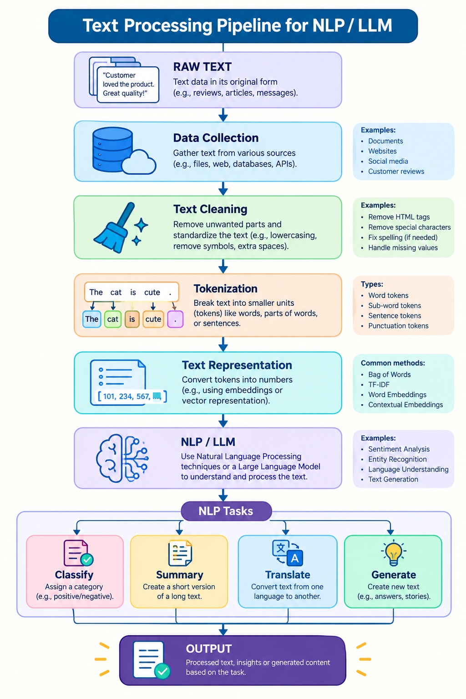
</p>

### **4.3.1 Introduction to Pretrained LLMs**

**What is a Pretrained Model?**

Training an LLM from the beginning requires:

- very large datasets,
- powerful computers/GPUs,
- considerable time,
- large amounts of computing resources.
Because of this, students and developers normally do not train a large language model from zero.

Instead, they can use a pretrained model.

**Simple Definition**

A pretrained model is an AI model that has already been trained on a large dataset and can be used for a particular task or further adapted for another task.

For example:

<p align="center">
  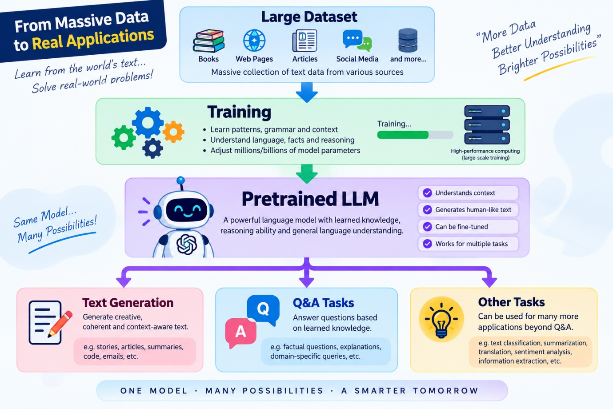
</p>

This saves a large amount of time and computing resources.

**What is Hugging Face?**

**Hugging Face** is a popular platform and open-source ecosystem for machine learning models, datasets and tools.

Its Hugging Face Hub provides access to many pretrained models.

The transformers library provides a simple interface for using pretrained models for tasks such as text generation, classification and other NLP tasks. Hugging Face's pipeline() interface is designed to make model inference easier.

Simple Idea Picture:

<p align="center">
  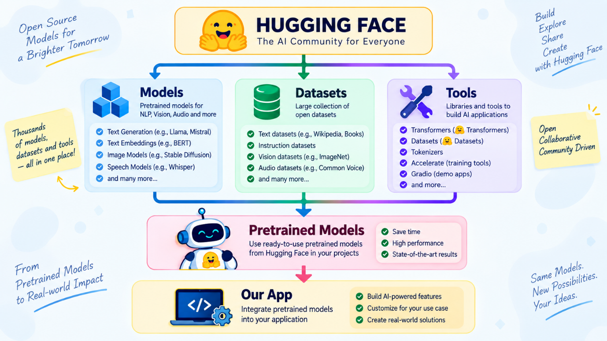
</p>

**Why Use a Pretrained Model?**

Suppose we want to build a simple text-generation application.

**Training from Scratch**

<p align="center">
  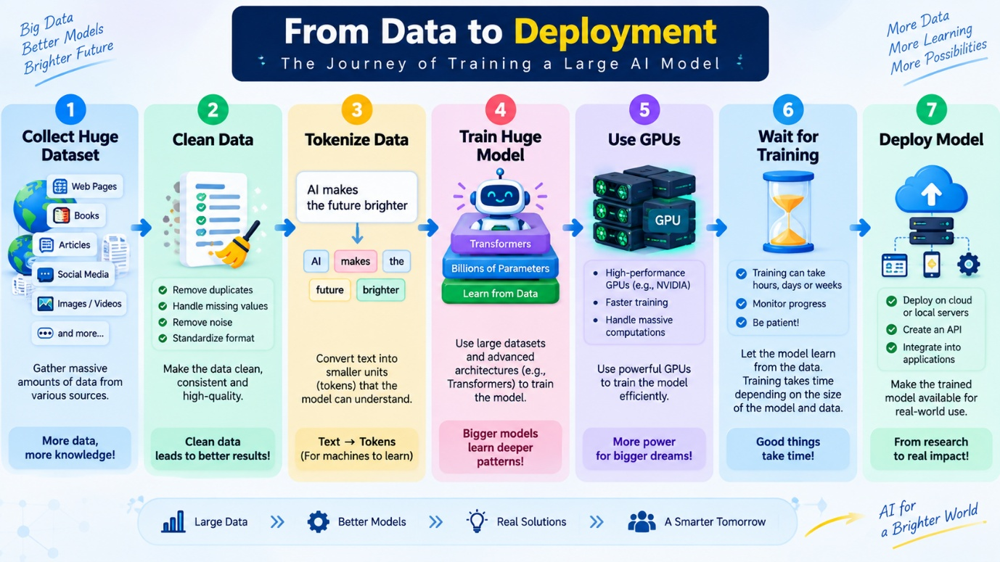
</p>

This is difficult for a beginner.

**Using a Pretrained Model**

<p align="center">
  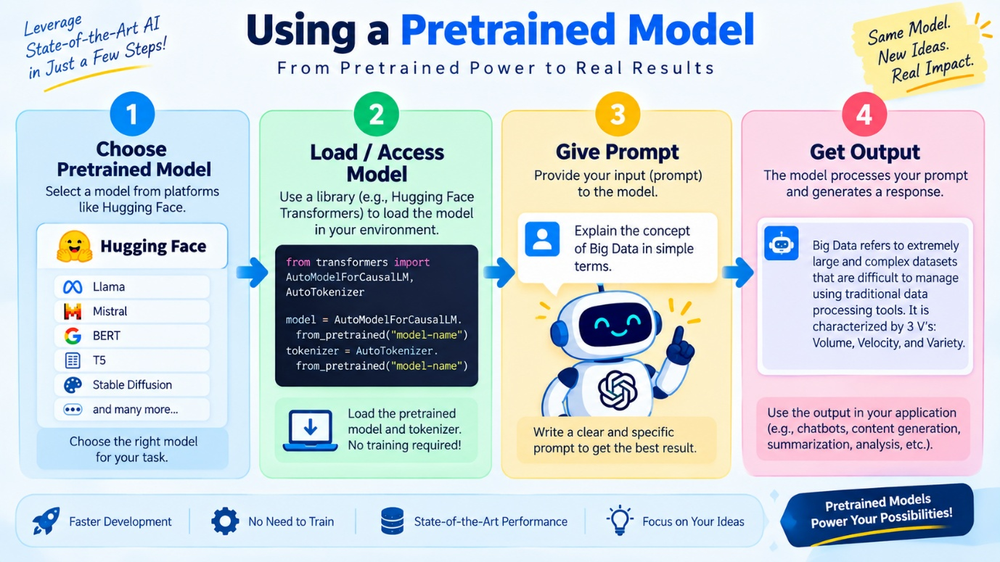
</p>

This is much easier.

**Main Advantage****:** Pretrained models allow us to use the knowledge learned during previous training instead of training a large model from zero.

**What is the Hugging Face pipeline()?**

The pipeline() function provides a simple way to perform inference with pretrained models.

For example:

```python
from transformers import pipeline
generator = pipeline("text-generation")
result = generator("Artificial Intelligence is")
print(result)

```

The pipeline automatically handles much of the work required to run the model.

Hugging Face documents pipeline() as a high-level inference API for different machine-learning tasks, including text generation.

Common Pipeline Tasks

A pipeline can be used for different tasks.

| Task | Purpose |
| --- | --- |
| text-generation | Generate text |
| text-classification | Classify text |
| summarization | Create summaries |
| translation | Translate text |
| question-answering | Answer questions |
| token-classification | Identify entities or labels |

> 💡 **Remember**

Pipeline = Easy interface for using a pretrained model.

### **4.3.2 Using APIs for Text Generation**

What is an API?

API stands for Application Programming Interface.

An API allows one software application to communicate with another software service.

Simple Example

Imagine a restaurant.

You:

Give an order.

Waiter:

Takes the order to the kitchen.

Kitchen:

Prepares the food.

Waiter:

Brings the food back.

An API works in a similar way.

What is an LLM API?

An LLM API allows a program to send a prompt to a language model and receive the model's output.

For example:

<p align="center">
  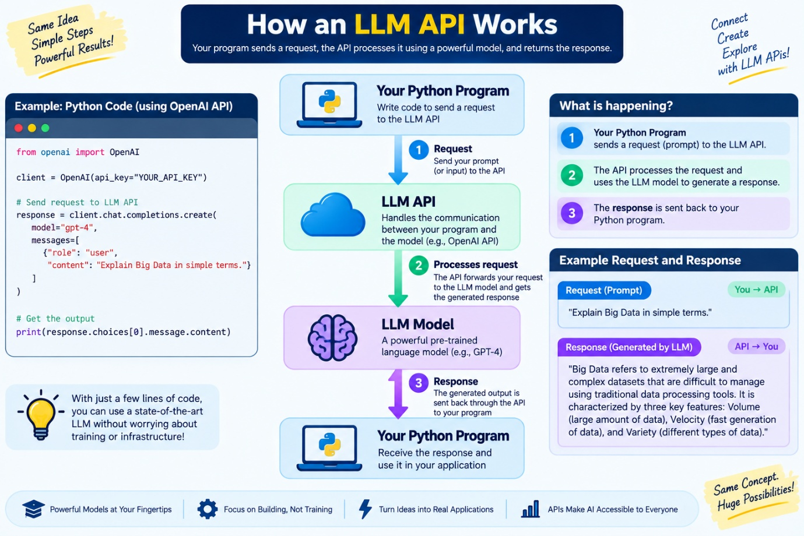
</p>

The application does not necessarily need to download and run the complete model locally.

API-Based LLM vs Local Model

| API-Based Model | Local Model |
| --- | --- |
| Model is accessed through a service | Model runs on your computer/server |
| Usually easier to start | Requires suitable hardware/resources |
| No need to manage full model locally | Need to download/manage model |
| Internet/service access may be required | Can potentially work without external API access |
| Usage may have limits/costs | Infrastructure cost is on the user |

Basic API Workflow

<p align="center">
  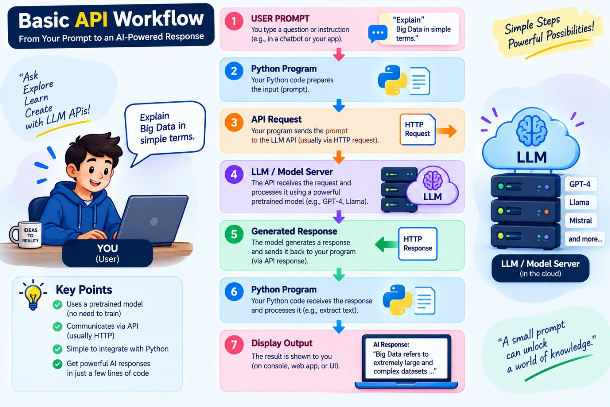
</p>

**Text Generation**

Text generation means producing new text based on an input prompt.

Example: Prompt: Write three lines about Big Data.

Possible Output:

Big Data refers to very large datasets.
	It is generated from many different sources.
	Technologies such as distributed computing help process it.

The exact output can vary between models and settings.

Hugging Face's current documentation provides both high-level transformers pipelines and hosted Inference Providers for accessing models through APIs.

**Beginner Practical: Text Generation with Transformers**

This is a simple local demonstration using the Hugging Face transformers library.

#### ⚡ **Step 1 — Install Transformers**

In Google Colab or Jupyter Notebook:

```python
!pip install transformers

```

#### ⚡ **Step 2 — Import Pipeline**

```python
from transformers import pipeline

```

#### ⚡ **Step 3 — Create a Text Generator**

generator = pipeline("text-generation")

#### ⚡ **Step 4 — Give a Prompt**

result = generator(

"Big Data is important because",

max_new_tokens=40)

print(result[0]["generated_text"])

The text-generation pipeline can load a suitable pretrained model and generate text from the supplied prompt.

**Expected Idea**

Big Data is important because it helps organizations analyze large amounts of information and make better decisions.

> 💡 **Note: The exact output may be different each time or may change depending on the model selected.**

What Happens Behind the Code?

When we write:

generator("Big Data is important because")

the basic process is:

<p align="center">
  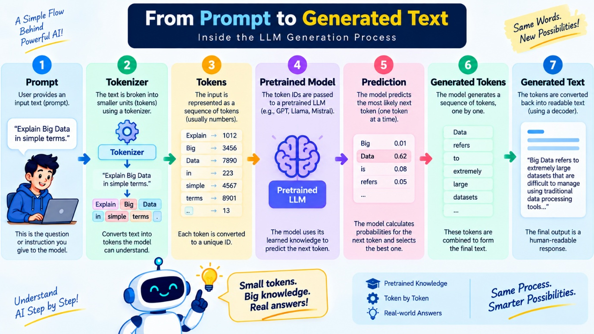
</p>

This connects directly with the 4.2 Text Data Processing concepts studied earlier.

**Using a Specific Model**

We can also specify a particular pretrained model.

For example:

```python
from transformers import pipeline

generator = pipeline(
```

"text-generation",

model="google/gemma-2-2b")

result = generator(

"Explain Big Data in simple words.",

max_new_tokens=50)

print(result[0]["generated_text"])

**Hugging Face's current documentation demonstrates selecting a specific model through the model parameter of pipeline().**

**Important for students:** Model names and availability can change. For classroom practicals, check the current model page before using a particular model.

**API-Based Example with Hugging Face**

Hugging Face currently provides **Inference Providers**, which allow applications to access supported models through a common interface. Its Python SDK includes InferenceClient.

A simplified example is:

```python
from huggingface_hub import InferenceClient

client = InferenceClient(
    api_key="YOUR_HUGGING_FACE_TOKEN")

response = client.chat.completions.create(
    model="MODEL_NAME",
    messages=[
```

{

"role": "user",

"content": "Explain Big Data in simple words."

}

]

)

print(response.choices[0].message)

**Important**

Do not write your actual API token directly into code that you share publicly.

Instead, use a secure method such as an environment variable.

For example:

import os

token = os.environ["HF_TOKEN"]

Hugging Face's current documentation recommends using an authentication token with the required inference permissions for API access.

**transformers vs LLM API**

Students may see both approaches.

<p align="center">
  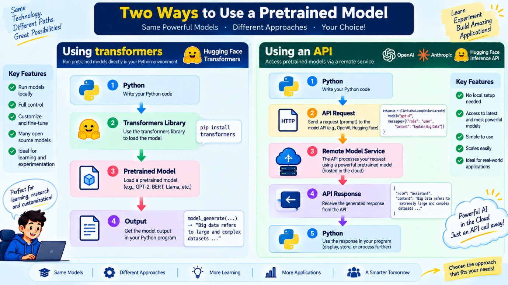
</p>

Using transformers : The model may be downloaded and run in the local environment.

Using an API : The model inference is provided through a service.

Easy Difference

Transformers = Library for working with models

API = Communication method for accessing a model/service

### **4.3.3 Ethical Considerations in AI Systems**

LLMs are powerful, but they should be used responsibly.

**1. Incorrect Information**
An LLM can sometimes produce an answer that sounds correct but is actually wrong.

This is sometimes called a hallucination.

**Example**

A student asks:

"Give the publication year of a particular research paper."

The model may provide a confident but incorrect year.

Therefore: Important information should be verified from reliable sources.

**2. Bias**
Models learn patterns from their training data.

If training data contains unwanted bias, model outputs may also show bias.

For example, a model may produce different descriptions for different groups because of patterns present in its data.

Therefore, AI systems should be tested for fairness and bias.

**3. Privacy**
Users should be careful when sending personal or confidential information to an AI service.

Do not casually enter:

- passwords,
- bank information,
- private student records,
- confidential company information,
- personal identification information.
**Simple Rule**

Do not put sensitive information into an AI service unless you are authorized to do so and understand how the service handles the data.

**4. Copyright and Intellectual Property**
Text used by AI systems and text generated by them may raise copyright or intellectual-property questions.

Students should:

- respect copyright,
- avoid copying material and presenting it as their own,
- follow institutional rules,
- acknowledge sources when required.

## **5. Human Responsibility**

An AI system can assist people, but users remain responsible for how they use its output.

For example:

AI generates answer

↓

Human checks answer

↓

Human improves/corrects answer

↓

Final decision/use

**Important Principle** **:** AI should assist human decision-making, not remove human responsibility.

## **6. Misuse of AI**

LLMs can be misused to generate:

- misleading content,
- spam,
- fake information,
- harmful instructions,
- impersonation content.
Therefore, developers should consider the possible misuse of an AI application before deploying it.

<p align="center">
  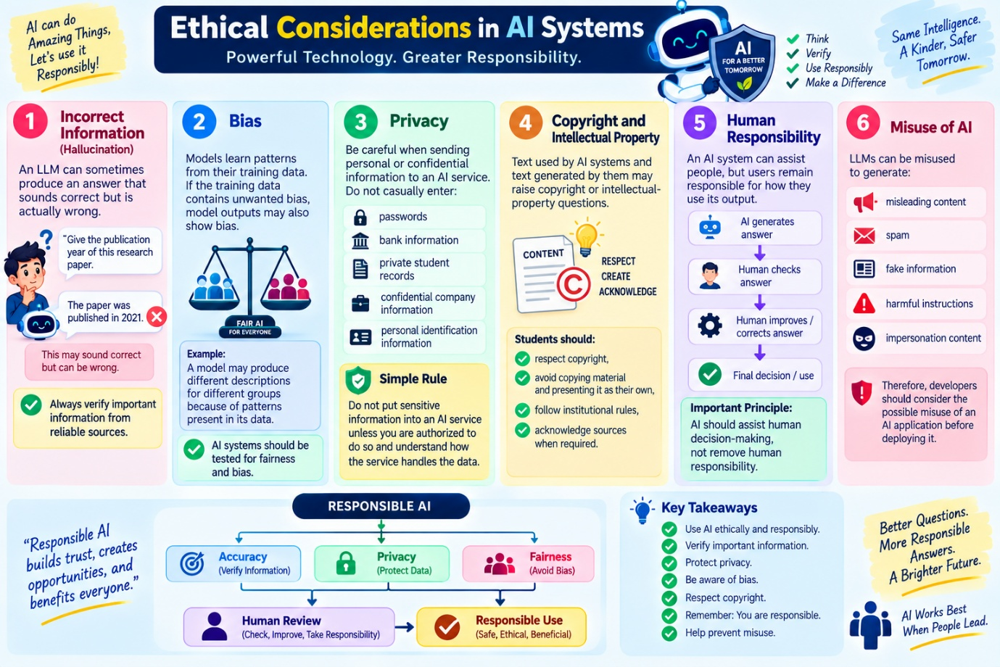
</p>

**Final Takeaway**

> 💡 **Remember this simple sequence:**

Pretrained Model → Prompt → API / Pipeline → LLM → Generated Output → Human Verification

The main advantage of pretrained models is that we can use an already-trained model instead of building and training a large model from scratch.

## **4.4 Practical Implementation and Important Functions**

### **4.4.1 Installation of Transformers**

**What is Transformers?**

Transformers is a Python library that provides tools for working with pretrained Transformer-based models.

It can be used for tasks such as:

- Text generation
- Text classification
- Text summarization
- Translation
- Question answering
For DS-505, we mainly use it to understand how a pretrained language model can be loaded and used in Python.

**Installing Transformers**

The library can be installed using Python's package manager, pip.

In Google Colab or Jupyter Notebook:

```python
!pip install transformers

```

The ! tells Google Colab/Jupyter to execute the command as a system/shell command.

**Basic Flow**

<p align="center">
  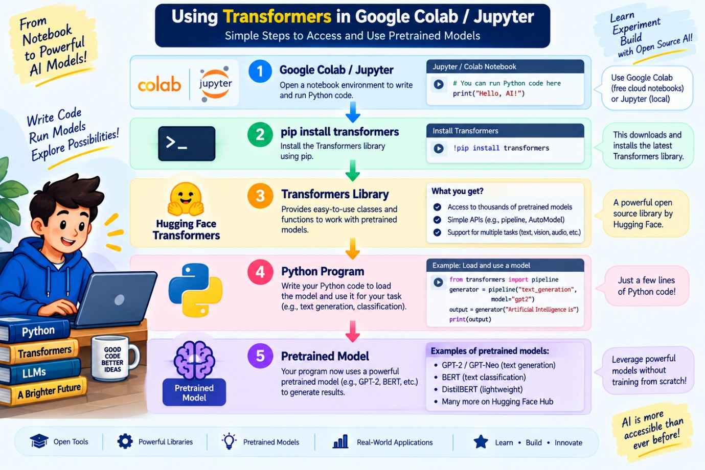
</p>

**Checking the Installation**

After installation, we can import the library:

```python
import transformers

print(transformers.__version__)

```

If the installation is successful, Python will display the installed version.

**Why check the version?**

Different versions of a library may have differences in features or behaviour. Checking the version helps us know which version is being used in our practical environment.

**Using pipeline()**

One of the easiest ways to work with pretrained models is the pipeline() function.

Example:

```python
from transformers import pipeline

generator = pipeline("text-generation")
```

Here:

- pipeline → function provided by Transformers
- "text-generation" → task we want to perform
- generator → variable that stores the pipeline
We can then provide text:

result = generator(

"Data Science is",

max_new_tokens=30)

print(result)

The pretrained model processes the input and generates additional text.

Simple Understanding

Input Text -> pipeline("text-generation") -> Pretrained Model ->Generated Text

Practical Example — Simple Text Generation

```python
from transformers import pipeline

generator = pipeline("text-generation")

result = generator(
```

"Machine Learning is",

max_new_tokens=30)

print(result[0]["generated_text"])

Possible Output

Machine Learning is a field of Artificial Intelligence

that allows computers to learn patterns from data..

> 💡 ****Note:** The exact output may be different because the model generates text based on its learned patterns and generation settings.**

### **4.4.2 Text Processing Using Python**

Before using NLP or LLM techniques, we often need to perform basic text processing.

Python provides several built-in string functions that are useful for this purpose.

The important functions in the DS-505 syllabus are:

split()

lower()

replace()

count()

Let's understand each one with simple examples.

**1. lower()**
**Purpose**

The lower() function converts alphabetic characters in a string to lowercase.

**Example**

text = "DATA SCIENCE"

print(text.lower())

**Output**

data science

**Why is it useful?**

Suppose we have:

Python

PYTHON

python

Python

A computer may treat different capitalizations as different strings.

Converting text to lowercase can make comparison and counting easier.

**Example**

text = "Python Python PYTHON"

print(text.lower())

Output:

python python python

**2. split()**
**Purpose**

The split() function divides a string into smaller parts and returns them as a list.

**Example**

text = "Data Science is interesting"

words = text.split()

print(words)

**Output**

['Data', 'Science', 'is', 'interesting']

The sentence has been divided into individual words.

**Why is split() useful in Text Processing?**

It provides a simple introduction to **tokenization**.

"Data Science is interesting"

↓

split()

↓

["Data", "Science", "is", "interesting"]

**Counting Words**

We can also find the number of words:

text = "Data Science is interesting"

words = text.split()

print(len(words))

Output:

4

**3. replace()**
**Purpose**

The replace() function replaces one piece of text with another.

**Syntax**

text.replace(old, new)

**Example**

text = "I like Python"

new_text = text.replace("Python", "Data Science")

print(new_text)

**Output**

I like Data Science

**Removing Unwanted Characters**

replace() can also be used to remove a character by replacing it with an empty string.

text = "Data! Science!"

clean_text = text.replace("!", "")

print(clean_text)

Output:

Data Science

**Important**

replace() performs exactly the replacement we specify. It does not automatically understand whether a character is useful or unwanted.

Therefore, we should use it carefully when cleaning real text.

**4. count()**
**Purpose**

The count() function tells us how many times a particular substring occurs in a string.

**Example**

text = "data science and data analytics"

print(text.count("data"))

**Output**

2

The word **data** occurs two times.

**Example with a Sentence**

text = "Python is easy. Python is powerful."

print(text.count("Python"))

Output:

2

**Combining All Four Functions**

The real benefit comes when we combine these functions.

Consider:

"  DATA Science is EASY!!!  "

We can perform several basic processing steps.

#### ⚡ **Step 1 — Convert to lowercase**

text = "  DATA Science is EASY!!!  "

text = text.lower()

print(text)

Output:

data science is easy!!!

#### ⚡ **Step 2 — Remove unwanted characters**

text = text.replace("!", "")

print(text)

Output:

data science is easy

#### ⚡ **Step 3 — Split into words**

words = text.split()

print(words)

Output:

['data', 'science', 'is', 'easy']

#### ⚡ **Step 4 — Count a word**

print(text.count("data"))

Output:

1

**Complete Practical Program**

Students can practice all four functions together:

text = "  DATA Science is EASY!!!  "

# Convert to lowercase

text = text.lower()

# Remove exclamation marks

text = text.replace("!", "")

# Split text into words

words = text.split()

# Count occurrence of "data"

data_count = text.count("data")

print("Clean Text:", text)

print("Words:", words)

print("Number of Words:", len(words))

print("Count of 'data':", data_count)

**Expected Output**

Clean Text:   data science is easy

Words: ['data', 'science', 'is', 'easy']

Number of Words: 4

Count of 'data': 1

**Practical Example: Student Review Analysis**

Suppose we have the following review:

review = "Python is EASY and Python is POWERFUL!"

We want to:

Convert it to lowercase.

Remove !.

Split it into words.

Count the number of times python occurs.

**Program**

review = "Python is EASY and Python is POWERFUL!"

review = review.lower()

review = review.replace("!", "")

words = review.split()

python_count = review.count("python")

print("Review:", review)

print("Words:", words)

print("Python occurs:", python_count, "times")

**Output**

Review: python is easy and python is powerful

Words: ['python', 'is', 'easy', 'and', 'python', 'is', 'powerful']

Python occurs: 2 times.

<p align="center">
  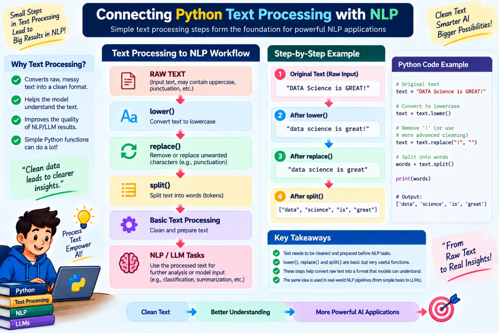
</p>

Extra 4.4.4 Live Demonstrations: Hugging Face transformers

Note for Practical Labs: The scripts below can be executed inside Google Colab using a standard CPU or free T4 GPU environment.

### Live Demo 1: Pretrained Text Summarization Pipeline

```python
"""
Demonstration: Abstractive Text Summarization using Hugging Face Pipeline
Model: sshleifer/distilbart-cnn-12-6
"""
from transformers import pipeline

# Initialize summarization pipeline
summarizer = pipeline("summarization", model="sshleifer/distilbart-cnn-12-6")

input_article = """
Large Language Models represent a major milestone in artificial intelligence research. 
Trained on extensive text corpora collected from across the internet, these transformer-based 
architectures learn grammar, world knowledge, and contextual logic. However, handling and 
curating these enormous datasets presents significant data engineering hurdles, including 
memory bottlenecks, computational costs, and the absolute requirement for distributed computing 
frameworks such as Apache Spark during initial preprocessing.
"""

# Generate summary
summary_result = summarizer(input_article, max_length=50, min_length=20, do_sample=False)

print("--- Source Document ---")
print(input_article.strip())
print("\n--- Model Generated Summary ---")
print(summary_result[0]['summary_text'])

```

### Live Demo 2: Pretrained Auto-Regressive Text Generation

```python
"""
Demonstration: Controlled Text Generation using Pretrained GPT-2
"""
from transformers import pipeline

# Load causal language modeling pipeline
generator = pipeline("text-generation", model="gpt2")

prompt_query = "Distributed computing is essential for big data because"

# Generation with controlled sampling hyperparameters
generation_output = generator(
    prompt_query,
    max_length=40,
    num_return_sequences=1,
    temperature=0.7,
    pad_token_id=50256  # Sets EOS token ID to avoid warning
)

print("--- Generated Text ---")
print(generation_output[0]['generated_text'])

```

## 5. Comprehensive Examination Preparation

## 5.1 Key Terminology Glossary

| Term | Exact Technical Definition |
| --- | --- |
| LLM | Large Language Model; deep learning systems trained on massive corpora to model and generate human language. |
| NLP | Natural Language Processing; the branch of AI concerned with enabling machines to understand, interpret, and generate text. |
| Token | The atomic unit of text (word, subword, or character) handled by a language model's tokenizer. |
| Tokenization | The process of parsing raw unstructured strings into sequences of discrete numerical token IDs. |
| Text Cleaning | Removing noise, punctuation, markup tags, and anomalies to standardize inputs for modeling. |
| Pretrained Model | A model whose weights have already been optimized on massive datasets via self-supervised pretraining. |
| API | Application Programming Interface; standard protocols and endpoints facilitating client-server interactions. |
| Abstractive Summarization | Paraphrasing and generating concise new text expressing the key ideas of a longer document. |
| Extractive Summarization | Selecting and extracting existing sentences directly from a source text based on importance scoring. |
| Hugging Face | A central platform and software ecosystem providing models, datasets, and utilities for NLP and ML. |
| Transformers | The Python library implementing Transformer-based architectures with standard APIs. |
| Hallucination | When an LLM generates plausibly phrased but factually inaccurate or unsubstantiated text. |

## 5.2 Short-Answer Questions & Model Answers (2 to 3 Marks Each)

#### ❓ Q1: What is a Large Language Model (LLM)?

#### ❓ Q2: What is the functional difference between split() and tokenization?

#### ❓ Q3: Differentiate between Extractive and Abstractive Summarization.

#### ❓ Q4: What does the temperature parameter control in text generation APIs?

#### ❓ Q5: Why is lower() commonly used in text cleaning pipelines?

## 5.3 Long-Answer Questions & Model Theory Answers (5 to 7 Marks Each)

#### ❓ Q1: Explain the relationship between Big Data and Large Language Models. Why are large datasets essential for LLM training?

#### ❓ Q2: Discuss major ethical concerns associated with Large Language Models and AI systems. Provide an illustrative scenario for algorithmic bias.

## 5.4 Practical Viva Voce & Laboratory Exam Questions

#### ❓ Q: What is the return type of the Python string .split() function?
A: It returns a Python list of strings.

#### ❓ Q: If text = "Data Science", what is the output of text.replace("Science", "Analytics")?
A: "Data Analytics".

#### ❓ Q: Does string.lower() modify the original string in place?
A: No. Python strings are immutable; lower() returns a new string copy.

#### ❓ Q: How do you determine the total number of words in a space-separated string s using basic Python?
A: len(s.split()).

#### ❓ Q: What command installs the Hugging Face transformers package in a Jupyter notebook?
A: !pip install transformers.

#### ❓ Q: What is the primary role of the Hugging Face pipeline function?
A: It abstracts the end-to-end NLP workflow, combining tokenization, model inference, and output decoding into a single callable object.

#### ❓ Q: Why do modern LLMs use subword tokenization (like BPE) instead of traditional whitespace split()?
A: Subword tokenization limits vocabulary size while avoiding out-of-vocabulary (OOV) errors by decomposing rare or unseen words into known subword fragments.

#### ❓ 🔹 Q: What is the difference between greedy decoding and nucleus sampling in text generation?
A: Greedy decoding always picks the single highest-probability token (deterministic and prone to loops), whereas nucleus (top-) sampling dynamically samples from candidates whose cumulative probability reaches threshold .

## 6. Student Assignment & Lab Worksheet

Theoretical Assignment Tasks

#### ❓ 🔹 Assignment Task 1: Draw and explain the architectural block diagram of the basic LLM life-cycle: Data Collection  Cleaning  Pre-training  Fine-Tuning  Inference.

#### ❓ Assignment Task 2: Compare and contrast the capabilities and trade-offs of rule-based conversational agents versus LLM-powered conversational agents.

#### ❓ Assignment Task 3: Explain three real-world risks associated with AI hallucinations in healthcare and financial domains.

Practical Lab Programming Tasks

#### ❓ Lab Task 1: Write a Python program that accepts a multi-line paragraph, normalizes all words to lowercase, strips periods (.), commas (,), and exclamation marks (!), splits the text into tokens, and displays the top 3 most frequent tokens along with their counts.

#### ❓ Lab Task 2: Given the string raw_log = "ERROR: Connection reset by peer! [Module: Ingestion]", write Python statements using replace() and split() to extract only the error message text (Connection reset by peer).

#### ❓ Lab Task 3: In Google Colab, import the transformers library, load the "sentiment-analysis" pipeline, and evaluate the sentiment of the following two sentences:

"Handling large text datasets with PySpark and Transformers is efficient and rewarding."

"The server crashed repeatedly due to poor memory optimization."
