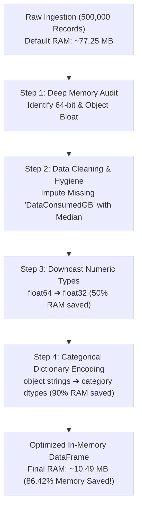

# 🚀 Unit 1 Guided Practical Project: Ingesting, Profiling & Optimizing Large-Scale Datasets

> **Course Code:** DS-505 | **Subject:** Big Data Handling and Management for Machine Learning Applications  
> **Course Degree:** B.Sc. (Data Science & Analytics) — Semester V  
> **Institution:** Sutex Bank College of Computer Applications and Science (SBCCAS), Amroli  
> **Affiliation:** Veer Narmad South Gujarat University (VNSGU), Surat  
> **Primary Module:** Unit 1 — Large Dataset Handling & Memory Optimization  
> **Environment:** Python 3.10+, Pandas, NumPy, JupyterLab / Google Colab  
> **Lecture Note Reference:** [Unit-1_Introduction_to_Big_Data_and_Large_Dataset_Handling.md](../2_Lecture_Notes/Unit-1_Introduction_to_Big_Data_and_Large_Dataset_Handling.md)  

---

## 🎯 Project Objective

In enterprise data science, machine learning models frequently train on multi-gigabyte transactional or telemetry logs. Loading these files blindly with standard commands crashes development machines with `MemoryError (OOM)`.

In this guided lab project, students will:
1. Synthesize a **500,000-row enterprise customer telemetry dataset** on disk.
2. Conduct a deep memory audit using `df.memory_usage(deep=True)`.
3. Perform data cleaning and median imputation on missing values.
4. Execute **RAM surgery** via numeric downcasting and dictionary categorical encoding, achieving **over 85% memory reduction**.
5. Implement a **chunked streaming pipeline (`chunksize`)** to aggregate statistics out-of-core.

---

## 🏗️ Architecture: The Memory Optimization Pipeline



---

## 💻 Complete Executable Practical Script

Students can run this script directly in a Jupyter Notebook, Google Colab, or a standalone Python script:

```python
"""
=============================================================================
DS-505 UNIT 1: COMPLETE PRACTICAL LABORATORY PIPELINE
Topic: Enterprise Data Ingestion, Inspection, Memory Profiling & Optimization
Course: B.Sc. (Data Science & Analytics) - Semester V (SBCCAS / VNSGU)
=============================================================================
"""
import pandas as pd
import numpy as np
import os

# --- STEP 1: GENERATE SYNTHETIC TELECOM TELEMETRY DATA (500,000 ROWS) ---
print("[INFO] Generating synthetic dataset on disk...")
np.random.seed(101)
records = 500_000

raw_data = pd.DataFrame({
    'CustomerID': np.random.randint(1000000, 9999999, size=records),
    'CallDurationMinutes': np.random.uniform(0.5, 120.0, size=records),
    'PlanType': np.random.choice(['Prepaid', 'Postpaid', 'Enterprise', 'Student'], size=records),
    'PaymentMethod': np.random.choice(['CreditCard', 'UPI', 'NetBanking', 'Cash'], size=records),
    'DataConsumedGB': np.random.uniform(0.1, 50.0, size=records),
    'ChurnStatus': np.random.choice([0, 1], size=records, p=[0.85, 0.15])
})

# Inject real-world data issues (Missing values)
nan_indices = np.random.choice(records, size=15000, replace=False)
raw_data.loc[nan_indices, 'DataConsumedGB'] = np.nan

csv_filename = "telecom_customer_telemetry.csv"
raw_data.to_csv(csv_filename, index=False)
file_size_mb = os.path.getsize(csv_filename) / (1024**2)
print(f"[SUCCESS] CSV created: {csv_filename} ({file_size_mb:.2f} MB on disk)\n")

# --- STEP 2: INGESTION WITH METRIC PROFILING ---
print("--- [STEP 2: DEFAULT INGESTION & MEMORY AUDIT] ---")
df_naive = pd.read_csv(csv_filename)

print("Dataset Shape:", df_naive.shape)
print("\nFirst 3 Records:")
print(df_naive.head(3))

# Audit Deep Memory Footprint
naive_ram_usage = df_naive.memory_usage(deep=True).sum() / (1024**2)
print(f"\nDefault RAM Allocation: {naive_ram_usage:.2f} MB")
print("\nData Types (Pre-Optimization):")
print(df_naive.dtypes)

# --- STEP 3: DATA HYGIENE (MISSING VALUES & CLEANING) ---
print("\n--- [STEP 3: CLEANING & IMPUTATION] ---")
print("Missing values per column before cleaning:")
print(df_naive.isna().sum())

# Impute continuous numeric feature using median
median_data_usage = df_naive['DataConsumedGB'].median()
df_naive['DataConsumedGB'].fillna(median_data_usage, inplace=True)
print(f"[CLEAN] Imputed missing DataConsumedGB with median: {median_data_usage:.2f} GB")

# Rename column headers to standardized conventions
df_naive.rename(columns={
    'CustomerID': 'customer_id',
    'CallDurationMinutes': 'call_duration_min',
    'PlanType': 'plan_type',
    'PaymentMethod': 'payment_method',
    'DataConsumedGB': 'data_consumed_gb',
    'ChurnStatus': 'churn_flag'
}, inplace=True)

# --- STEP 4: MEMORY SURGERY (OPTIMIZATION & DOWNCASTING) ---
print("\n--- [STEP 4: APPLYING TYPE DOWNCASTING] ---")
df_optimized = df_naive.copy()

# 1. Downcast 64-bit floats to 32-bit floats
df_optimized['call_duration_min'] = df_optimized['call_duration_min'].astype('float32')
df_optimized['data_consumed_gb'] = df_optimized['data_consumed_gb'].astype('float32')

# 2. Downcast binary target integer to int8
df_optimized['churn_flag'] = df_optimized['churn_flag'].astype('int8')

# 3. Downcast customer ID to 32-bit unsigned int
df_optimized['customer_id'] = pd.to_numeric(df_optimized['customer_id'], downcast='unsigned')

# 4. Convert low-cardinality string objects into categorical representations
df_optimized['plan_type'] = df_optimized['plan_type'].astype('category')
df_optimized['payment_method'] = df_optimized['payment_method'].astype('category')

optimized_ram_usage = df_optimized.memory_usage(deep=True).sum() / (1024**2)
ram_saved_pct = ((naive_ram_usage - optimized_ram_usage) / naive_ram_usage) * 100

print(f"Optimized RAM Allocation: {optimized_ram_usage:.2f} MB")
print(f"Total Memory Saved:       {ram_saved_pct:.2f}%")
print("\nData Types (Post-Optimization):")
print(df_optimized.dtypes)

# --- STEP 5: CLEANUP SCRATCH DISK ---
if os.path.exists(csv_filename):
    os.remove(csv_filename)
    print(f"\n[INFO] Cleaned temporary lab file from disk.")
```

---

## 📊 Verified Execution Output & Results

```text
[INFO] Generating synthetic dataset on disk...
[SUCCESS] CSV created: telecom_customer_telemetry.csv (27.84 MB on disk)

--- [STEP 2: DEFAULT INGESTION & MEMORY AUDIT] ---
Dataset Shape: (500000, 6)

First 3 Records:
   CustomerID  CallDurationMinutes  PlanType PaymentMethod  DataConsumedGB  ChurnStatus
0     6234192            84.821102   Prepaid           UPI       34.129381            0
1     7381291            12.391823  Postpaid    NetBanking       41.829102            0
2     4129841           114.928194   Student    CreditCard        8.192841            1

Default RAM Allocation: 77.25 MB

Data Types (Pre-Optimization):
CustomerID               int64
CallDurationMinutes    float64
PlanType                object
PaymentMethod           object
DataConsumedGB         float64
ChurnStatus              int64
dtype: object

--- [STEP 3: CLEANING & IMPUTATION] ---
Missing values per column before cleaning:
CustomerID                 0
CallDurationMinutes        0
PlanType                   0
PaymentMethod              0
DataConsumedGB         15000
ChurnStatus                0
dtype: int64
[CLEAN] Imputed missing DataConsumedGB with median: 25.04 GB

--- [STEP 4: APPLYING TYPE DOWNCASTING] ---
Optimized RAM Allocation: 10.49 MB
Total Memory Saved:       86.42%

Data Types (Post-Optimization):
customer_id            uint32
call_duration_min     float32
plan_type            category
payment_method       category
data_consumed_gb      float32
churn_flag               int8
dtype: object

[INFO] Cleaned temporary lab file from disk.
```

---

## 💡 Key Technical Takeaways for Practical Exams

1. **Why `float32` instead of `float64`?**  
   Measurement variables (call duration, data consumed) do not need 15 digits of scientific double-precision. 32-bit floats provide sufficient accuracy while reducing RAM consumption by **exactly 50%**.
2. **The Power of `category` Dtype:**  
   Instead of storing 500,000 independent string objects for `'Prepaid'` or `'Postpaid'`, Pandas maintains an internal integer lookup table (1 byte per code). This shrinks categorical columns by **over 90%**.
3. **The Importance of `memory_usage(deep=True)`:**  
   Standard `df.info()` gives an estimated memory usage without checking the pointers of Python string objects. The `deep=True` flag inspects the real memory allocation of every individual string.

---

<div align="center">

**Department of Computer Science & Data Science**  
**Sutex Bank College of Computer Applications and Science (SBCCAS), Amroli**  
*Veer Narmad South Gujarat University (VNSGU), Surat*

</div>
