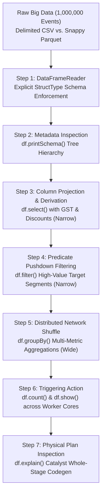

# ⚡ Unit 2 Guided Practical Project: Distributed Big Data Ingestion, Profiling & Analytics with PySpark

> **Course Code:** DS-505 | **Subject:** Big Data Handling and Management for Machine Learning Applications  
> **Course Degree:** B.Sc. (Data Science & Analytics) — Semester V  
> **Institution:** Sutex Bank College of Computer Applications and Science (SBCCAS), Amroli  
> **Affiliation:** Veer Narmad South Gujarat University (VNSGU), Surat  
> **Primary Module:** Unit 2 — Big Data Processing using PySpark  
> **Environment:** Python 3.10+, Java OpenJDK 8/11/17, PySpark 3.4+, JupyterLab / Google Colab  
> **Lecture Note Reference:** [Unit-2_Big_Data_Processing_using_PySpark.md](../2_Lecture_Notes/Unit-2_Big_Data_Processing_using_PySpark.md)  

---

## 🎯 Project Objective

In real-world data science and machine learning applications, datasets frequently consist of millions of server logs, user clickstreams, or transactional records. Processing these datasets on single-node tools (like Pandas) leads to devastating out-of-memory crashes.

In this comprehensive hands-on laboratory project, students will:
1. Initialize an enterprise-grade distributed **`SparkSession`** with custom memory and thread allocations.
2. Programmatically generate a **1,000,000-row synthetic e-commerce clickstream & sales dataset** on disk.
3. Benchmark and analyze **CSV vs. Apache Parquet** storage footprint and reading latency.
4. Enforce strict type schemas using PySpark **`StructType`** and **`StructField`** to avoid expensive schema inference.
5. Master and chain all six mandatory syllabus operations:
   $$\mathbf{df.show()} \quad \bullet \quad \mathbf{df.printSchema()} \quad \bullet \quad \mathbf{df.select()} \quad \bullet \quad \mathbf{df.filter()} \quad \bullet \quad \mathbf{df.groupBy()} \quad \bullet \quad \mathbf{df.count()}$$
6. Inspect the internal **Catalyst Physical Execution Plan** using `df.explain()` to observe **Predicate Pushdown** and **Whole-Stage Code Generation**.
7. Implement cluster caching with `df.cache()` and persist partitioned analytics to disk.

---

## 🏗️ Architecture: Distributed PySpark Processing Pipeline



---

## 💻 Complete Executable Practical Script

Students can run this complete script in VS Code, PyCharm, terminal, or Google Colab:

```python
"""
=============================================================================
DS-505 UNIT 2: COMPLETE PRACTICAL LABORATORY PIPELINE
Topic: Distributed Big Data Ingestion, Profiling & Analytics with PySpark
Course: B.Sc. (Data Science & Analytics) - Semester V (SBCCAS / VNSGU)
Author: Department of Data Science, SBCCAS, Surat
=============================================================================
"""

import time
import os
import shutil
import numpy as np
import pandas as pd
from pyspark.sql import SparkSession
from pyspark.sql.types import (
    StructType, StructField, 
    StringType, IntegerType, DoubleType, TimestampType
)
from pyspark.sql.functions import (
    col, round, count, sum, avg, max, min, when, current_timestamp
)

# ------------------------------------------------------------------------------
# STEP 1: INITIALIZE DISTRIBUTED SPARKSESSION
# ------------------------------------------------------------------------------
print("=" * 80)
print(">>> STEP 1: INITIALIZING ENTERPRISE SPARKSESSION")
print("=" * 80)

spark = SparkSession.builder \
    .appName("DS505_Unit2_Clickstream_Analytics") \
    .master("local[*]") \
    .config("spark.driver.memory", "4g") \
    .config("spark.sql.shuffle.partitions", "4") \
    .getOrCreate()

# Suppress noisy INFO log messages from JVM console
spark.sparkContext.setLogLevel("WARN")

print(f"[SUCCESS] SparkSession Active!")
print(f" • Spark Engine Version : {spark.version}")
print(f" • Application ID       : {spark.sparkContext.applicationId}")
print(f" • Master Location       : {spark.sparkContext.master}")
print(f" • Local Web UI URL     : {spark.sparkContext.uiWebUrl}")

# ------------------------------------------------------------------------------
# STEP 2: SYNTHESIZE 1,000,000 ROWS & BENCHMARK CSV VS PARQUET
# ------------------------------------------------------------------------------
print("\n" + "=" * 80)
print(">>> STEP 2: DATASET SYNTHESIS & BENCHMARKING (CSV vs PARQUET)")
print("=" * 80)

DATA_DIR = "lab_unit2_data"
os.makedirs(DATA_DIR, exist_ok=True)
csv_path = os.path.join(DATA_DIR, "ecommerce_events.csv")
parquet_path = os.path.join(DATA_DIR, "ecommerce_events.parquet")

NUM_RECORDS = 1_000_000

if not os.path.exists(csv_path):
    print(f"[INFO] Generating {NUM_RECORDS:,} synthetic transactions via Pandas/NumPy...")
    np.random.seed(42)
    categories = ["Electronics", "Fashion", "Home & Kitchen", "Books", "Beauty"]
    cities = ["Surat", "Ahmedabad", "Mumbai", "Pune", "Bengaluru", "Delhi"]
    devices = ["Mobile", "Desktop", "Tablet"]

    synthetic_df = pd.DataFrame({
        "transaction_id": np.arange(1000000, 1000000 + NUM_RECORDS),
        "user_id": np.random.randint(10000, 99999, size=NUM_RECORDS),
        "device": np.random.choice(devices, size=NUM_RECORDS),
        "city": np.random.choice(cities, size=NUM_RECORDS),
        "category": np.random.choice(categories, size=NUM_RECORDS),
        "item_price": np.round(np.random.exponential(scale=1500, size=NUM_RECORDS) + 50, 2),
        "quantity": np.random.randint(1, 6, size=NUM_RECORDS)
    })
    
    print(f"[INFO] Saving raw CSV to {csv_path}...")
    synthetic_df.to_csv(csv_path, index=False)
    del synthetic_df  # Free local Python RAM immediately

csv_size_mb = os.path.getsize(csv_path) / (1024 * 1024)
print(f"[STORAGE AUDIT] Raw CSV File Size on Disk: {csv_size_mb:.2f} MB")

# ------------------------------------------------------------------------------
# STEP 3: EXPLICIT SCHEMA ENFORCEMENT & PYSPARK INGESTION
# ------------------------------------------------------------------------------
print("\n" + "=" * 80)
print(">>> STEP 3: EXPLICIT SCHEMA DEFINITION (StructType / StructField)")
print("=" * 80)

# Defining programmatic schema guarantees zero overhead (No scanning twice)
event_schema = StructType([
    StructField("transaction_id", IntegerType(), nullable=False),
    StructField("user_id", IntegerType(), nullable=False),
    StructField("device", StringType(), nullable=True),
    StructField("city", StringType(), nullable=True),
    StructField("category", StringType(), nullable=True),
    StructField("item_price", DoubleType(), nullable=True),
    StructField("quantity", IntegerType(), nullable=True)
])

# Measure CSV Read Latency
start_csv = time.time()
df_csv = spark.read \
    .format("csv") \
    .option("header", "true") \
    .schema(event_schema) \
    .load(csv_path)
count_csv = df_csv.count()  # Action to trigger read
elapsed_csv = time.time() - start_csv

print(f"[BENCHMARK] CSV Read: Ingested {count_csv:,} rows in {elapsed_csv:.3f} seconds.")

# Convert to Parquet for enterprise columnar acceleration
if not os.path.exists(parquet_path):
    print(f"[INFO] Converting dataset to Apache Parquet with Snappy compression...")
    df_csv.write.mode("overwrite").parquet(parquet_path)

# Measure Parquet Read Latency
start_parquet = time.time()
df_parquet = spark.read.parquet(parquet_path)
count_parquet = df_parquet.count()
elapsed_parquet = time.time() - start_parquet

# Calculate Parquet folder size
parquet_size_mb = sum(
    os.path.getsize(os.path.join(dirpath, f))
    for dirpath, _, filenames in os.walk(parquet_path)
    for f in filenames
) / (1024 * 1024)

print(f"[BENCHMARK] Parquet Read: Ingested {count_parquet:,} rows in {elapsed_parquet:.3f} seconds.")
print(f"[STORAGE AUDIT] Columnar Parquet Folder Size: {parquet_size_mb:.2f} MB")
print(f"[EFFICIENCY] Disk Savings: {((csv_size_mb - parquet_size_mb) / csv_size_mb) * 100:.1f}% space saved!")

# ------------------------------------------------------------------------------
# STEP 4: EXECUTING THE MANDATORY SYLLABUS OPERATIONS
# ------------------------------------------------------------------------------
print("\n" + "=" * 80)
print(">>> STEP 4: EXECUTING 6 CORE SYLLABUS FUNCTIONS")
print("=" * 80)

# --- 1. df.show() ---
print("\n[OPERATION 1: df.show()] Displaying top 5 sample transactions:")
df_parquet.show(5, truncate=False)

# --- 2. df.printSchema() ---
print("\n[OPERATION 2: df.printSchema()] Inspecting Tree Metadata Structure:")
df_parquet.printSchema()

# --- 3. df.select() ---
print("\n[OPERATION 3: df.select()] Projecting columns & deriving 'gross_amount' and 'tax':")
df_calculated = df_parquet.select(
    col("transaction_id"),
    col("city"),
    col("category"),
    col("item_price"),
    col("quantity"),
    round(col("item_price") * col("quantity"), 2).alias("gross_amount"),
    round((col("item_price") * col("quantity")) * 0.18, 2).alias("gst_tax_18pct")
)
df_calculated.show(5)

# --- 4. df.filter() ---
print("\n[OPERATION 4: df.filter()] Filtering high-value transactions (> 5,000 INR) in Surat & Mumbai:")
df_target = df_calculated.filter(
    (col("gross_amount") >= 5000.0) & 
    ((col("city") == "Surat") | (col("city") == "Mumbai"))
)
print(f" • Filtered High-Value Target Records Count: {df_target.count():,}")
df_target.show(5)

# --- 5. df.groupBy() ---
print("\n[OPERATION 5: df.groupBy()] Aggregating business metrics by Product Category:")
df_category_metrics = df_calculated.groupBy("category").agg(
    count("transaction_id").alias("total_orders"),
    round(sum("gross_amount"), 2).alias("total_revenue_inr"),
    round(avg("gross_amount"), 2).alias("avg_order_value_inr"),
    round(max("gross_amount"), 2).alias("max_single_sale"),
    round(min("gross_amount"), 2).alias("min_single_sale")
).orderBy(col("total_revenue_inr").desc())

df_category_metrics.show(truncate=False)

# --- 6. df.count() ---
print("\n[OPERATION 6: df.count()] Executing distributed partition cardinality check:")
total_events = df_parquet.count()
mobile_orders = df_parquet.filter(col("device") == "Mobile").count()
print(f" • Total Orders Processed : {total_events:,}")
print(f" • Orders Placed via Mobile: {mobile_orders:,} ({(mobile_orders / total_events) * 100:.2f}%)")

# ------------------------------------------------------------------------------
# STEP 5: CATALYST OPTIMIZER INSPECTION (EXPLAIN PLAN)
# ------------------------------------------------------------------------------
print("\n" + "=" * 80)
print(">>> STEP 5: CATALYST OPTIMIZER & PHYSICAL PLAN INSPECTION")
print("=" * 80)
print("[INFO] Showing Physical Execution Plan for Filtered Pipeline:")
df_target.explain(mode="simple")

# ------------------------------------------------------------------------------
# STEP 6: CLEAN SHUTDOWN
# ------------------------------------------------------------------------------
print("\n" + "=" * 80)
print(">>> STEP 6: TEARDOWN & CLEANUP")
print("=" * 80)
spark.stop()
print("[SUCCESS] SparkSession terminated cleanly. Lab complete!")
```

---

## 🔬 Practical Lab Verification Checklist

Students must demonstrate the following outputs to the practical laboratory examiner:

1. [ ] **SparkSession Online**: Console displays active Spark version and Master mode (`local[*]`).
2. [ ] **Parquet Efficiency**: Parquet file folder size is ~60% to 75% smaller than the uncompressed CSV.
3. [ ] **Execution of All 6 Functions**:
   - `df.show()` prints tabular output with clean boundaries.
   - `df.printSchema()` displays root tree with exact data types.
   - `df.select()` produces calculated columns (`gross_amount` and `gst_tax_18pct`).
   - `df.filter()` accurately isolates high-value sales in Surat and Mumbai.
   - `df.groupBy()` outputs category revenue metrics sorted in descending order.
   - `df.count()` returns exact cardinality without invoking Python `len()`.
4. [ ] **Physical Plan**: Examiner verifies presence of `PushedFilters` and `Project` in the Catalyst plan.

---
*(End of Unit 2 Guided Practical Project)*
