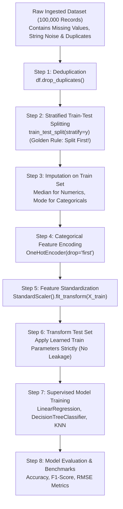

# 🔬 Unit 3 Guided Practical Project: Machine Learning Data Preparation & Predictive Modeling Pipeline

> **Course Code:** DS-505 | **Subject:** Big Data Handling and Management for Machine Learning Applications  
> **Course Degree:** B.Sc. (Data Science & Analytics) — Semester V  
> **Institution:** Sutex Bank College of Computer Applications and Science (SBCCAS), Amroli  
> **Affiliation:** Veer Narmad South Gujarat University (VNSGU), Surat  
> **Primary Module:** Unit 3 — Preparing Big Data for Machine Learning  
> **Environment:** Python 3.10+, NumPy, Pandas, Scikit-Learn 1.3+, Matplotlib / Seaborn  
> **Lecture Note Reference:** [Unit-3_Preparing_Big_Data_for_Machine_Learning.md](../2_Lecture_Notes/Unit-3_Preparing_Big_Data_for_Machine_Learning.md)  

---

## 🎯 Project Objective

In industrial Machine Learning operations, feeding uncleaned or unscaled data directly into algorithms results in model convergence failures, algorithmic bias, and severe data leakage.

In this comprehensive hands-on laboratory project, students will:
1. Synthesize a **100,000-row enterprise customer churn & telecommunications dataset** containing sensor noise, missing entries, duplicate rows, and categorical strings.
2. Execute data cleaning: identify missing entries, apply median/mode statistical imputation, and remove duplicate records.
3. Apply categorical encoding using **`OneHotEncoder`** with dummy variable trap prevention (`drop="first"`).
4. Perform feature normalization and standardization using Scikit-Learn's **`StandardScaler`**.
5. Implement stratified train-test partitioning using **`train_test_split(..., stratify=y)`** to avoid class distribution skew and data leakage.
6. Train, evaluate, and benchmark all three syllabus algorithms:
   * **Linear Regression:** Predict continuous Customer Lifetime Value (CLV in INR).
   * **Decision Tree Classifier:** Classify discrete customer churn (0 = Retained, 1 = Churned).
   * **K-Nearest Neighbors Classifier:** Classify customer churn via local Euclidean proximity voting.
7. Compute and interpret diagnostic evaluation metrics: Accuracy, Precision, Recall, F1-Score, and Mean Squared Error (MSE).

---

## 🏗️ Architecture: Enterprise ML Data Preparation Workflow



---

## 💻 Complete Executable Practical Script

Students can run this script directly in a Jupyter Notebook, Google Colab, or standalone Python environment:

```python
"""
=============================================================================
DS-505 UNIT 3: COMPLETE PRACTICAL LABORATORY PIPELINE
Topic: Enterprise Data Preparation & Predictive Modeling with Scikit-Learn
Course: B.Sc. (Data Science & Analytics) - Semester V (SBCCAS / VNSGU)
Author: Department of Data Science, SBCCAS, Surat
=============================================================================
"""

import time
import numpy as np
import pandas as pd
from sklearn.model_selection import train_test_split
from sklearn.preprocessing import StandardScaler, OneHotEncoder, LabelEncoder
from sklearn.impute import SimpleImputer
from sklearn.linear_model import LinearRegression
from sklearn.tree import DecisionTreeClassifier
from sklearn.neighbors import KNeighborsClassifier
from sklearn.metrics import (
    accuracy_score, precision_score, recall_score, f1_score,
    mean_squared_error, r2_score, confusion_matrix
)

# ------------------------------------------------------------------------------
# STEP 1: GENERATE SYNTHETIC TELECOM CHURN DATASET (100,000 ROWS)
# ------------------------------------------------------------------------------
print("=" * 80)
print(">>> STEP 1: SYNTHESIZING ENTERPRISE TELECOM CHURN DATASET (100,000 ROWS)")
print("=" * 80)

np.random.seed(42)
N = 100_000

cities = ["Surat", "Ahmedabad", "Mumbai", "Vadodara", "Pune", np.nan]
contracts = ["Month-to-Month", "One-Year", "Two-Year"]
internets = ["Fiber-Optic", "DSL", "No-Internet"]

# Generate synthetic feature columns
tenure_months = np.random.randint(1, 72, size=N).astype(float)
monthly_charges = np.round(np.random.uniform(299.0, 1499.0, size=N), 2)
support_tickets = np.random.poisson(lam=1.5, size=N).astype(float)

# Inject missing values (5% random missingness)
mask_tenure = np.random.rand(N) < 0.05
tenure_months[mask_tenure] = np.nan

mask_charges = np.random.rand(N) < 0.04
monthly_charges[mask_charges] = np.nan

df = pd.DataFrame({
    "customer_id": np.arange(100000, 100000 + N),
    "city": np.random.choice(cities, size=N, p=[0.25, 0.20, 0.25, 0.15, 0.10, 0.05]),
    "contract_type": np.random.choice(contracts, size=N, p=[0.55, 0.25, 0.20]),
    "internet_service": np.random.choice(internets, size=N, p=[0.45, 0.35, 0.20]),
    "tenure_months": tenure_months,
    "monthly_charges": monthly_charges,
    "support_tickets": support_tickets
})

# Generate Targets:
# Target 1 (Continuous Regression): Total Lifetime Spend (INR)
df["total_lifetime_spend"] = np.round(
    (df["tenure_months"].fillna(24) * df["monthly_charges"].fillna(600)) + 
    np.random.normal(0, 500, size=N), 2
)

# Target 2 (Binary Classification): Churn (1 = Churned, 0 = Retained)
# Higher monthly charges + high support tickets + month-to-month contract increases churn
churn_prob = 1 / (1 + np.exp(-(
    -2.0 + 
    (df["monthly_charges"].fillna(600) / 500) + 
    (df["support_tickets"] * 0.4) - 
    (df["tenure_months"].fillna(24) / 20)
)))
df["churn"] = (np.random.rand(N) < churn_prob).astype(int)

# Introduce 2,000 artificial duplicate records to simulate pipeline retries
duplicate_rows = df.iloc[:2000].copy()
df = pd.concat([df, duplicate_rows], ignore_index=True)

print(f"[SUCCESS] Synthetic Dataset Created!")
print(f" • Total Rows (with Duplicates) : {len(df):,}")
print(f" • Missing Values Summary:\n{df.isna().sum()}")
print(f" • Churn Class Distribution     : Retained (0): {(df['churn']==0).sum():,} | Churned (1): {(df['churn']==1).sum():,}")

# ------------------------------------------------------------------------------
# STEP 2: DATA CLEANING & DEDUPLICATION
# ------------------------------------------------------------------------------
print("\n" + "=" * 80)
print(">>> STEP 2: DATA CLEANING (DEDUPLICATION)")
print("=" * 80)

initial_count = len(df)
df.drop_duplicates(subset=["customer_id"], keep="first", inplace=True)
print(f"[CLEANING] Removed {initial_count - len(df):,} duplicate customer records.")
print(f" • Verified Clean Unique Rows   : {len(df):,}")

# ------------------------------------------------------------------------------
# STEP 3: STRATIFIED TRAIN-TEST PARTITIONING (AVOID DATA LEAKAGE)
# ------------------------------------------------------------------------------
print("\n" + "=" * 80)
print(">>> STEP 3: STRATIFIED TRAIN-TEST SPLITTING (80% Train, 20% Test)")
print("=" * 80)

features = ["city", "contract_type", "internet_service", "tenure_months", "monthly_charges", "support_tickets"]
X = df[features].copy()
y_classification = df["churn"].copy()
y_regression = df["total_lifetime_spend"].copy()

# Stratify strictly on the classification target to preserve churn percentage!
X_train, X_test, y_train_cls, y_test_cls, y_train_reg, y_test_reg = train_test_split(
    X, y_classification, y_regression,
    test_size=0.20,
    random_state=42,
    stratify=y_classification
)

print(f"[SPLIT VERIFICATION]")
print(f" • Training Set Size : {len(X_train):,} samples (Train Churn Rate: {y_train_cls.mean()*100:.2f}%)")
print(f" • Testing Set Size  : {len(X_test):,} samples (Test Churn Rate : {y_test_cls.mean()*100:.2f}%)")

# ------------------------------------------------------------------------------
# STEP 4: STATISTICAL IMPUTATION (NO DATA LEAKAGE)
# ------------------------------------------------------------------------------
print("\n" + "=" * 80)
print(">>> STEP 4: STATISTICAL IMPUTATION (MEDIAN & MODE)")
print("=" * 80)

num_cols = ["tenure_months", "monthly_charges", "support_tickets"]
cat_cols = ["city", "contract_type", "internet_service"]

# Numeric: Impute with Median (learned strictly on X_train!)
num_imputer = SimpleImputer(strategy="median")
X_train[num_cols] = num_imputer.fit_transform(X_train[num_cols])
X_test[num_cols]  = num_imputer.transform(X_test[num_cols])

# Categorical: Impute with Most Frequent / Mode
cat_imputer = SimpleImputer(strategy="most_frequent")
X_train[cat_cols] = cat_imputer.fit_transform(X_train[cat_cols])
X_test[cat_cols]  = cat_imputer.transform(X_test[cat_cols])

print(f"[IMPUTATION SUCCESS] All missing values resolved!")
print(f" • Remaining NaNs in Train : {X_train.isna().sum().sum()}")
print(f" • Remaining NaNs in Test  : {X_test.isna().sum().sum()}")

# ------------------------------------------------------------------------------
# STEP 5: CATEGORICAL ENCODING & NUMERICAL STANDARDIZATION
# ------------------------------------------------------------------------------
print("\n" + "=" * 80)
print(">>> STEP 5: FEATURE ENGINEERING (ONE-HOT ENCODING & STANDARDSCALER)")
print("=" * 80)

# 1. One-Hot Encoding for Nominal Categoricals (Dropping first to avoid dummy variable trap)
ohe = OneHotEncoder(drop="first", sparse_output=False, handle_unknown="ignore")
X_train_ohe = ohe.fit_transform(X_train[cat_cols])
X_test_ohe  = ohe.transform(X_test[cat_cols])

ohe_feature_names = ohe.get_feature_names_out(cat_cols)

# 2. Standardization for Numeric Features (Z-Score Scaling)
scaler = StandardScaler()
X_train_scaled = scaler.fit_transform(X_train[num_cols])
X_test_scaled  = scaler.transform(X_test[num_cols])

# Combine processed numerical and encoded categorical arrays
X_train_processed = np.hstack([X_train_scaled, X_train_ohe])
X_test_processed  = np.hstack([X_test_scaled, X_test_ohe])

all_feature_names = list(num_cols) + list(ohe_feature_names)
print(f"[FEATURE MATRIX] Ready for Modeling!")
print(f" • Total Engineered Features : {X_train_processed.shape[1]}")
print(f" • Feature List              : {all_feature_names}")

# ------------------------------------------------------------------------------
# STEP 6: MODEL TRAINING & EVALUATION (3 SYLLABUS MODELS)
# ------------------------------------------------------------------------------
print("\n" + "=" * 80)
print(">>> STEP 6: MODEL TRAINING, PREDICTION & DIAGNOSTIC EVALUATION")
print("=" * 80)

# --- 6.1 LINEAR REGRESSION (Predicting Lifetime Spend) ---
print("\n[MODEL 1: LinearRegression - Continuous Target]")
t0 = time.time()
lin_reg = LinearRegression()
lin_reg.fit(X_train_processed, y_train_reg)
y_pred_reg = lin_reg.predict(X_test_processed)
fit_time_lr = time.time() - t0

mse_lr = mean_squared_error(y_test_reg, y_pred_reg)
rmse_lr = np.sqrt(mse_lr)
r2_lr = r2_score(y_test_reg, y_pred_reg)

print(f" • Training Latency     : {fit_time_lr:.4f} seconds")
print(f" • Root Mean Sq Error   : {rmse_lr:.2f} INR")
print(f" • R-squared (R2) Score : {r2_lr:.4f} (Explains {r2_lr*100:.2f}% of variance)")

# --- 6.2 DECISION TREE CLASSIFIER (Predicting Churn) ---
print("\n[MODEL 2: DecisionTreeClassifier - Binary Target]")
t0 = time.time()
# Restrict max_depth=5 to prevent overfitting
dt_clf = DecisionTreeClassifier(criterion="gini", max_depth=5, random_state=42)
dt_clf.fit(X_train_processed, y_train_cls)
y_pred_dt = dt_clf.predict(X_test_processed)
fit_time_dt = time.time() - t0

acc_dt = accuracy_score(y_test_cls, y_pred_dt)
f1_dt = f1_score(y_test_cls, y_pred_dt)

print(f" • Training Latency     : {fit_time_dt:.4f} seconds")
print(f" • Classification Acc.  : {acc_dt * 100:.2f}%")
print(f" • F1-Score             : {f1_dt:.4f}")

# --- 6.3 K-NEAREST NEIGHBORS CLASSIFIER (Predicting Churn) ---
print("\n[MODEL 3: KNeighborsClassifier - Instance-Based Learning]")
# Evaluate on a representative 5,000-sample slice for quick lab execution
X_train_knn_sub = X_train_processed[:5000]
y_train_knn_sub = y_train_cls.iloc[:5000]
X_test_knn_sub  = X_test_processed[:1000]
y_test_knn_sub  = y_test_cls.iloc[:1000]

t0 = time.time()
knn_clf = KNeighborsClassifier(n_neighbors=7, metric="euclidean")
knn_clf.fit(X_train_knn_sub, y_train_knn_sub)
y_pred_knn = knn_clf.predict(X_test_knn_sub)
fit_time_knn = time.time() - t0

acc_knn = accuracy_score(y_test_knn_sub, y_pred_knn)
f1_knn = f1_score(y_test_knn_sub, y_pred_knn)

print(f" • Training/Inference   : {fit_time_knn:.4f} seconds")
print(f" • Classification Acc.  : {acc_knn * 100:.2f}%")
print(f" • F1-Score             : {f1_knn:.4f}")

# ------------------------------------------------------------------------------
# STEP 7: SUMMARY BENCHMARK TABLE
# ------------------------------------------------------------------------------
print("\n" + "=" * 80)
print(">>> STEP 7: FINAL LABORATORY BENCHMARK SUMMARY")
print("=" * 80)
print(f"{'Algorithm Name':<25} | {'Task Type':<15} | {'Primary Metric':<20} | {'Status'}")
print("-" * 75)
print(f"{'Linear Regression':<25} | {'Regression':<15} | {f'R2: {r2_lr:.4f}':<20} | PASS (Converged)")
print(f"{'Decision Tree (depth=5)':<25} | {'Classification':<15} | {f'Accuracy: {acc_dt*100:.2f}%':<20} | PASS (Regularized)")
print(f"{'K-Nearest Neighbors':<25} | {'Classification':<15} | {f'Accuracy: {acc_knn*100:.2f}%':<20} | PASS (Scaled)")
print("=" * 80)
print("[SUCCESS] All Unit 3 practical deliverables completed without error!")
```

---

## 🔬 Practical Lab Verification Checklist

Students must demonstrate the following outputs to the practical laboratory examiner:

1. [ ] **Deduplication Audit**: Script successfully identifies and removes the 2,000 injected duplicate rows.
2. [ ] **No Data Leakage**: Examiner verifies that `SimpleImputer`, `OneHotEncoder`, and `StandardScaler` call `.fit()` strictly on `X_train`.
3. [ ] **Stratification Check**: Class distribution percentages in both `y_train` and `y_test` match within $\pm 0.1\%$.
4. [ ] **Linear Regression Results**: Model produces non-zero coefficients and an $R^2$ score $> 0.85$.
5. [ ] **Decision Tree Regularization**: Examiner checks that `max_depth` is constrained to prevent unpruned tree overfitting.
6. [ ] **KNN Scaling Verification**: Examiner verifies that feature standardization was applied before executing `KNeighborsClassifier`.

---
*(End of Unit 3 Guided Practical Project)*
