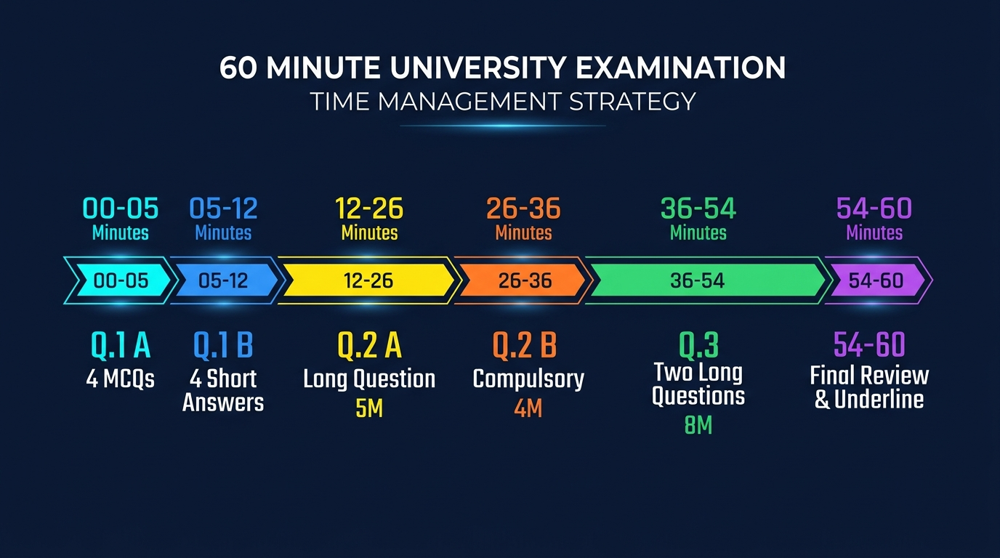

# ⏱️ 60-Minute University Examination Strategy & Time Budget Guide

> **Course Code:** DS-505 | **Subject:** Big Data Handling and Management for Machine Learning Applications  
> **Course Degree:** B.Sc. (Data Science & Analytics) — Semester V (NCrF Level 5.5)  
> **Institution:** Sutex Bank College of Computer Applications and Science (SBCCAS), Amroli  
> **Affiliation:** Veer Narmad South Gujarat University (VNSGU), Surat  
> **Examination Format:** 1 Hour (60 Minutes) | **Total Marks:** 25 Marks  
> **Target Audience:** All Students (Especially Average Students aiming for 20+ Marks)  

---

<details open>
<summary><b>📑 Table of Contents (Click to Expand / Collapse)</b></summary>

- [1. Visual Timeline: The 60-Minute Master Time Budget](#1-visual-timeline-the-60-minute-master-time-budget)
- [2. Minute-by-Minute Tactical Breakdown](#2-minute-by-minute-tactical-breakdown)
- [3. Section-by-Section Answering Guide for Maximum Marks](#3-section-by-section-answering-guide-for-maximum-marks)
  - [3.1 Q.1 A: Multiple Choice Questions (4 Marks)](#31-q1-a-multiple-choice-questions-4-marks)
  - [3.2 Q.1 B: Short 1–2 Line Answers (4 Marks)](#32-q1-b-short-12-line-answers-4-marks)
  - [3.3 Q.2 A: Detailed Long Question (5 Marks)](#33-q2-a-detailed-long-question-5-marks)
  - [3.4 Q.2 B: Compulsory Question (4 Marks)](#34-q2-b-compulsory-question-4-marks)
  - [3.5 Q.3: Two Short Notes (8 Marks)](#35-q3-two-short-notes-8-marks)
- [4. Presentation & Formatting Secrets That University Examiners Love](#4-presentation--formatting-secrets-that-university-examiners-love)
- [5. Top 5 Fatal Examination Traps to Avoid](#5-top-5-fatal-examination-traps-to-avoid)

</details>

---

# 1. Visual Timeline: The 60-Minute Master Time Budget



> [!TIP]
> **🎨 AI Image Generation Prompt (For GPT / DALL-E Uniform Aesthetics):**
> ```text
> Modern technical timeline infographic diagram of a 60-minute university examination time management strategy on dark navy background. Horizontal progress timeline displaying distinct color-coded time blocks from 0 to 60 minutes: 1. 00-05 min (Cyan) Q.1 A 4 MCQs, 2. 05-12 min (Blue) Q.1 B 4 Short Answers, 3. 12-26 min (Yellow) Q.2 A Long Question 5M, 4. 26-36 min (Orange) Q.2 B Compulsory 4M, 5. 36-54 min (Green) Q.3 Two Long Questions 8M, 6. 54-60 min (Purple) Final Review & Underline. High-tech vector aesthetic, clean minimalist typography, glowing accents, sharp layout.
> ```

---

# 2. Minute-by-Minute Tactical Breakdown

In a 25-mark, 1-hour university paper, **time is your most valuable asset**. Students who fail to plan their minutes often spend 25 minutes on Q.2 A and are forced to leave Q.3 unfinished.

Follow this battle-tested schedule strictly:

| Time Window | Elapsed Time | Target Section | Target Task | Marks | Recommended Pace |
| :---: | :---: | :---: | :--- | :---: | :--- |
| **00:00 – 05:00** | 5 mins | **Q.1 A** | 4 Multiple Choice Questions | 04 | ~1.25 mins per MCQ |
| **05:00 – 12:00** | 7 mins | **Q.1 B** | 4 Short Definitions / Explanations | 04 | ~1.75 mins per question |
| **12:00 – 26:00** | 14 mins | **Q.2 A** | 1 Detailed Long Question (with Diagram) | 05 | ~1.5 to 2 pages |
| **26:00 – 36:00** | 10 mins | **Q.2 B** | 1 Compulsory Question | 04 | ~1 to 1.5 pages |
| **36:00 – 54:00** | 18 mins | **Q.3** | 2 Short Notes (Any Two out of Three) | 08 | ~9 mins each (~1 to 1.25 pages each) |
| **54:00 – 60:00** | 6 mins | **Review** | Check question numbering, underline keywords, fix errors | — | Buffer / Quality Polish |

---

# 3. Section-by-Section Answering Guide for Maximum Marks

## 3.1 Q.1 A: Multiple Choice Questions (4 Marks)
* **Goal:** 4 out of 4 Marks in under 5 minutes.
* **How to Write on the Answer Sheet:**  
  Write the question number, the correct option letter, and the full option text. Never write just the letter!
  ```text
  Q.1 A
  1. b) Veracity
  2. c) df.count()
  3. b) StandardScaler()
  4. c) Self-Attention Transformer
  ```
* **Pro Tip:** Attempt all 4 questions you are most confident in first. If unsure between two options, eliminate the two obvious wrong ones first.

---

## 3.2 Q.1 B: Short 1–2 Line Answers (4 Marks)
* **Goal:** Direct, crisp definitions (4 Marks in 7 minutes).
* **Length:** Exactly 2 to 3 lines per question.
* **Format:** Provide the core technical keyword followed by one simple example.
  ```text
  Q.1 B
  1. Big Data:
     Big Data refers to massive, complex, and rapidly arriving datasets
     characterized by High Volume, High Velocity, and High Variety that cannot
     be managed using traditional single-node RDBMS systems.
  ```
* **Pro Tip:** Avoid long paragraphs. University examiners award full 1 mark for the presence of the exact technical keyword!

---

## 3.3 Q.2 A: Detailed Long Question (5 Marks)
* **Goal:** 4.5 to 5 Marks in 14 minutes.
* **Length:** ~1.5 to 2 handwritten pages.
* **Structure:**
  1. **Brief Introduction & Definition** (3–4 lines).
  2. **Neat Labeled Diagram / Architecture Sketch** (Take 3–4 minutes with a pencil; e.g., Driver Node $\rightarrow$ Cluster Manager $\rightarrow$ Worker Nodes).
  3. **Core Bullet Points** (Use clean headings like *1. Driver Program, 2. Cluster Manager, 3. Worker Executors*).
  4. **One Real-World Example** (e.g., E-commerce log processing or social media feeds).

---

## 3.4 Q.2 B: Compulsory Question (4 Marks)
* **Goal:** 3.5 to 4 Marks in 10 minutes.
* **Length:** ~1 to 1.5 handwritten pages.
* **Structure:**
  * If asking for **Lazy Evaluation vs. Eager Execution**: Explain the concept, mention DAG lineage, and give a 2-line code example.
  * If asking for **DataFrame Operations (`show`, `select`, `filter`, `count`)**: Write the function name, its purpose in 1 sentence, and its exact syntax.
  * If asking for a **Comparison Table**: Draw a clean 2-column table with at least 4 clear distinction points.

---

## 3.5 Q.3: Two Short Notes (8 Marks)
* **Goal:** 7 to 8 Marks in 18 minutes (9 minutes per question).
* **Length:** ~1 to 1.25 pages per question.
* **Strategy:** Carefully read all three options and select the **two most straightforward questions**:
  * *Option A (Data Cleaning / Missing Values):* Highly scoring! Explain dropping rows/columns, median/mode imputation, and deduplication.
  * *Option B (LLMs / Chatbots):* Very easy to write! Explain LLM concept, ChatGPT examples, and customer support chatbot benefits.
  * *Option C (Normalization vs. Standardization):* Draw a clean 4-point comparison table with the two formulas:
    $$X_{\text{norm}} = \frac{X - X_{\min}}{X_{\max} - X_{\min}} \quad \text{and} \quad z = \frac{X - \mu}{\sigma}$$

---

# 4. Presentation & Formatting Secrets That University Examiners Love

University evaluators grade hundreds of answer sheets within tight deadlines. A clean, structured paper instantly earns higher marks:

1. **Use Lead Pencil for Diagrams:** Always sketch boxes, flowcharts, and architecture diagrams using a sharp pencil and scale. Label all components clearly.
2. **Underline Core Keywords:** Use your pen to underline technical terms (e.g., <u>In-Memory Computing</u>, <u>Catalyst Optimizer</u>, <u>DAG</u>, <u>Py4J</u>, <u>Stratified Splitting</u>).
3. **Box Your Mathematical Formulas:** Draw a neat rectangle around mathematical equations:
   $$\boxed{z = \frac{X - \mu}{\sigma}}$$
4. **Use Numbered Bullet Points:** Never write unbroken walls of text. Break complex thoughts into 3 to 5 numbered points.
5. **Leave 2 Blank Lines Between Questions:** Clearly separate Q.1 A, Q.1 B, Q.2 A, and Q.3 so the examiner never misses awarding marks for any sub-question.

---

# 5. Top 5 Fatal Examination Traps to Avoid

| # | Common Student Mistake | How to Avoid It |
| :-: | :--- | :--- |
| ❌ | **Spending 25 minutes on Q.2 A** | Wear a wristwatch! Stop writing Q.2 A at the **26-minute mark**, even if you have more to say. |
| ❌ | **Writing only option letters in MCQs** (e.g., `1. b`) | Always write both letter and text: `1. b) Veracity`. Prevents ambiguity if handwriting is messy. |
| ❌ | **Skipping diagrams in long questions** | A 5-mark question without a diagram rarely gets more than 3 marks. A 2-minute sketch guarantees 4.5+ marks. |
| ❌ | **Mixing up question numbers** | Always write the exact question identifier prominently in the margin: e.g., **`Q.2 A (Option 1)`**. |
| ❌ | **Leaving the last 5 minutes empty** | Use the final 6 minutes (54:00 to 60:00) to verify your seat number, check that you answered all compulsory questions, and underline key terms. |

---

<div align="center">
<b>Department of Computer Science & Data Science</b><br>
Sutex Bank College of Computer Applications and Science (SBCCAS), Amroli<br>
<i>Affiliated with Veer Narmad South Gujarat University (VNSGU), Surat</i>
</div>
