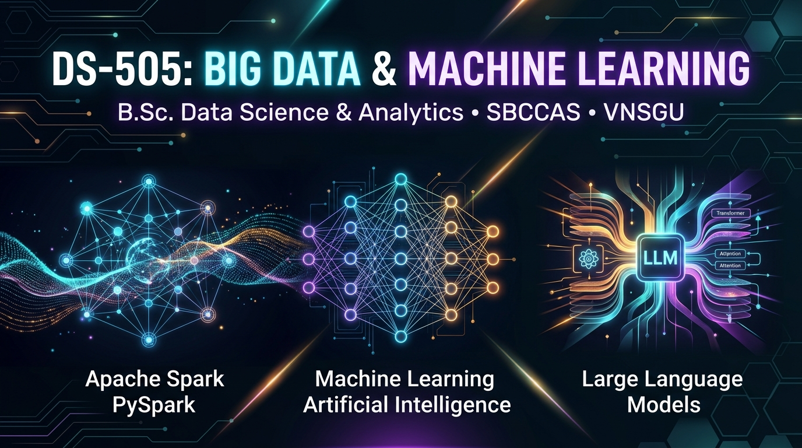

<div align="center">



# ⚡ DS-505: Big Data Handling & Management for Machine Learning

### *Bridging Distributed Big Data Computing and Next-Generation Generative AI*

[](https://www.vnsgu.ac.in/)
[](https://www.education.gov.in/)
[](https://www.python.org/)
[](https://spark.apache.org/)
[](https://scikit-learn.org/)
[](https://huggingface.co/)
[](https://colab.research.google.com/)

<p align="center">
  <b>Department of Computer Science & Data Science</b><br>
  <b>Sutex Bank College of Computer Applications and Science (SBCCAS)</b><br>
  <i>Affiliated with Veer Narmad South Gujarat University (VNSGU), Surat, Gujarat, India</i>
</p>

[📘 Syllabus](1_Syllabus/) • [📝 Lecture Notes](2_Lecture_Notes/) • [🚀 Projects](3_Projects_Presentations/) • [📂 Assignments](4_Assignments/) • [💡 Question Bank](5_QuestionBank/) • [📚 eBooks](6_eBooks_ExtraResources/) • [📄 Past Papers](7_Previous_Year_Papers/)

---

</div>

## 🌌 Course Architecture: The Data-to-Intelligence Fabric

Modern machine learning does not exist in isolation—it thrives on **massive, high-velocity datasets** and reaches its zenith with **foundation models and Large Language Models (LLMs)**. This repository houses the complete academic curriculum, code notebooks, datasets, and practical assignments for **DS-505**.

```mermaid
flowchart LR
    subgraph S1["🌊 Stage 1: Big Data Ingestion"]
        A["Unstructured & Structured Data<br>(CSV / JSON / Parquet / Streams)"] --> B["Memory Management & Pandas Chunking"]
    end

    subgraph S2["⚡ Stage 2: Distributed Processing Engine"]
        B --> C["Apache Spark Cluster<br>(Driver & Executor Cores)"]
        C --> D["PySpark DataFrames<br>(Transformations & Actions)"]
    end

    subgraph S3["⚙️ Stage 3: ML Feature Engineering"]
        D --> E["Data Cleaning & Preprocessing<br>(Imputation, Scaling, Encoding)"]
        E --> F["Scikit-Learn ML Models<br>(Regression, Trees, KNN)"]
    end

    subgraph S4["🧠 Stage 4: Cognitive AI & GenAI"]
        F --> G["Text Processing & Tokenization"]
        G --> H["Hugging Face Transformers<br>& Pretrained LLM APIs"]
    end

    classDef s1 fill:#0f172a,stroke:#38bdf8,stroke-width:2px,color:#fff;
    classDef s2 fill:#1e1b4b,stroke:#818cf8,stroke-width:2px,color:#fff;
    classDef s3 fill:#14532d,stroke:#4ade80,stroke-width:2px,color:#fff;
    classDef s4 fill:#3b0764,stroke:#c084fc,stroke-width:2px,color:#fff;
    class S1 s1;
    class S2 s2;
    class S3 s3;
    class S4 s4;
```



---

## 🎯 Course Outcomes (CO Matrix)

Upon successful completion of this syllabus, students achieve mastery across five primary dimensions:

| ID | Course Outcome (CO) | Key Industry Competency | Tools & Frameworks |
| :--- | :--- | :--- | :--- |
| **CO1** | Deconstruct the fundamental properties of **Big Data (Volume, Velocity, Variety)** and the necessity of scalable pipelines in AI. | Big Data Architecture & Strategy | Data Architectures |
| **CO2** | Harness **NumPy & Pandas** for large dataset ingestion, memory-efficient manipulation, and automated exploratory data analysis. | In-Memory Optimization & Vectorization | `pandas`, `numpy` |
| **CO3** | Execute distributed computation on massive datasets using **Apache Spark & PySpark DataFrames**. | Distributed Computing & Cluster Wrangling | `pyspark`, `SparkSession` |
| **CO4** | Architect end-to-end preprocessing, feature scaling, encoding, and train predictive models via **Scikit-Learn**. | Machine Learning Feature Engineering | `scikit-learn` |
| **CO5** | Implement text tokenization, NLP cleaning pipelines, and deploy **Hugging Face Pretrained LLM APIs** with ethical AI compliance. | Generative AI & Foundation Models | `transformers`, Pretrained APIs |

---

## 📑 Syllabus Breakdown: 4 High-Octane Units

<details open>
<summary><h3>📦 Unit 1: Introduction to Big Data and Large Dataset Handling</h3></summary>

* **Core Theory**:
  * Demystifying the Big Data revolution: *Volume, Velocity, Variety, Veracity, Value*.
  * Why traditional RDBMS bottlenecks on high-throughput ML pipelines.
  * Real-world data paradigms: IoT telemetry, financial streams, multimodal text/vision corpora.
* **Hands-on Python Wrangling**:
  * Loading large-scale files (`read_csv()`, `read_json()`, chunked iteration).
  * Python garbage collection, data typing (`category`, `float32` vs `float64`), memory optimization.
  * Dataframe surgical operations: `drop()`, `dropna()`, `fillna()`, `rename()`, `info()`, `describe()`.

```python
# 💡 Pro Tip: Memory-optimized chunked reader
import pandas as pd

chunk_iterator = pd.read_csv("massive_dataset.csv", chunksize=100_000)
for chunk in chunk_iterator:
    processed_data = chunk.dropna().astype({"sensor_id": "category"})
    # Stream downstream directly to feature storage
```

👉 **[📖 Read Complete Unit-1 Notes, Diagrams & Practical Lab Manual](2_Lecture_Notes/Unit-1_Introduction_to_Big_Data_and_Large_Dataset_Handling.md)**
</details>

<details open>
<summary><h3>⚡ Unit 2: Big Data Processing Using PySpark</h3></summary>

* **Distributed Compute Paradigm**:
  * Bottlenecks of single-node compute; Scalability via master-worker topology.
  * Apache Spark Core Architecture: Driver Program, Cluster Manager (YARN/K8s/Standalone), and Executor nodes.
  * Directed Acyclic Graph (DAG) execution, Lazy Evaluation, Transformations vs. Actions.
* **PySpark Practical Toolkit**:
  * Building resilient sessions: `SparkSession.builder.appName("DS505").getOrCreate()`.
  * Distributed query primitives: `.show()`, `.printSchema()`, `.select()`, `.filter()`, `.groupBy()`, `.count()`.

```python
from pyspark.sql import SparkSession
from pyspark.sql.functions import col, count

spark = SparkSession.builder.appName("DS505_BigData").getOrCreate()
df = spark.read.json("web_traffic_logs.json")

# Distributed high-performance aggregation
df.filter(col("status_code") == 200) \
  .groupBy("endpoint") \
  .agg(count("*").alias("hits")) \
  .orderBy(col("hits").desc()) \
  .show(10)
```
</details>

<details open>
<summary><h3>⚙️ Unit 3: Preparing Big Data for Machine Learning</h3></summary>

* **Data Cleaning & Standardization**:
  * Strategic missing-value treatment (mean/median/KNN imputation vs. exclusion).
  * Outlier detection and robust deduplication.
  * Normalization (`MinMaxScaler`) vs Standardization (`StandardScaler`).
* **Feature Engineering & Scikit-Learn Pipelines**:
  * Handling categorical attributes: One-Hot Encoding vs `LabelEncoder`.
  * Train/Test stratification: `train_test_split(..., stratify=y)`.
  * Model building & validation: `LinearRegression`, `DecisionTreeClassifier`, `KNeighborsClassifier`.

```python
from sklearn.model_selection import train_test_split
from sklearn.preprocessing import StandardScaler
from sklearn.tree import DecisionTreeClassifier

X_train, X_test, y_train, y_test = train_test_split(X, y, test_size=0.2, random_state=42)
scaler = StandardScaler()
X_train_scaled = scaler.fit_transform(X_train)
X_test_scaled = scaler.transform(X_test)

clf = DecisionTreeClassifier(max_depth=5)
clf.fit(X_train_scaled, y_train)
```
</details>

<details open>
<summary><h3>🤖 Unit 4: Introduction to Large Language Models (LLMs) & Big Data AI</h3></summary>

* **Foundation Models & LLM Foundations**:
  * Architecture of modern Generative AI: From Word2Vec to Self-Attention Transformers.
  * The role of web-scale text corpora (Common Crawl, C4) in pretraining.
  * Downstream applications: Contextual search, summarization, conversational AI, code generation.
* **NLP Pipeline & Pretrained APIs**:
  * Text normalization: regex cleaning, lowercase conversion, whitespace stripping, subword tokenization.
  * Hugging Face ecosystem: `pipeline()`, model hubs, tokenizers.
  * AI Ethics, hallucination detection, bias mitigation, and responsible data governance.

```python
from transformers import pipeline

# Zero-shot inference with Hugging Face Transformers
classifier = pipeline("sentiment-analysis", model="distilbert-base-uncased-finetuned-sst-2-english")
result = classifier("Distributed computing with PySpark transforms raw information into intelligent models!")
print(result)
# Output: [{'label': 'POSITIVE', 'score': 0.9998}]
```

👉 **[📖 Read Complete Unit-4 Notes, Diagrams & Practical Lab Manual](2_Lecture_Notes/Unit-4_Introduction_to_Large_Language_Models_and_Big_Data_Applications.md)**
</details>

---

## 🗂️ Repository Structure Blueprint

```text
505_Big-Data-Handling-and-Management-for-Machine-Learning-Applications/
│
├── 📂 1_Syllabus/                       # Official University syllabus & credit frameworks
│   └── 505 Big Data Handling...pdf
│
├── 📂 2_Lecture_Notes/                  # Unit-wise slide decks, markdown summaries & Colab guides
│   ├── Unit-1_Introduction_to_Big_Data_and_Large_Dataset_Handling.md
│   └── Unit-4_Introduction_to_Large_Language_Models_and_Big_Data_Applications.md
│
├── 📂 3_Projects_Presentations/         # Capstone project guidelines, rubrics & student work
│   └── Unit-1_Lab_Case_Study_Large_Dataset_Optimization.md
│
├── 📂 4_Assignments/                    # Problem statements, code deliverables & grading rubrics
│   ├── Assignment-1_Unit-1_Theory_Assignment.md
│   └── Assignment-4_Unit-4_Theory_Assignment.md
│
├── 📂 5_QuestionBank/                   # Question bank, MCQs, viva preparation & practical prompts
│   └── Unit-1_Question_Bank_and_Viva_Voce.md
│
├── 📂 6_eBooks_ExtraResources/          # Reference guides, cheat sheets, papers & textbook links
│   └── DECAP456_INTRODUCTION_TO_BIG_DATA.pdf
│
└── 📂 7_Previous_Year_Papers/           # University examination papers & QR archives
    └── BCA Old Papers QR.pdf
```

---

## 🧪 Quickstart Lab Environment Setup

### Option 1: 1-Click Interactive Cloud Lab (Google Colab)
Launch code directly in the cloud without local installations:
[](https://colab.research.google.com)

### Option 2: Local High-Performance Environment
Clone the repository and install the complete data science and distributed computing environment:

```bash
# 1. Clone repository
git clone https://github.com/sbccas/Big-Data-Handling-and-Management-for-Machine-Learning-Applications.git
cd Big-Data-Handling-and-Management-for-Machine-Learning-Applications

# 2. Initialize virtual environment (Python 3.10 or higher recommended)
python -m venv venv
source venv/bin/activate  # On Windows: .\venv\Scripts\activate

# 3. Install core dependencies
pip install --upgrade pip
pip install numpy pandas pyspark scikit-learn transformers torch jupyterlab
```

---

## 🔮 A Pinch of AI: Student Copilot Cheat Sheet

As future Data Scientists, leverage AI intelligently to debug distributed jobs and optimize algorithms:

<div align="center">

| Objective | Recommended Prompt Template for Student LLM Assistants |
| :--- | :--- |
| **Debug PySpark OOM Errors** | *"I am encountering a PySpark `OutOfMemoryError` during a wide shuffle operation on a DataFrame with 10M rows. Here is my DAG and aggregation logic: [code]. Analyze the partition skew and suggest an optimal repartitioning/coalesce strategy."* |
| **Optimize Pandas Memory** | *"Review this Pandas pipeline loading a 4GB CSV file. Suggest category dtype casting, chunking with `chunksize`, and memory profiling using `df.info(memory_usage='deep')`."* |
| **Pipeline Construction** | *"Convert my standalone Scikit-learn preprocessing steps (imputation, standard scaling, and one-hot encoding) into a production-grade `sklearn.pipeline.Pipeline` coupled with a cross-validation grid search."* |
| **Transformer Fine-Tuning** | *"Explain how tokenization truncation and padding work in Hugging Face `AutoTokenizer` when feeding batches of long documents to DistilBERT."* |

</div>

---

## 📖 Recommended Reference Books & Literature

1. **Learning Spark: Lightning-Fast Data Analytics** — *Jules S. Damji, Brooke Wenig, Tathagata Das, Denny Lee* (O'Reilly, ISBN: `9781492050049`)
2. **Python for Data Analysis** — *Wes McKinney* (O'Reilly, ISBN: `9781491957660`)
3. **Hands-On Machine Learning with Scikit-Learn, Keras, and TensorFlow** — *Aurélien Géron* (O'Reilly, ISBN: `9781492032649`)
4. **Natural Language Processing with Transformers** — *Lewis Tunstall, Leandro von Werra, Thomas Wolf* (O'Reilly, ISBN: `9781098103247`)
5. **Big Data: Principles and Best Practices of Scalable Real-Time Data Systems** — *Nathan Marz, James Warren* (Manning, ISBN: `9781617290341`)
6. **Machine Learning with PySpark** — *Tomasz Drabas, Denny Lee* (Packt, ISBN: `9781784390796`)

---

## 📊 Evaluation & Examination Scheme

| Assessment Type | Components | Weightage |
| :--- | :--- | :---: |
| **Internal Assessment** | Continuous Evaluation, Lab Practicals, Quizzes, Assignments & Attendance | **50%** |
| **External University Exam** | VNSGU End-Semester Theory Examination & Practical Hands-on VIVA Examination | **50%** |

---

## 🤝 Contributing & Academic Integrity

- **For Students**: Contributions through pull requests are welcome! If you find typographical errors, have optimized notebook solutions, or want to contribute project templates, feel free to open a PR.
- **Academic Honor Code**: Students must submit original implementations for lab exercises and project submissions. Use of Generative AI tools is encouraged for understanding and conceptual synthesis, but all project code must be understood and defended by the author during viva examinations.

---

<div align="center">

Made with 💙 for the **B.Sc. Data Science & Analytics** Students  
**Sutex Bank College of Computer Applications and Science (SBCCAS)**  
*Veer Narmad South Gujarat University (VNSGU), Surat*

</div>
